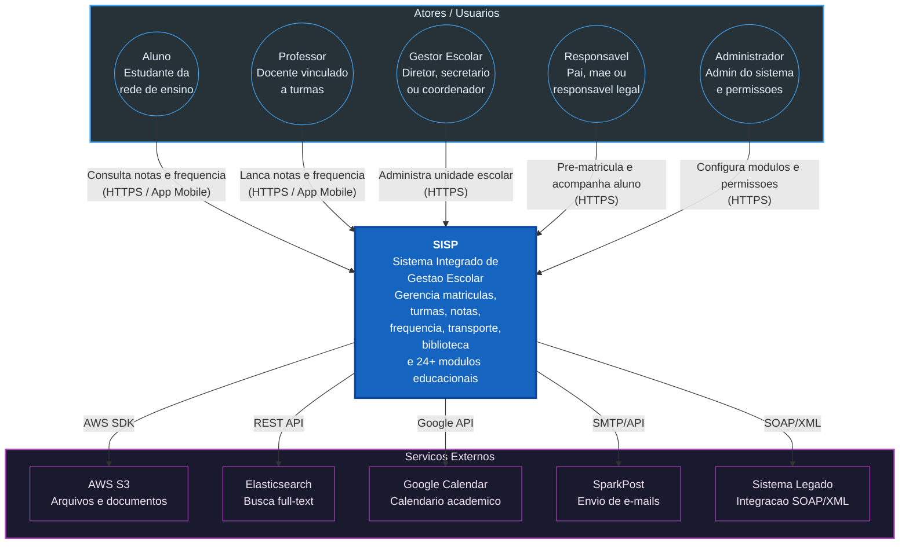
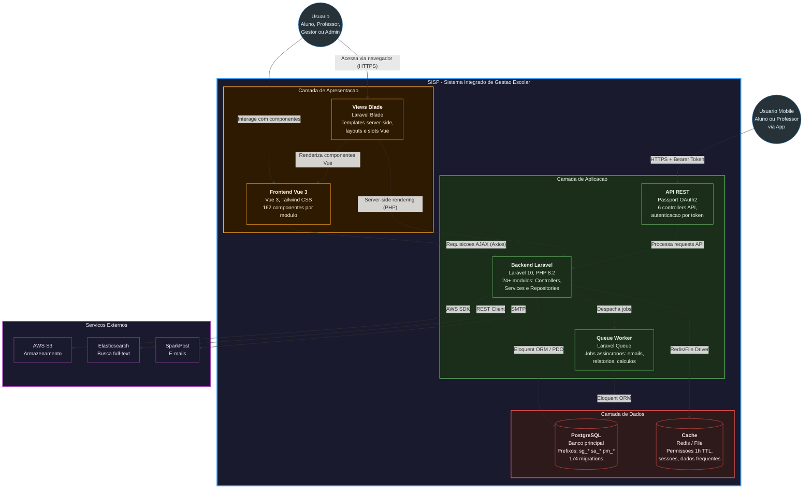
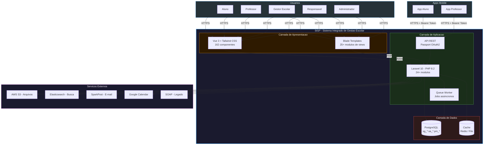

# 01 - Arquitetura Geral do SISP

## 1.1 Diagrama de Contexto

Visao de alto nivel: atores, sistema SISP e servicos externos.

## 1.2 Diagrama de Containers

Componentes internos do SISP e suas interacoes.

## 1.3 Visao Compacta

Versao resumida com todas as camadas.

