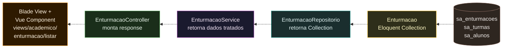
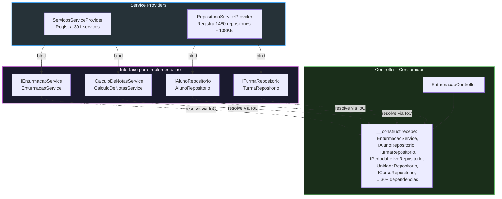
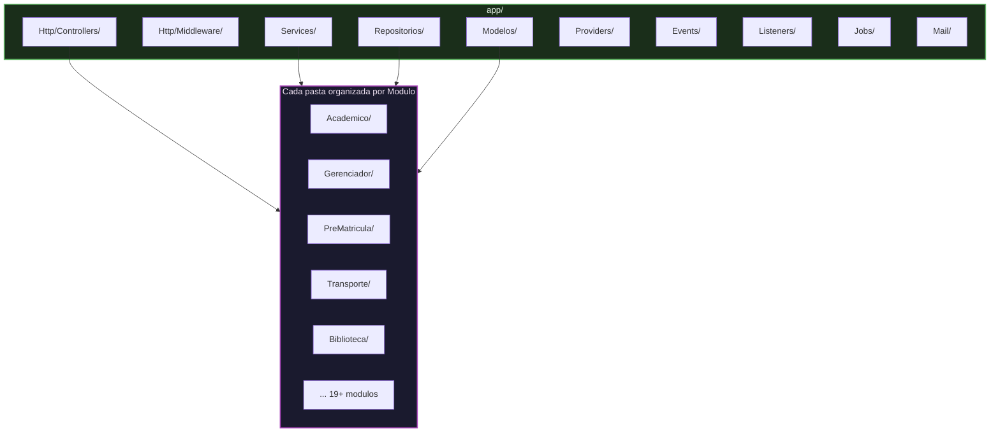
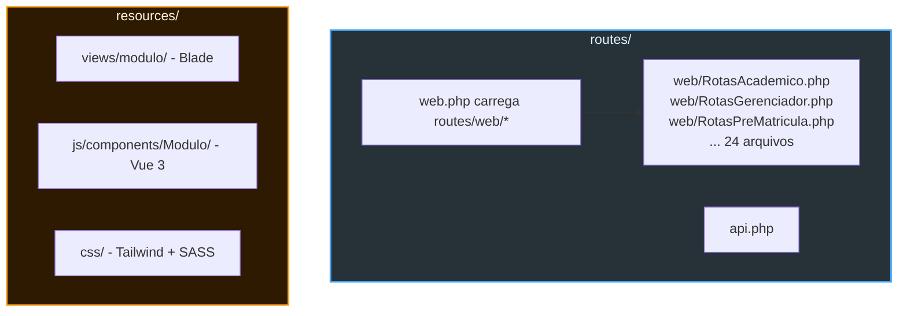

# 02 - Camadas Arquiteturais do SISP

## 2.1 Visao Geral das Camadas

O SISP segue uma arquitetura **MVC Modular com Service/Repository Pattern**. Cada request HTTP atravessa as camadas de cima para baixo.

```mermaid
graph TB
    subgraph Apresentacao["Camada de Apresentacao"]
        V1["Blade Templates<br/>resources/views/modulo/"]
        V2["Vue 3 Components<br/>resources/js/components/Modulo/"]
    end

    subgraph Roteamento["Camada de Roteamento"]
        R1["web.php - Carrega 24 arquivos de rotas"]
        R2["api.php - Rotas REST com auth:api"]
        R3["Rotas por Modulo<br/>routes/web/RotasAcademico.php<br/>routes/web/RotasGerenciador.php<br/>... 24 arquivos"]
    end

    subgraph Middleware["Camada de Middleware"]
        MW1["Global: CheckForMaintenanceMode,<br/>TrimStrings, ValidatePostSize"]
        MW2["Web Group: Session, CSRF,<br/>EncryptCookies, SubstituteBindings"]
        MW3["manutencaoMiddleware<br/>Verifica manutencao do modulo"]
        MW4["acessoRestritoMiddleware<br/>Auth::check + !bloqueado"]
        MW5["permissaoAcessoMiddleware<br/>Cache permissoes 1h TTL"]
    end

    subgraph Controllers["Camada de Controllers"]
        C1["Controllers por Modulo<br/>Http/Controllers/Academico/<br/>Http/Controllers/Gerenciador/<br/>Http/Controllers/API/<br/>... 24+ pastas"]
    end

    subgraph Services["Camada de Services - Business Logic"]
        S1["Interfaces<br/>Services/Modulo/Interfaces/I*Service.php"]
        S2["Implementacoes<br/>Services/Modulo/*Service.php<br/>391 services em ServicosServiceProvider"]
    end

    subgraph Repositories["Camada de Repositories - Data Access"]
        RP1["Interfaces<br/>Repositorios/Modulo/Interfaces/I*Repositorio.php"]
        RP2["Implementacoes<br/>Repositorios/Modulo/*Repositorio.php<br/>1480 repositories em RepositorioServiceProvider"]
    end

    subgraph Models["Camada de Models - Eloquent ORM"]
        M1["Models por Modulo<br/>Modelos/Academico/ - Aluno, Turma, Enturmacao...<br/>Modelos/Gerenciador/ - Usuario, Pessoa, Perfil...<br/>1505 models com belongsTo/hasMany"]
    end

    subgraph Database["Banco de Dados"]
        DB1[("PostgreSQL<br/>174 migrations<br/>Prefixos: sg_*, sa_*, pm_*, st_*")]
    end

    V1 & V2 --> R1 & R2
    R1 --> R3
    R3 --> MW1
    R2 --> MW1
    MW1 --> MW2
    MW2 --> MW3
    MW3 --> MW4
    MW4 --> MW5
    MW5 --> C1
    C1 --> S1
    S1 --> S2
    S2 --> RP1
    RP1 --> RP2
    RP2 --> M1
    M1 --> DB1

    style Apresentacao fill:#2e1a00,stroke:#FFA726,color:#FFF3E0,stroke-width:2px
    style Roteamento fill:#263238,stroke:#42A5F5,color:#E3F2FD,stroke-width:2px
    style Middleware fill:#2e1a1a,stroke:#EF5350,color:#FFEBEE,stroke-width:2px
    style Controllers fill:#1a2e1a,stroke:#66BB6A,color:#E8F5E9,stroke-width:2px
    style Services fill:#1a1a2e,stroke:#AB47BC,color:#F3E5F5,stroke-width:2px
    style Repositories fill:#1a2e2e,stroke:#26A69A,color:#E0F2F1,stroke-width:2px
    style Models fill:#2e2e1a,stroke:#FFCA28,color:#FFF9C4,stroke-width:2px
    style Database fill:#2e2620,stroke:#8D6E63,color:#EFEBE9,stroke-width:2px
```

## 2.2 Fluxo de uma Request - Ida

Exemplo real: `GET /academico/enturmacao/listar` - caminho da request ate o banco.

```mermaid
graph LR
    REQ["GET<br/>/academico/<br/>enturmacao/listar"]

    MW1["manutencao<br/>Middleware"]
    MW2["acessoRestrito<br/>Middleware"]
    MW3["permissaoAcesso<br/>Middleware"]

    CTRL["EnturmacaoController<br/>listar - Request"]

    SVC["EnturmacaoService<br/>implements<br/>IEnturmacaoService"]

    REPO["EnturmacaoRepositorio<br/>implements<br/>IEnturmacaoRepositorio"]

    MDL["Enturmacao<br/>extends ModeloBase"]

    TBL[("sa_enturmacoes<br/>sa_turmas<br/>sa_alunos<br/>sg_pessoas")]

    REQ --> MW1 --> MW2 --> MW3 --> CTRL
    CTRL --> SVC --> REPO --> MDL --> TBL

    style REQ fill:#263238,stroke:#42A5F5,color:#E3F2FD
    style MW1 fill:#2e1a1a,stroke:#EF5350,color:#FFEBEE
    style MW2 fill:#2e1a1a,stroke:#EF5350,color:#FFEBEE
    style MW3 fill:#2e1a1a,stroke:#EF5350,color:#FFEBEE
    style CTRL fill:#1a2e1a,stroke:#66BB6A,color:#E8F5E9
    style SVC fill:#1a1a2e,stroke:#AB47BC,color:#F3E5F5
    style REPO fill:#1a2e2e,stroke:#26A69A,color:#E0F2F1
    style MDL fill:#2e2e1a,stroke:#FFCA28,color:#FFF9C4
    style TBL fill:#2e2620,stroke:#8D6E63,color:#EFEBE9
```

## 2.3 Fluxo de uma Request - Volta

Retorno dos dados do banco ate a view renderizada.

## 2.4 Padrao de Injecao de Dependencia

O SISP utiliza o container de IoC do Laravel para resolver dependencias via interfaces.

## 2.5 Estrutura de Diretorios - Codigo

## 2.6 Estrutura de Diretorios - Rotas e Resources

