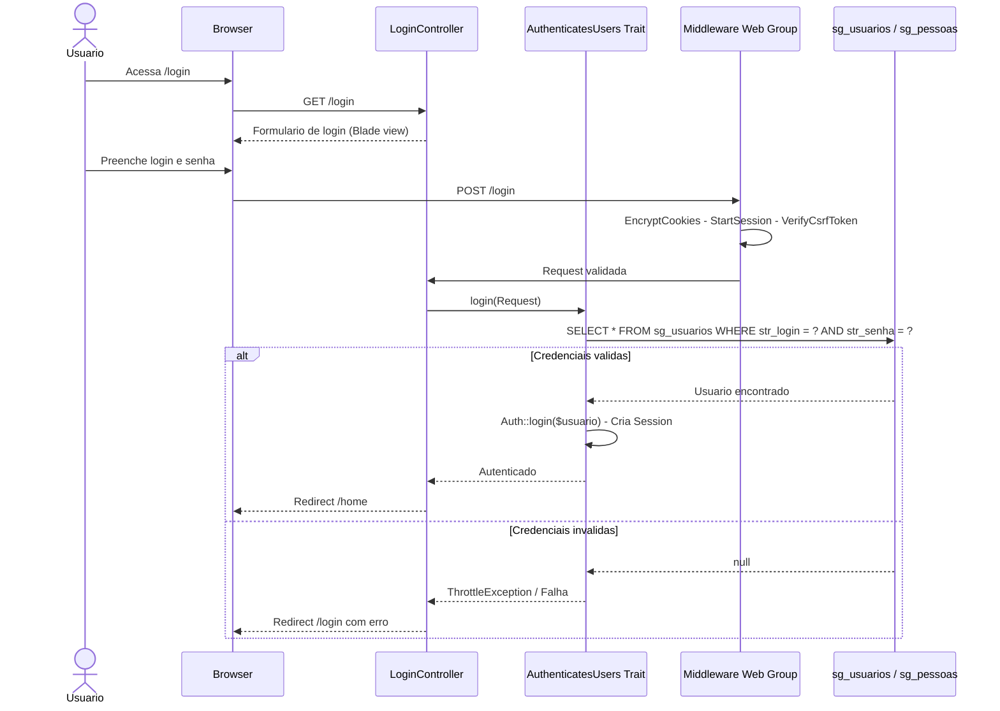
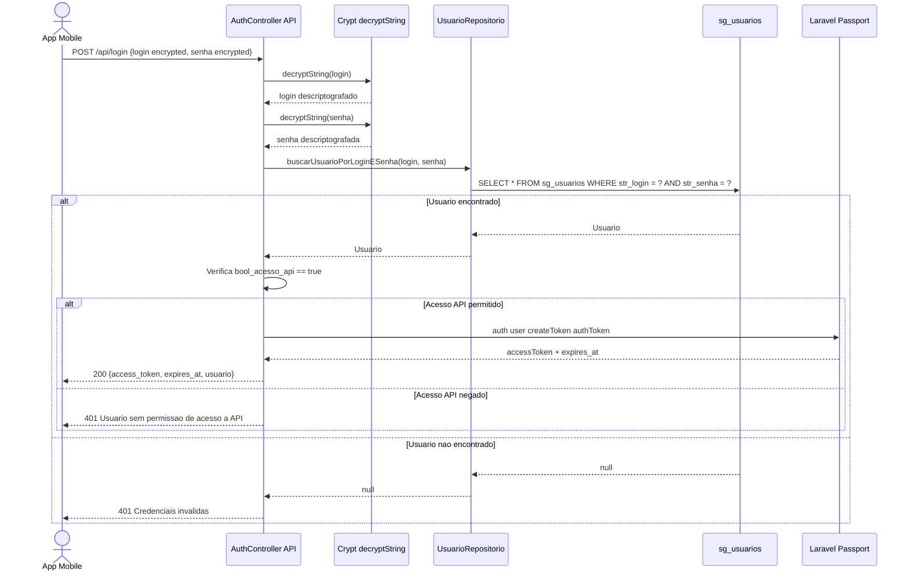
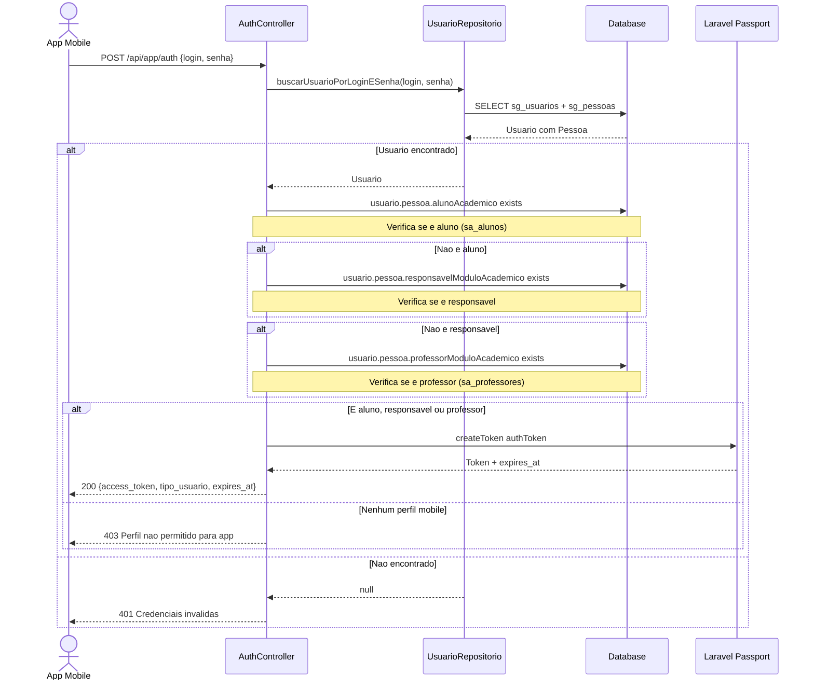
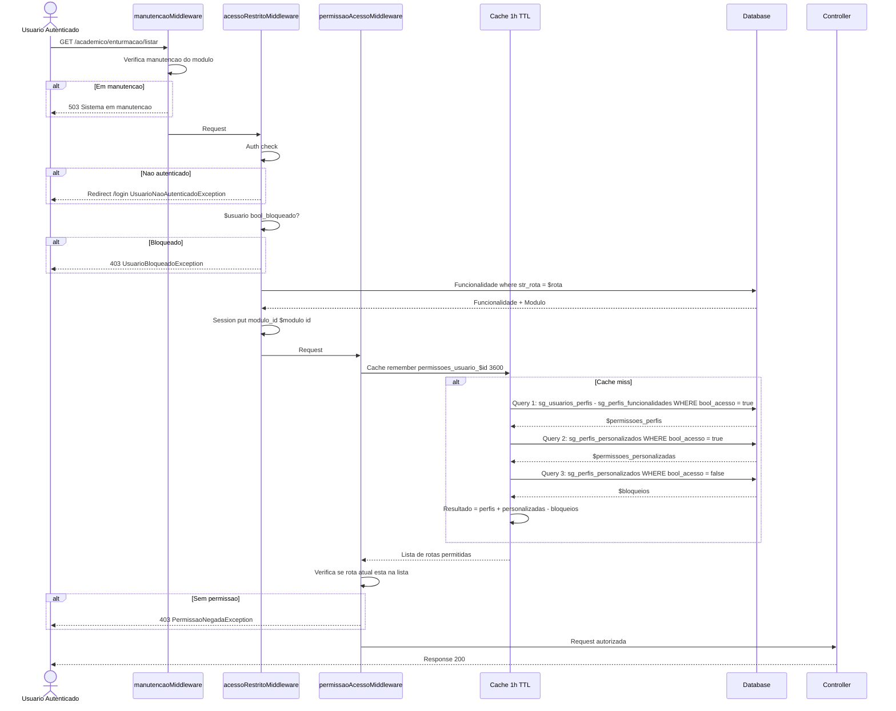
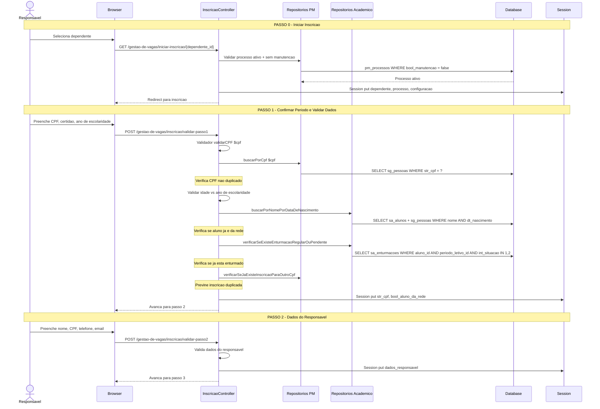
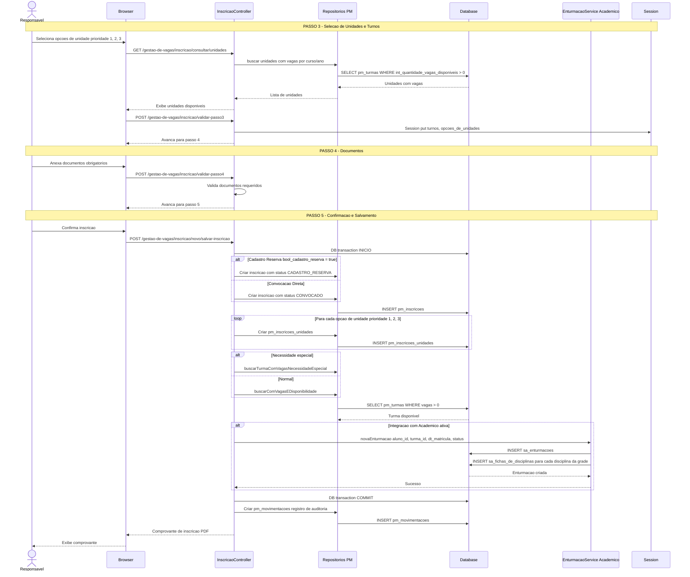
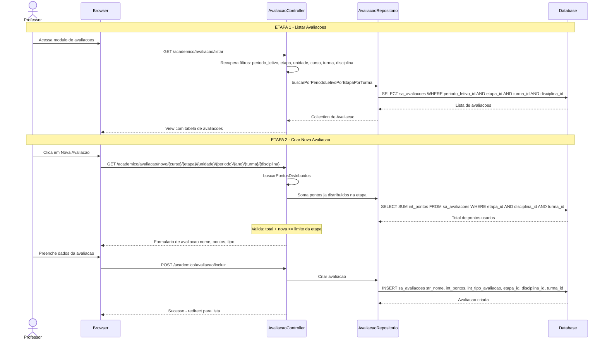
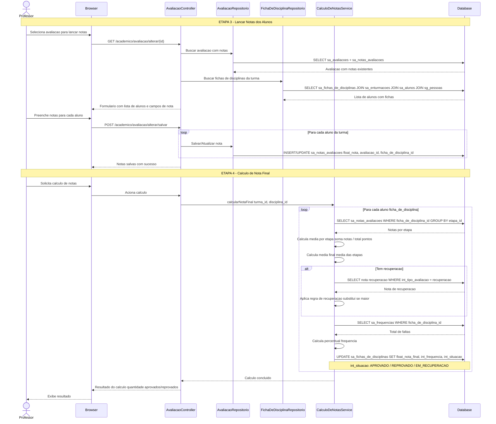

# 04 - Diagramas de Sequencia (Fluxos Criticos)

## 4.1 Fluxo de Autenticacao

### 4.1a Autenticacao Web (Session)

### 4.1b Autenticacao API (Passport OAuth2)

### 4.1c Autenticacao App Mobile (Aluno/Professor)

### 4.1d Pipeline de Middleware (Acesso a Rotas Protegidas)

---

## 4.2 Fluxo de Matricula / Inscricao - Passos 0 a 2

## 4.2b Fluxo de Matricula / Inscricao - Passos 3 a 5

---

## 4.3 Fluxo de Lancamento de Notas - Etapas 1 e 2

## 4.3b Fluxo de Lancamento de Notas - Etapas 3 e 4

## 4.4 Legenda de Status

### Status de Enturmacao (sa_enturmacoes.int_situacao)
| Codigo | Status |
|--------|--------|
| 1 | REGULAR (matriculado) |
| 2 | PENDENTE (condicional) |
| 3 | CANCELADA |
| 4 | TRANSFERIDA |

### Status de Inscricao (pm_inscricoes.status_id)
| Codigo | Status |
|--------|--------|
| 1 | CADASTRO_RESERVA (lista de espera) |
| 2 | CONVOCADO (chamado para matricula) |
| 3 | MATRICULADO |
| 4 | CANCELADO |

### Tipos de Avaliacao (sa_avaliacoes.int_tipo_avaliacao)
| Codigo | Tipo |
|--------|------|
| 1 | Avaliacao Regular |
| 2 | Recuperacao Paralela |
| 3 | Avaliacao Integrada |
| 4 | Recuperacao de Etapa |
| 5 | Recuperacao Geral |
