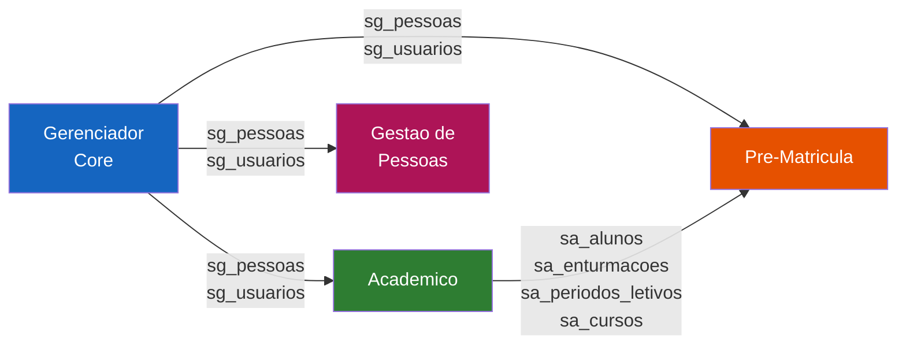
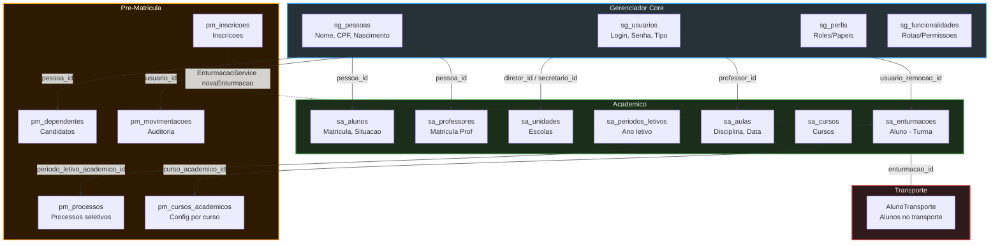
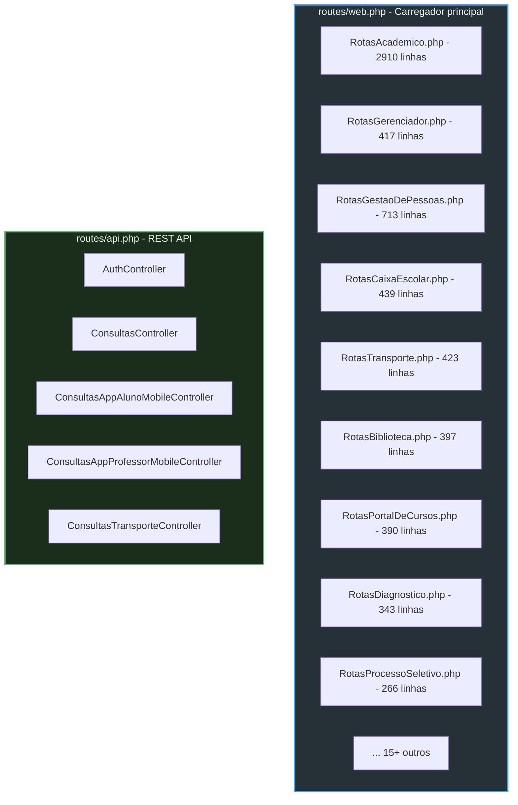

# 05 - Modulos e Dependencias do SISP

## 5.1 Mapa Geral de Modulos

Visao hierarquica dos 24+ modulos do SISP e suas dependencias.

```mermaid
graph TB
    subgraph Core["CORE - Base do Sistema"]
        G["Gerenciador<br/>Usuarios, Pessoas, Perfis,<br/>Permissoes, Configuracoes<br/>sg_*"]
    end

    subgraph Principal["MODULOS PRINCIPAIS"]
        AC["Academico<br/>Alunos, Turmas, Notas,<br/>Frequencia, Disciplinas<br/>sa_*"]
        GP["Gestao de Pessoas<br/>RH, Funcionarios,<br/>Contratos, Cargos"]
        PM["Pre-Matricula /<br/>Gestao de Vagas<br/>Inscricoes, Processos,<br/>Convocacoes<br/>pm_*"]
    end

    subgraph Secundario["MODULOS SECUNDARIOS"]
        TR["Transporte<br/>Rotas, Motoristas,<br/>Veiculos, Alunos<br/>st_*"]
        BI["Biblioteca<br/>Acervo, Emprestimos,<br/>Devolucoes"]
        AL["Alimentacao<br/>Cardapios, Refeicoes,<br/>Nutricao"]
        CE["Caixa Escolar<br/>Financeiro, Receitas,<br/>Despesas"]
        AX["Almoxarifado<br/>Estoque, Materiais,<br/>Requisicoes"]
    end

    subgraph Especializado["MODULOS ESPECIALIZADOS"]
        BA["Busca Ativa<br/>Alunos em risco"]
        AI["Avaliacao Institucional<br/>Pesquisas"]
        AD["Avaliacao de Desempenho<br/>Funcionarios"]
        DG["Diagnostico<br/>Analises educacionais"]
        ED["Eleicao de Diretores<br/>Votacao"]
        CS["Censo<br/>Dados censitarios"]
    end

    subgraph Portais["PORTAIS E COMUNICACAO"]
        PC["Portal de Cursos<br/>Cursos online"]
        PCO["Portal de Comunicacao<br/>Comunicados"]
        PN["Portal de Noticias<br/>Publicacoes"]
    end

    subgraph RH["RECURSOS HUMANOS"]
        PS["Processo Seletivo<br/>Selecao, Concursos"]
        PF["Progressao Funcional<br/>Carreira"]
        RL["Remocao / Lotacao<br/>Movimentacao de pessoal"]
        GV["Gestao de Vagas<br/>Posicoes abertas"]
    end

    subgraph Operacional["OPERACIONAL"]
        IN["Indicadores<br/>Dashboards, KPIs"]
        MN["Manutencao<br/>Operacoes"]
    end

    G -->|base| AC
    G -->|base| GP
    G -->|base| PM

    AC -->|alunos| PM
    G -->|pessoas| PM

    G & AC -->|usuarios + alunos| TR
    G & AC -->|usuarios + alunos| BI
    G & AC -->|usuarios + unidades| AL
    G & AC -->|usuarios + unidades| CE
    G -->|usuarios| AX

    AC -->|dados academicos| BA
    G & AC -->|usuarios + dados| AI
    GP -->|funcionarios| AD
    AC -->|dados academicos| DG
    G & AC -->|usuarios + unidades| ED
    AC -->|dados academicos| CS

    G -->|usuarios| PC
    G -->|usuarios| PCO
    G -->|usuarios| PN

    G & GP -->|usuarios + funcionarios| PS
    GP -->|funcionarios| PF
    GP -->|funcionarios| RL
    G & AC -->|usuarios + unidades| GV

    G -->|configuracoes| MN
    AC & GP & PM & TR -->|dados diversos| IN

    style Core fill:#1565C0,stroke:#0D47A1,color:#fff,stroke-width:3px
    style Principal fill:#2E7D32,stroke:#1B5E20,color:#fff,stroke-width:2px
    style Secundario fill:#E65100,stroke:#BF360C,color:#fff,stroke-width:2px
    style Especializado fill:#6A1B9A,stroke:#4A148C,color:#fff,stroke-width:2px
    style Portais fill:#00838F,stroke:#006064,color:#fff,stroke-width:2px
    style RH fill:#AD1457,stroke:#880E4F,color:#fff,stroke-width:2px
    style Operacional fill:#4E342E,stroke:#3E2723,color:#fff,stroke-width:2px
```

## 5.2 Dependencias Detalhadas por Modulo

Visao focada nas dependencias entre os 4 modulos centrais.

## 5.3 Integracao Cross-Module: Detalhamento

Pontos exatos de integracao entre os modulos centrais via foreign keys e services.

## 5.4 Tabela Resumo de Modulos

| Modulo | Prefixo BD | Controllers | Rota Base | Depende de |
|--------|-----------|-------------|-----------|------------|
| **Gerenciador** | `sg_*` | `Gerenciador/` | `/gerenciador` | - Core |
| **Academico** | `sa_*` | `Academico/` | `/academico` | Gerenciador |
| **Pre-Matricula** | `pm_*` | `PreMatricula/` | `/gestao-de-vagas` | Gerenciador, Academico |
| **Gestao de Pessoas** | - | `GestaoDePessoas/` | `/gestao-de-pessoas` | Gerenciador |
| **Transporte** | `st_*` | `Transporte/` | `/transporte` | Gerenciador, Academico |
| **Biblioteca** | - | `Biblioteca/` | `/biblioteca` | Gerenciador, Academico |
| **Alimentacao** | - | `Alimentacao/` | `/alimentacao` | Gerenciador, Academico |
| **Caixa Escolar** | - | `CaixaEscolar/` | `/caixa-escolar` | Gerenciador, Academico |
| **Almoxarifado** | - | `Almoxarifado/` | `/almoxarifado` | Gerenciador |
| **Busca Ativa** | - | `BuscaAtiva/` | `/busca-ativa` | Academico |
| **Avaliacao Institucional** | - | `AvaliacaoInstitucional/` | `/avaliacao-institucional` | Gerenciador, Academico |
| **Avaliacao de Desempenho** | - | `AvaliacaoDeDesempenho/` | `/avaliacao-de-desempenho` | Gestao de Pessoas |
| **Diagnostico** | - | `Diagnostico/` | `/diagnostico` | Academico |
| **Eleicao de Diretores** | - | `EleicaoDeDiretores/` | `/eleicao-de-diretores` | Gerenciador, Academico |
| **Portal de Cursos** | - | `PortalDeCursos/` | `/portal-de-cursos` | Gerenciador |
| **Portal de Comunicacao** | - | `PortalDeComunicacao/` | `/portal-de-comunicacao` | Gerenciador |
| **Processo Seletivo** | - | `ProcessoSeletivo/` | `/processo-seletivo` | Gerenciador, Gestao de Pessoas |
| **Progressao Funcional** | - | `ProgressaoFuncional/` | `/progressao-funcional` | Gestao de Pessoas |
| **Remocao/Lotacao** | - | `RemocaoLotacao/` | `/remocao-lotacao` | Gestao de Pessoas |
| **Gestao de Vagas** | - | `GestaoDeVagas/` | `/gestao-de-vagas` | Gerenciador, Academico |
| **Indicadores** | - | `Indicadores/` | `/indicadores` | Todos leitura |
| **Censo** | - | `Censo/` | `/censo` | Academico |
| **Manutencao** | - | `Manutencao/` | `/manutencao` | Gerenciador |
| **Portal de Noticias** | - | `PortalDeNoticias/` | `/portal-de-noticias` | Gerenciador |

## 5.5 Arquivos de Rotas por Modulo

Cada modulo tem seu proprio arquivo de rotas em `routes/web/`:

