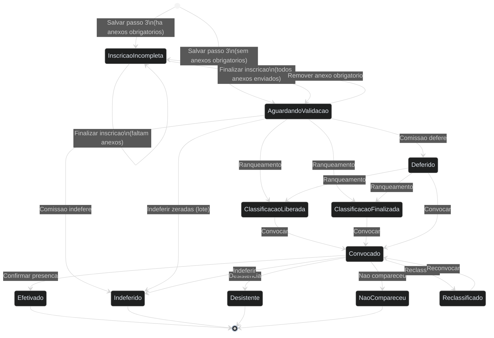
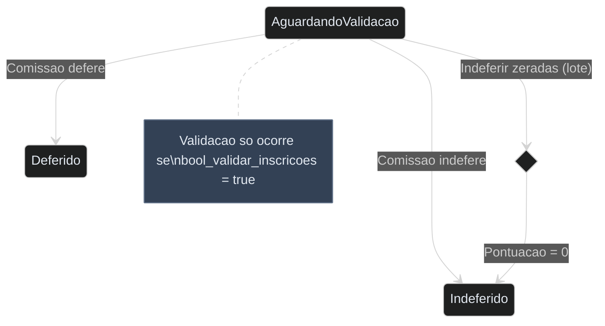
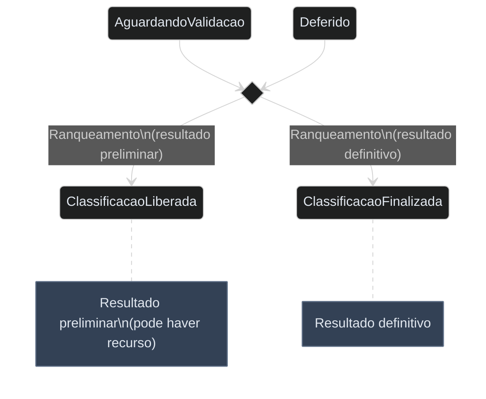
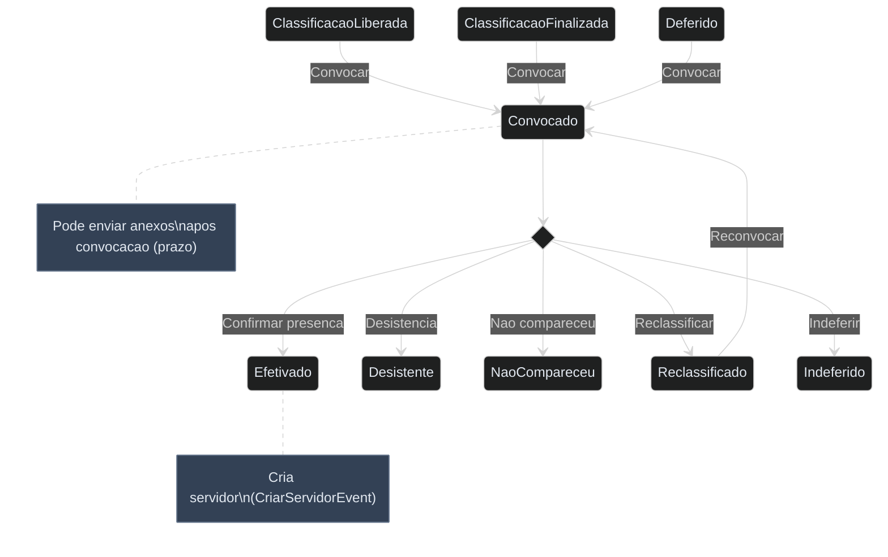

# Diagrama de Estado - Inscricao (Processo Seletivo)

**Modulo:** Processo Seletivo
**Model:** `SISP/app/Modelos/ProcessoSeletivo/Inscricao.php`
**Enum:** `SISP/app/Extras/Enums/ProcessoSeletivo/StatusInscricaoEnum.php`
**Campo de status:** `int_situacao` (int) — controlado via `StatusInscricaoEnum`

> **Resumo:** Ciclo de vida completo de uma inscricao em processo seletivo, desde o preenchimento pelo candidato ate a efetivacao ou encerramento. Envolve 4 passos de preenchimento, validacao pela comissao, ranqueamento, convocacao e confirmacao de presenca.

## Diagrama Geral



## Diagrama por Fase

### Fase 1: Inscricao pelo Candidato

```mermaid
%%{init: {'theme': 'dark', 'themeVariables': {'primaryColor': '#4F46E5', 'primaryTextColor': '#E2E8F0', 'primaryBorderColor': '#818CF8', 'lineColor': '#94A3B8', 'secondaryColor': '#1E293B', 'tertiaryColor': '#0F172A', 'noteBkgColor': '#334155', 'noteTextColor': '#E2E8F0', 'noteBorderColor': '#64748B'}}}%%
stateDiagram-v2
    classDef passo fill:#4F46E5,color:#fff,stroke:#818CF8,stroke-width:2px
    classDef alerta fill:#D97706,color:#fff,stroke:#F59E0B,stroke-width:2px
    classDef erro fill:#DC2626,color:#fff,stroke:#F87171,stroke-width:2px

    state "Preenchimento (4 Passos)" as Preenchimento {
        [*] --> Passo1 : Dados Pessoais
        Passo1 --> Passo2 : Selecao de Vaga
        Passo2 --> Passo3 : Criterios e Pontuacao
        Passo3 --> Passo4 : Upload de Anexos
        note right of Passo3 : Status definido aqui:\ncom anexos obrig = INCOMPLETA\nsem anexos obrig = AGUARDANDO

        Passo1:::passo
        Passo2:::passo
        Passo3:::passo
        Passo4:::passo
    }

    Preenchimento --> InscricaoIncompleta : Ha anexos obrigatorios pendentes
    Preenchimento --> AguardandoValidacao : Todos os anexos enviados

    InscricaoIncompleta --> AguardandoValidacao : Finalizar inscricao\n(anexos completos)
    AguardandoValidacao --> InscricaoIncompleta : Remover anexo obrigatorio

    InscricaoIncompleta:::erro
    AguardandoValidacao:::alerta
```

### Fase 2: Validacao pela Comissao



### Fase 3: Ranqueamento e Classificacao



### Fase 4: Convocacao e Efetivacao



## Detalhamento dos Estados

| Estado | Valor (`int_situacao`) | Badge | Descricao |
|---|---|---|---|
| Aguardando Validacao | `1` | `badge-warning` | Inscricao completa, aguardando analise da comissao |
| Inscricao Incompleta | `2` | `badge-danger` | Faltam anexos obrigatorios |
| Classificacao Liberada | `3` | `badge-success` | Ranqueamento preliminar concluido |
| Classificacao Finalizada | `4` | `badge-success` | Ranqueamento definitivo concluido |
| Deferido | `5` | `badge-success` | Inscricao validada/aprovada pela comissao |
| Indeferido | `6` | `badge-danger` | Inscricao rejeitada (terminal) |
| Convocado | `7` | `badge-success` | Candidato convocado para vaga |
| Efetivado | `8` | `badge-blue` | Presenca confirmada, servidor criado (terminal) |
| Desistente | `9` | `badge-warning` | Candidato desistiu apos convocacao (terminal) |
| Nao Compareceu | `10` | `badge-warning` | Candidato nao compareceu (terminal) |
| Reclassificado | `11` | `badge-warning` | Voltou para fila de classificacao |

## Detalhamento das Transicoes

| De | Para | Evento/Acao | Condicao (Guarda) | Codigo-Fonte |
|---|---|---|---|---|
| `[*]` | Aguardando Validacao | Salvar Passo 3 | Sem anexos obrigatorios | `InscricaoController::salvarPasso3()` L309 |
| `[*]` | Inscricao Incompleta | Salvar Passo 3 | Ha anexos obrigatorios | `InscricaoController::salvarPasso3()` L309 |
| Inscricao Incompleta | Aguardando Validacao | Finalizar Inscricao | Todos anexos enviados | `InscricaoController::finalizarInscricao()` L749 |
| Inscricao Incompleta | Inscricao Incompleta | Finalizar Inscricao | Faltam anexos | `InscricaoController::finalizarInscricao()` L747 |
| Aguardando Validacao | Inscricao Incompleta | Remover Anexo | Anexo obrigatorio removido | `InscricaoController::removerAnexo()` L635,667,677 |
| Aguardando Validacao | Deferido | Deferir | `bool_validar_inscricoes_antes_do_ranqueamento` | `ValidarInscricaoController::salvar()` L266 |
| Aguardando Validacao | Indeferido | Indeferir | `bool_validar_inscricoes_antes_do_ranqueamento` | `ValidarInscricaoController::salvar()` L270 |
| Aguardando Validacao | Indeferido | Indeferir Zeradas (lote) | Pontuacao = 0 | `ValidarInscricaoController::indeferirInscricoesZeradas()` L353 |
| Aguardando Validacao / Deferido | Classificacao Liberada | Ranqueamento | `int_situacao_das_inscricoes = 3` | `SolicitacaoDeRanqueamentoService` L165 |
| Aguardando Validacao / Deferido | Classificacao Finalizada | Ranqueamento | `int_situacao_das_inscricoes = 4` | `SolicitacaoDeRanqueamentoService` L167 |
| Classificacao Liberada / Finalizada / Deferido | Convocado | Convocar (lote) | Periodo aberto, limite de idade | `ConvocacaoController::convocar()` L234 |
| Classificacao Liberada / Finalizada / Deferido | Convocado | Convocar (individual) | — | `ConvocacaoController::convocarIndividual()` L315 |
| Convocado | Efetivado | Confirmar Presenca | Vagas disponiveis | `ConvocacaoController::confirmar()` L335 |
| Convocado | Indeferido | Indeferir | Motivo informado | `ConvocacaoController::indeferir()` L352 |
| Convocado | Desistente | Desistencia | Motivo informado | `ConvocacaoController::desistencia()` L366 |
| Convocado | Nao Compareceu | Nao Compareceu | — | `ConvocacaoController::naoCompareceu()` L379 |
| Convocado | Reclassificado | Reclassificar | — | `ConvocacaoController::reclassificar()` L392 |
| Reclassificado | Convocado | Reconvocar | — | `ConvocacaoController::convocarIndividual()` |

## Regras de Negocio

- **Periodo de inscricao:** Candidato so pode se inscrever/editar anexos dentro do periodo (`dt_inicio_inscricoes` a `dt_termino_inscricoes`)
- **Limite de inscricoes:** Maximo de inscricoes por candidato definido no concurso (`int_qtd_de_inscricoes_por_candidato`)
- **Validacao opcional:** Validacao pela comissao so ocorre se `bool_validar_inscricoes_antes_do_ranqueamento = true`
- **Indeferimento em lote:** Apenas inscricoes com pontuacao zero e status AGUARDANDO_VALIDACAO
- **Convocacao com limite de idade:** Se `bool_limitar_idade_para_inscricao = true`, candidato nao pode ser convocado se idade excede o limite
- **Efetivacao com limite de vagas:** Presenca so pode ser confirmada se ha vagas disponiveis (`int_qtd_de_vagas`)
- **Envio de documentos pos-convocacao:** Se `bool_habilitar_envio_de_documentos_apos_a_convocacao = true`, candidato convocado pode enviar anexos dentro do prazo
- **Comprovante:** Nao pode ser emitido quando status = INSCRICAO_INCOMPLETA
- **Efetivacao dispara evento:** `CriarServidorEvent` cria registro de servidor ao efetivar
- **Notificacoes:** SMS e email podem ser enviados na inscricao e na convocacao (configuravel no concurso)

## Codigo-Fonte Relevante

| Arquivo | Responsabilidade |
|---|---|
| `SISP/app/Extras/Enums/ProcessoSeletivo/StatusInscricaoEnum.php` | Enum com 11 status e badges |
| `SISP/app/Modelos/ProcessoSeletivo/Inscricao.php` | Model — `alterarSituacao()`, `indeferir()` |
| `SISP/app/Http/Controllers/ProcessoSeletivo/InscricaoController.php` | Fluxo de inscricao (4 passos), finalizar, anexos |
| `SISP/app/Http/Controllers/ProcessoSeletivo/ValidarInscricaoController.php` | Validacao: deferir/indeferir, indeferir zeradas |
| `SISP/app/Http/Controllers/ProcessoSeletivo/ConvocacaoController.php` | Convocacao, efetivacao, desistencia, nao compareceu, reclassificacao |
| `SISP/app/Services/ProcessoSeletivo/SolicitacaoDeRanqueamentoService.php` | Ranqueamento → CLASSIFICACAO_LIBERADA/FINALIZADA |
| `SISP/app/Repositorios/ProcessoSeletivo/InscricaoRepositorio.php` | Queries filtradas por status |
