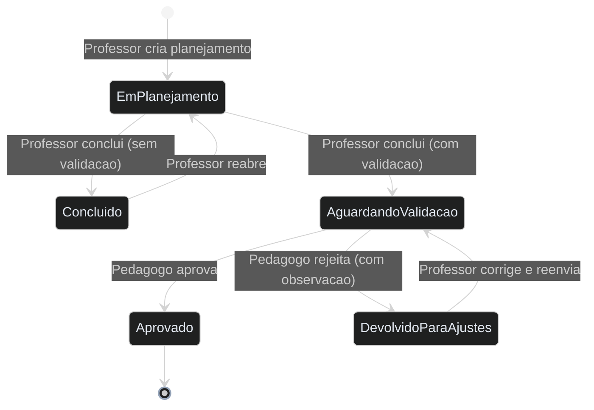
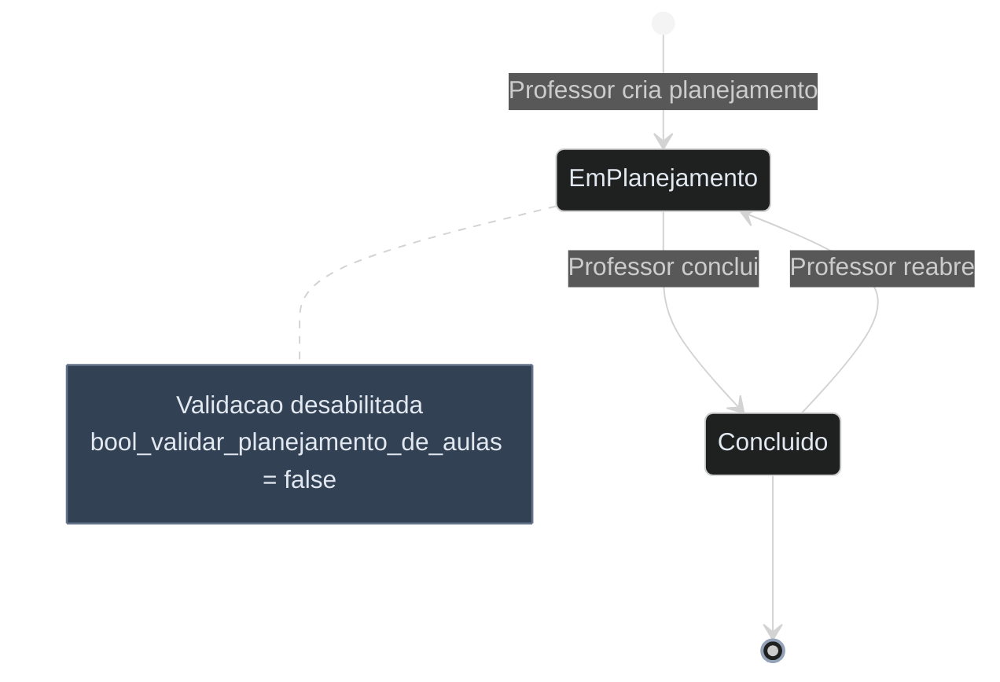
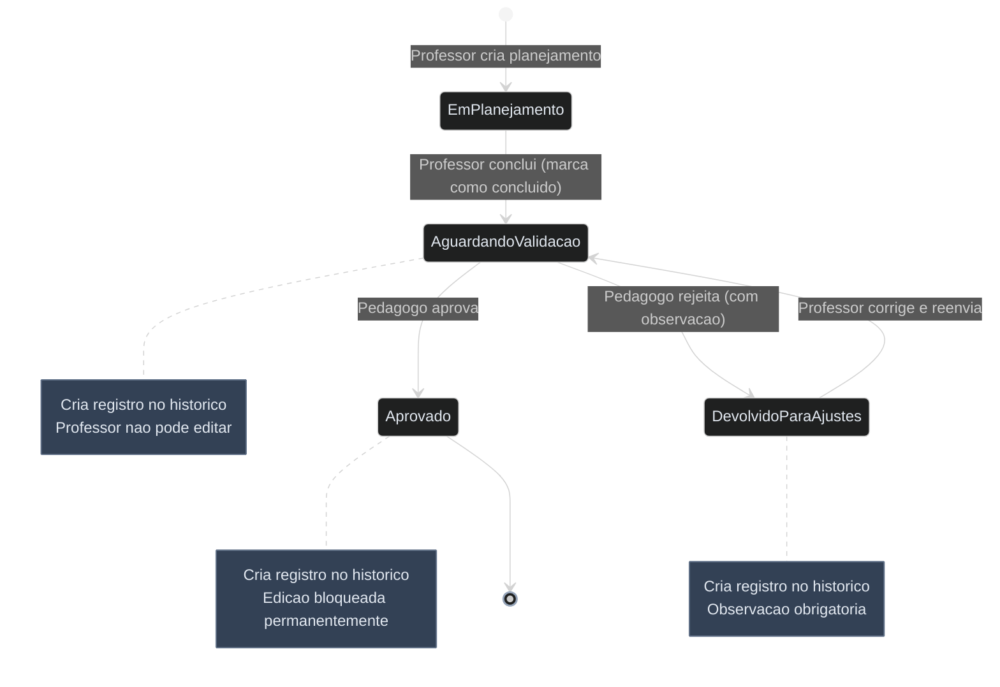

# Diagrama de Estado - Planejamento de Aulas

**Modulo:** Academico
**Model:** `SISP/app/Modelos/Academico/PlanejamentoDeAulas.php`
**Enum:** `SISP/app/Extras/Enums/Academico/SituacaoPlanejamentoDeAulaEnum.php`
**Campo de status:** `int_situacao` (int) — controlado via `SituacaoPlanejamentoDeAulaEnum`

> **Resumo:** Ciclo de vida do planejamento de aulas, desde a criacao pelo professor ate a validacao pelo pedagogo. O sistema suporta dois modos: sem validacao (simplificado) e com validacao (completo com aprovacao/rejeicao do pedagogo).

## Diagrama Geral (com validacao habilitada)

## Diagrama por Modo

### Modo 1: Sem Validacao (`bool_validar_planejamento_de_aulas = false`)

### Modo 2: Com Validacao (`bool_validar_planejamento_de_aulas = true`)

## Detalhamento dos Estados

| Estado | Valor (`int_situacao`) | Badge | Descricao |
|---|---|---|---|
| Em Planejamento | `1` | `badge-blue` | Estado inicial apos criacao pelo professor |
| Concluido | `2` | `badge-success` | Professor finalizou (modo sem validacao) |
| Aguardando Validacao | `3` | `badge-warning` | Aguardando analise do pedagogo |
| Aprovado | `4` | `badge-success` | Pedagogo aprovou (terminal) |
| Devolvido Para Ajustes | `5` | `badge-danger` | Pedagogo rejeitou, professor deve corrigir |

## Detalhamento das Transicoes

| De | Para | Ator | Condicao | Acao |
|---|---|---|---|---|
| `[*]` | Em Planejamento | Professor | Criar planejamento | — |
| Em Planejamento | Concluido | Professor | Validacao desabilitada (`bool_validar_planejamento_de_aulas = false`) | — |
| Em Planejamento | Aguardando Validacao | Professor | Validacao habilitada, marca como concluido | Cria registro no historico |
| Aguardando Validacao | Aprovado | Pedagogo | Analise OK | Cria registro no historico, bloqueia edicao |
| Aguardando Validacao | Devolvido Para Ajustes | Pedagogo | Analise NOK | Cria registro no historico com observacao obrigatoria |
| Devolvido Para Ajustes | Aguardando Validacao | Professor | Corrige e reenvia | Cria registro no historico |
| Concluido | Em Planejamento | Professor | Reabre para edicao | — |

## Regras de Negocio

- **Modo sem validacao:** Quando `bool_validar_planejamento_de_aulas = false`, o fluxo e simplificado (EM_PLANEJAMENTO -> CONCLUIDO), sem envolvimento do pedagogo
- **Modo com validacao:** Quando `bool_validar_planejamento_de_aulas = true`, o professor conclui e o planejamento aguarda aprovacao do pedagogo
- **Bloqueio apos aprovacao:** Estado APROVADO bloqueia completamente o planejamento (sem edicao nem remocao)
- **Bloqueio durante validacao:** Estado AGUARDANDO_VALIDACAO impede edicao pelo professor ate o pedagogo avaliar
- **Devolvido para ajustes:** Estado DEVOLVIDO_PARA_AJUSTES permite que o professor edite e reenvie para validacao
- **Observacao obrigatoria:** Ao devolver para ajustes, o pedagogo deve informar uma observacao explicando o motivo da rejeicao
- **Historico de validacoes:** Toda transicao entre AGUARDANDO_VALIDACAO, APROVADO e DEVOLVIDO_PARA_AJUSTES cria um registro no historico
