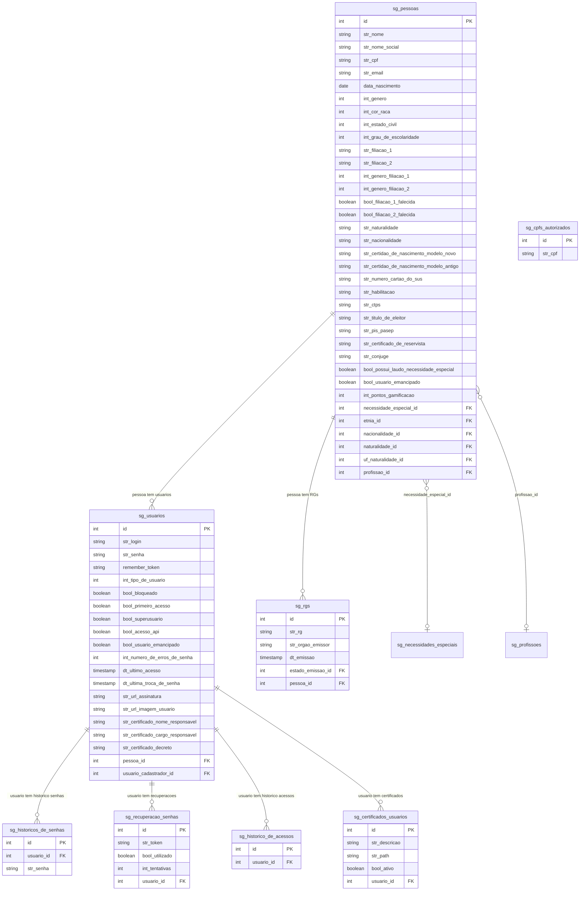
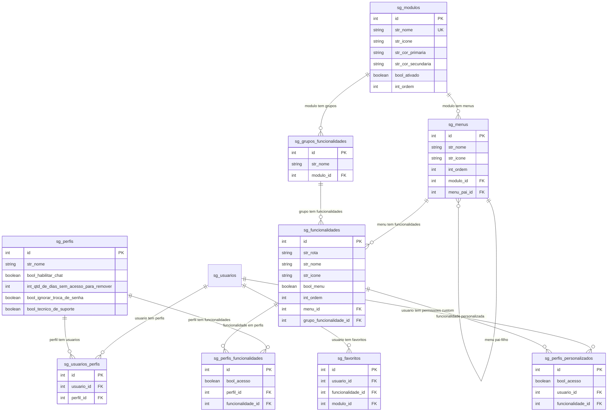
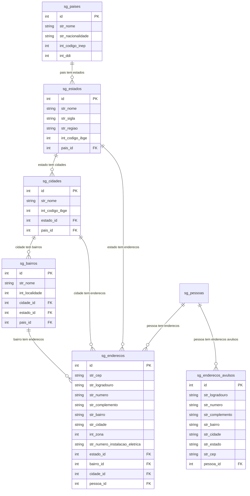
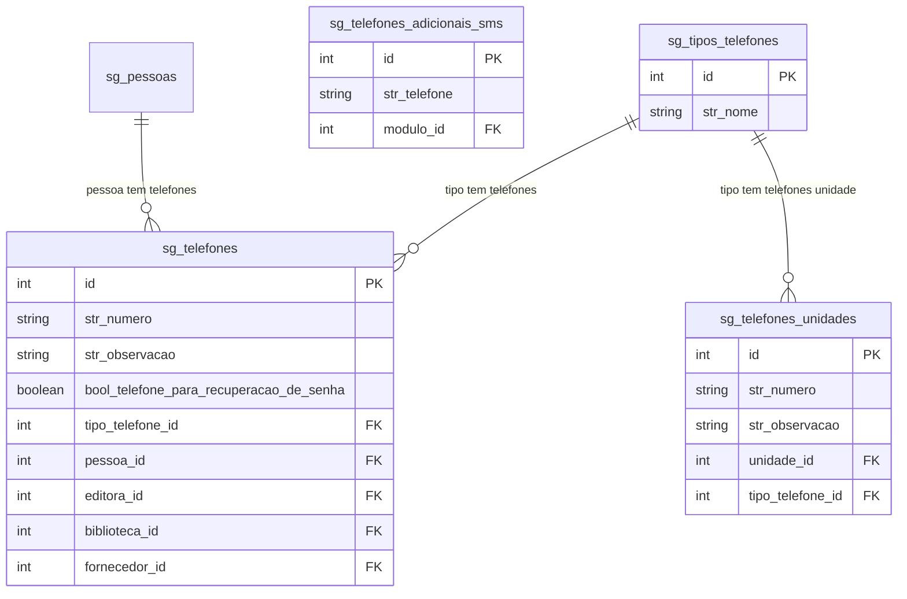
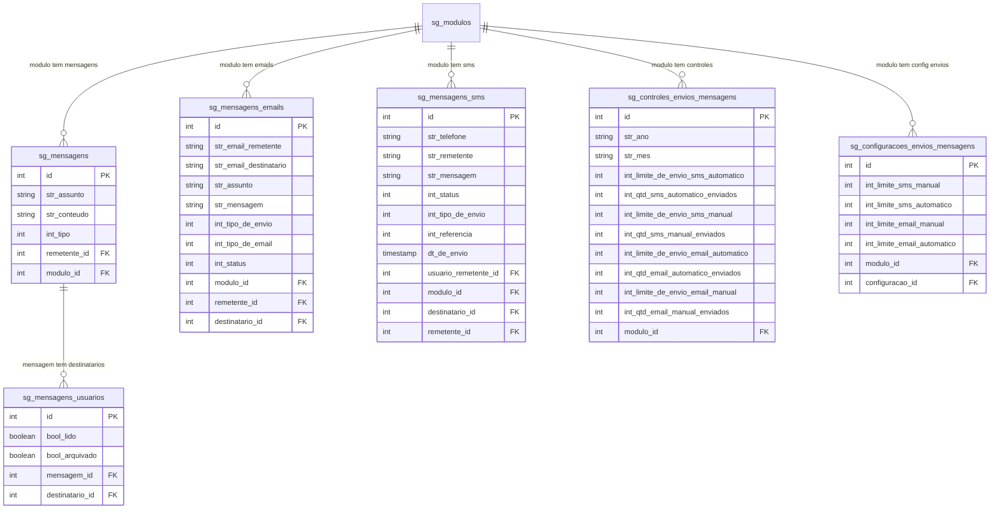
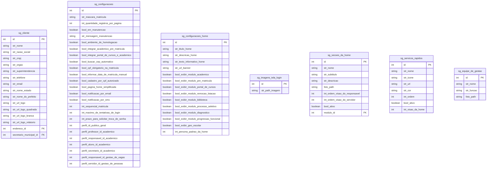
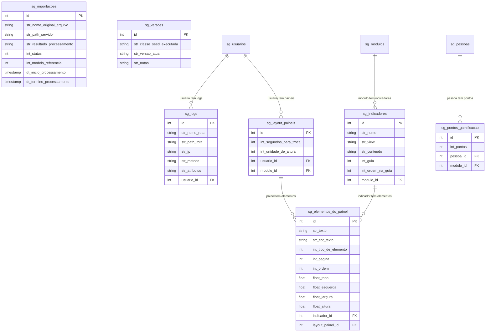
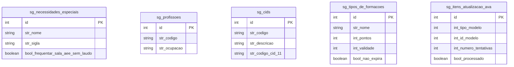

# ER - Modulo Gerenciador (Prefixo: sg_*)

52 tabelas. Base do sistema: pessoas, usuarios, permissoes, localidades, mensagens e configuracoes.

## 1. Pessoas e Usuarios

## 2. Permissoes e Modulos

## 3. Localidades

## 4. Telefones

## 5. Mensagens e Comunicacao

## 6. Configuracoes e Cliente

## 7. Sistema e Operacional

## 8. Tabelas Auxiliares

## Resumo das 52 tabelas sg_*

| Grupo | Tabelas | Quantidade |
|-------|---------|------------|
| Pessoas e Usuarios | sg_pessoas, sg_usuarios, sg_rgs, sg_historicos_de_senhas, sg_recuperacao_senhas, sg_historico_de_acessos, sg_certificados_usuarios, sg_cpfs_autorizados | 8 |
| Permissoes e Modulos | sg_perfis, sg_usuarios_perfis, sg_modulos, sg_menus, sg_funcionalidades, sg_grupos_funcionalidades, sg_perfis_funcionalidades, sg_perfis_personalizados, sg_favoritos | 9 |
| Localidades | sg_paises, sg_estados, sg_cidades, sg_bairros, sg_enderecos, sg_enderecos_avulsos | 6 |
| Telefones | sg_tipos_telefones, sg_telefones, sg_telefones_unidades, sg_telefones_adicionais_sms | 4 |
| Mensagens | sg_mensagens, sg_mensagens_usuarios, sg_mensagens_emails, sg_mensagens_sms, sg_controles_envios_mensagens, sg_configuracoes_envios_mensagens | 6 |
| Configuracoes | sg_cliente, sg_configuracoes, sg_configuracoes_home, sg_imagens_tela_login, sg_secoes_da_home, sg_servicos_rapidos, sg_equipe_de_gestao | 7 |
| Sistema | sg_logs, sg_importacoes, sg_versoes, sg_indicadores, sg_layout_paineis, sg_elementos_do_painel, sg_pontos_gamificacao | 7 |
| Auxiliares | sg_necessidades_especiais, sg_profissoes, sg_cids, sg_tipos_de_formacoes, sg_itens_atualizacao_ava | 5 |
| **Total** | | **52** |
