# ER - Escopo Completo do Aluno

Visao centrada no aluno: pessoa, endereco, estrutura academica, responsaveis, enturmacoes, notas, faltas e todas as tabelas que referenciam diretamente `sa_alunos` ou `sa_enturmacoes`.

> Campos de auditoria (`criado_em`, `atualizado_em`, `removido_em`) omitidos por brevidade.

---

## 1. Pessoa e Endereco (Modulo Gerenciador)

Dados pessoais, endereco, telefone e documentos. Compartilhados entre aluno e responsavel via `pessoa_id`.

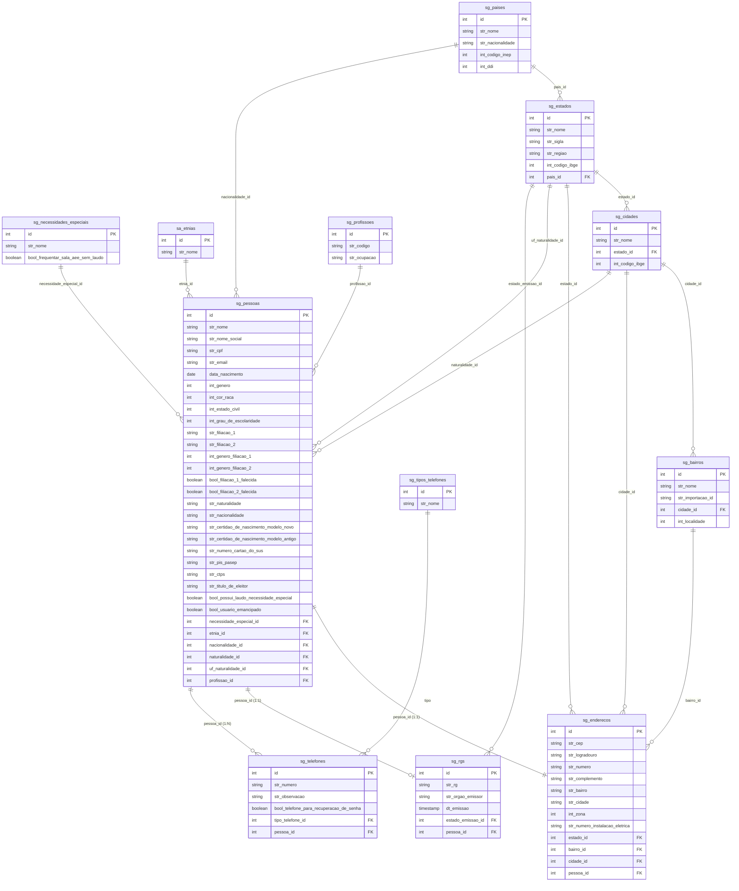

---

## 2. Estrutura Academica (22 tabelas)

Unidades, cursos, periodos letivos, turmas, disciplinas, etapas e demais tabelas estruturais referenciadas pelo escopo do aluno.

```mermaid
erDiagram
    sa_unidades {
        int id PK
        varchar str_nome
        varchar str_codigo_inep
        varchar str_cnpj
        varchar str_email
        varchar str_telefone
        int int_zona_unidade
        boolean bool_status
        int diretor_id FK
        int endereco_id FK
        int secretario_id FK
        int tipo_de_unidade_id FK
        int regiao_id FK
        boolean bool_mantenedora
    }

    sa_cursos {
        int id PK
        varchar str_nome
        varchar str_abreviatura
        int int_estrutura_curricular
        boolean bool_curso_aee
        int curso_sucessor_id FK
    }

    sa_periodos_letivos {
        int id PK
        varchar str_nome
        varchar str_ano
        boolean bool_padrao
        timestamp dt_inicial
        timestamp dt_final
        int secretario_de_educacao_id FK
    }

    sa_turmas {
        int id PK
        varchar str_nome
        boolean bool_ativo
        int int_total_vagas
        int unidade_id FK
        int curso_id FK
        int ano_de_escolaridade_id FK
        int turno_id FK
        int periodo_letivo_id FK
        int grade_curricular_id FK
        int horario_id FK
        int sala_id FK
        boolean bool_multiseriada
        boolean bool_extensao
    }

    sa_disciplinas {
        int id PK
        varchar str_nome
        varchar str_abreviatura
        int area_de_conhecimento_id FK
        smallint int_codigo_inep
    }

    sa_anos_de_escolaridade {
        int id PK
        varchar str_nome
        int int_numero_do_ano_de_escolaridade
        int curso_id FK
        int int_idade_de_referencia
    }

    sa_etapas {
        int id PK
        varchar str_nome
        varchar str_abreviatura
        int int_valor
        timestamp dt_inicial
        timestamp dt_final
        int curso_id FK
        int periodo_letivo_id FK
        int int_tipo_da_etapa
        boolean bool_possui_recuperacao
        int tipo_de_etapa_id FK
    }

    sa_turnos {
        int id PK
        varchar str_nome
        boolean bool_integral
        int tipo_de_turno_id FK
    }

    sa_grades_curriculares {
        int id PK
        varchar str_nome
        int int_status
        int curso_id FK
        int periodo_letivo_id FK
    }

    sa_grades_curriculares_disciplinas {
        int grade_curricular_id PK "FK"
        int disciplina_id PK "FK"
        int ano_de_escolaridade_id PK "FK"
        boolean bool_apura_nota
        boolean bool_apura_falta
        int int_carga_horaria
        int arredondamento_id FK
        boolean bool_avaliar_em_conceito
    }

    sa_professores {
        int id PK
        int pessoa_id FK
        boolean bool_ativo
    }

    sa_aulas {
        int id PK
        varchar str_conteudo
        timestamp dt_aula
        int disciplina_id FK
        int turma_id FK
        int professor_id FK
        int horario_aula_id FK
        boolean bool_aula_dada
        boolean bool_eletiva
        int grupo_de_aula_id FK
    }

    sa_tipos_de_unidades {
        int id PK
        varchar str_nome
    }

    sa_regioes {
        int id PK
        varchar str_nome
        int periodo_letivo_id FK
        int curso_id FK
    }

    sa_salas {
        int id PK
        varchar str_nome
        int periodo_letivo_id FK
        int unidade_id FK
        int int_capacidade
        float float_comprimento
        float float_largura
        float float_metragem
        int int_pavimento
        boolean bool_possui_acessibilidade
        boolean bool_ativo
    }

    sa_horarios {
        int id PK
        varchar str_nome
        int turno_id FK
        int int_minutos_hora_aula
    }

    sa_areas_de_conhecimento {
        int id PK
        varchar str_nome
        varchar str_descricao
        int area_principal_id FK
    }

    sa_tipos_de_turnos {
        int id PK
        varchar str_nome
    }

    sa_tipos_de_etapas {
        int id PK
        varchar str_nome
        boolean bool_resultado_final
        boolean bool_recuperacao_final
    }

    sa_arredondamentos {
        int id PK
        varchar str_nome
    }

    sa_horarios_aulas {
        int id PK
        varchar str_hora_inicial
        varchar str_hora_final
        int int_dia_da_semana
        int horario_id FK
        int int_sequencial_aula
    }

    sa_grupos_de_aulas {
        int id PK
        timestamp dt_aula
        int turma_id FK
        int professor_id FK
        int horario_aula_id FK
        varchar str_conteudo
        varchar str_observacao
    }

    sa_cursos ||--o{ sa_anos_de_escolaridade : "anos do curso"
    sa_cursos ||--o{ sa_etapas : "etapas do curso"
    sa_cursos ||--o{ sa_grades_curriculares : "grades"
    sa_grades_curriculares ||--o{ sa_grades_curriculares_disciplinas : "disciplinas da grade"
    sa_disciplinas ||--o{ sa_grades_curriculares_disciplinas : "em grades"
    sa_unidades ||--o{ sa_turmas : "turmas da unidade"
    sa_anos_de_escolaridade ||--o{ sa_turmas : "ano da turma"
    sa_turnos ||--o{ sa_turmas : "turno"
    sa_turmas ||--o{ sa_aulas : "aulas da turma"
    sa_disciplinas ||--o{ sa_aulas : "disciplina da aula"
    sa_professores ||--o{ sa_aulas : "professor da aula"
    sa_tipos_de_unidades ||--o{ sa_unidades : "tipo_de_unidade_id"
    sa_regioes ||--o{ sa_unidades : "regiao_id"
    sa_salas ||--o{ sa_turmas : "sala_id"
    sa_horarios ||--o{ sa_turmas : "horario_id"
    sa_areas_de_conhecimento ||--o{ sa_disciplinas : "area_de_conhecimento_id"
    sa_tipos_de_turnos ||--o{ sa_turnos : "tipo_de_turno_id"
    sa_tipos_de_etapas ||--o{ sa_etapas : "tipo_de_etapa_id"
    sa_arredondamentos ||--o{ sa_grades_curriculares_disciplinas : "arredondamento_id"
    sa_horarios ||--o{ sa_horarios_aulas : "horario_id"
    sa_horarios_aulas ||--o{ sa_aulas : "horario_aula_id"
    sa_grupos_de_aulas ||--o{ sa_aulas : "grupo_de_aula_id"
    sa_periodos_letivos ||--o{ sa_turmas : "periodo_letivo_id"
    sa_grades_curriculares ||--o{ sa_turmas : "grade_curricular_id"
    sa_cursos ||--o{ sa_turmas : "curso_id"
    sa_periodos_letivos ||--o{ sa_etapas : "periodo_letivo_id"
    sa_periodos_letivos ||--o{ sa_grades_curriculares : "periodo_letivo_id"
    sa_anos_de_escolaridade ||--o{ sa_grades_curriculares_disciplinas : "ano_de_escolaridade_id"
```

---

## 3. Aluno (12 tabelas)

Cadastro do aluno, deficiencias, documentacao e carteirinha.

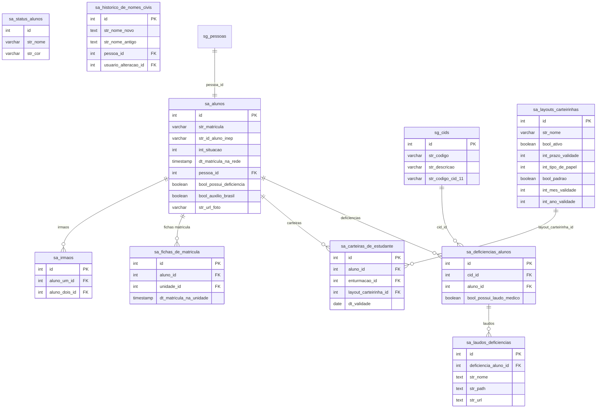

Tabela auxiliar: `sa_agendamento_de_atendimento_especializado` (aluno_id FK).

---

## 4. Responsaveis (5 tabelas)

Responsaveis legais, academicos e responsaveis pela saida do aluno.

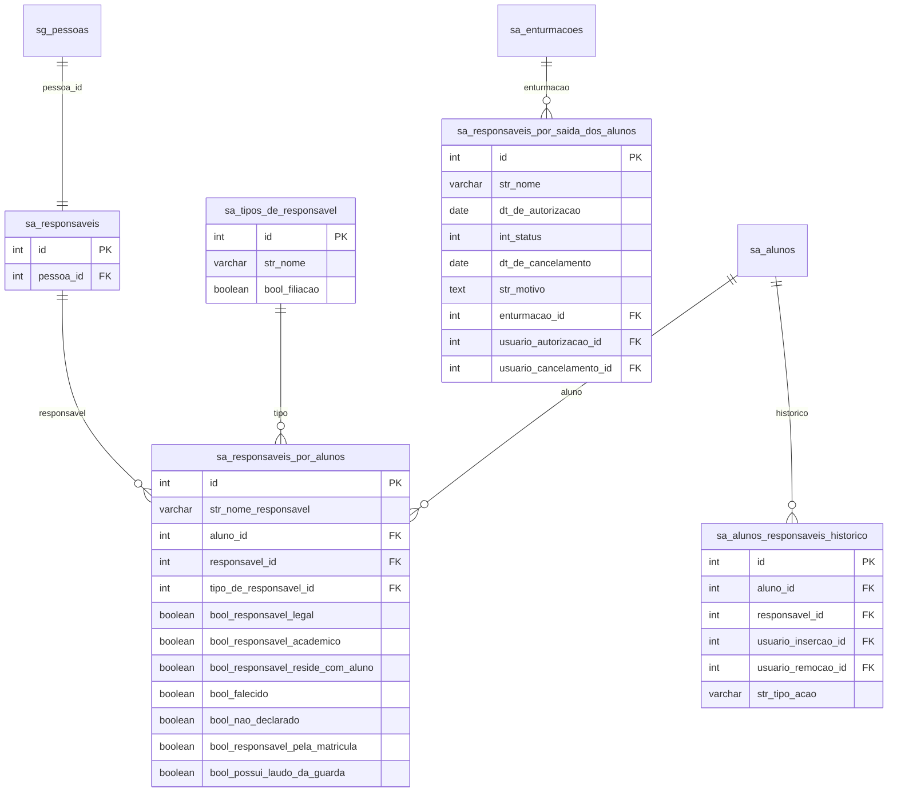

---

## 5. Enturmacao (5 tabelas)

Vinculo do aluno a turma, curso e periodo letivo. Tabela central que conecta o aluno ao contexto academico.

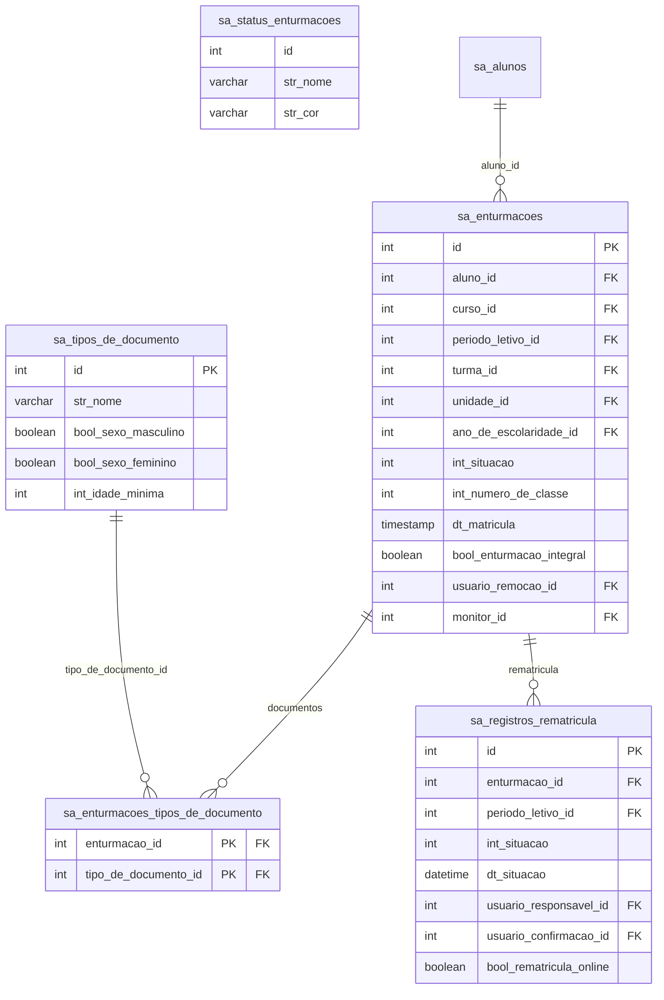

Tabela auxiliar: `sa_respostas_fichas_de_acompanhamento` (enturmacao_id FK).

---

## 6. Notas e Avaliacoes (12 tabelas)

Fichas de disciplina, avaliacoes, notas e conselho de classe — todos vinculados a enturmacao.

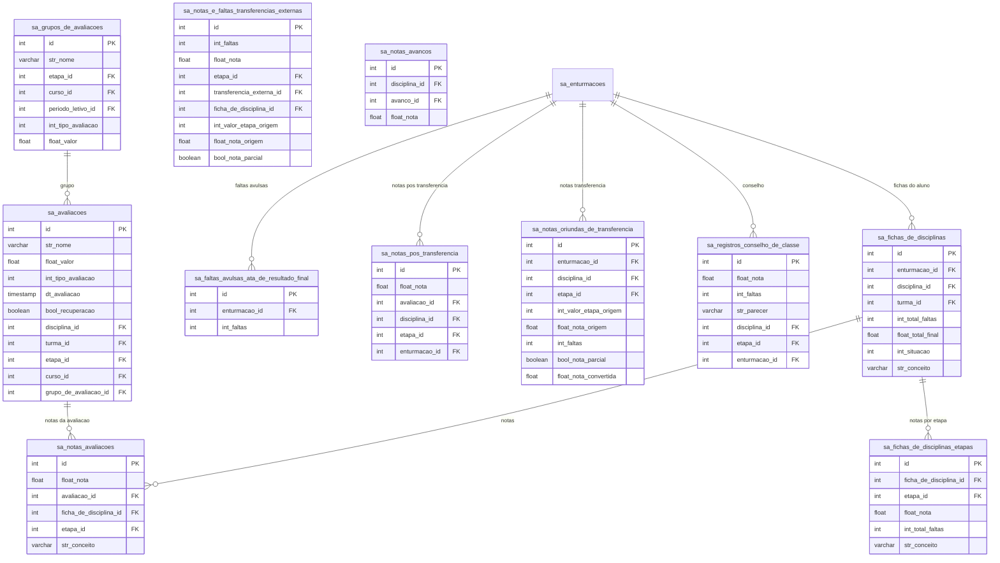

Tabela auxiliar: `sa_solicitacoes_de_calculo_de_notas`.

---

## 7. Frequencia e Faltas (5 tabelas)

Registro de presencas vinculadas a aula e faltas diarias independentes de aula.

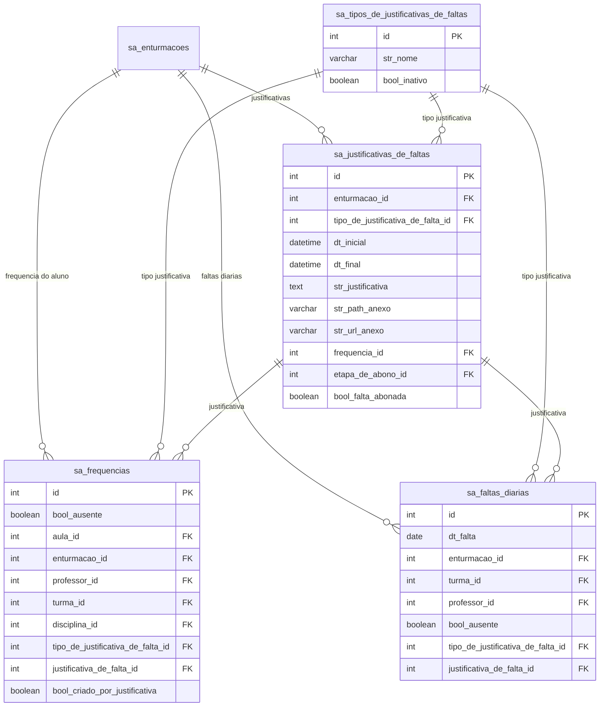

---

## 8. Movimentacao do Aluno (10 tabelas)

Transferencias, cancelamentos, desistencias, evasoes, avancos e encaminhamentos — todos vinculados a enturmacao.

```mermaid
erDiagram
    sa_pedidos_de_transferencia {
        int id PK
        int int_status
        varchar str_justificativa
        timestamp dt_transferencia
        int enturmacao_origem_id FK
        int enturmacao_destino_id FK
        int unidade_origem_id FK
        int unidade_destino_id FK
        boolean bool_aceite_unidade_origem
        boolean bool_aceite_unidade_destino
    }

    sa_transferencias_externas {
        int id PK
        varchar str_motivo
        timestamp dt_transferencia
        int enturmacao_id FK
        int usuario_executor_id FK
    }

    sa_transferencias_entre_cursos {
        int id PK
        text str_justificativa
        date dt_transferencia
        int enturmacao_origem_id FK
        int enturmacao_destino_id FK
        int usuario_executor_id FK
        int periodo_letivo_id FK
        int unidade_id FK
        int curso_id FK
    }

    sa_cancelamentos {
        int id PK
        int enturmacao_id FK
        timestamp dt_saida
        datetime dt_retorno
        text str_motivo
        int usuario_id FK
    }

    sa_desistencias {
        int id PK
        int enturmacao_id FK
        timestamp dt_saida
        text str_motivo
    }

    sa_evasoes {
        int id PK
        int enturmacao_id FK
        timestamp dt_saida
        text str_motivo
    }

    sa_avancos {
        int id PK
        varchar str_parecer
        int enturmacao_origem_id FK
        int enturmacao_destino_id FK
        int int_tipo_avanco
        datetime dt_avanco
    }

    sa_encaminhamentos_entre_periodos_letivos {
        int id PK
        int int_situacao
        int enturmacao_origem_id FK
        int enturmacao_destino_id FK
        int periodo_letivo_destino_id FK
        int ano_de_escolaridade_destino_id FK
        int unidade_destino_id FK
        int usuario_solicitante_id FK
        int usuario_receptor_id FK
    }

    sa_ocorrencias {
        int id PK
        int enturmacao_id FK
        date dt_ocorrencia
        int tipo_de_ocorrencia_id FK
        varchar str_observacao
        varchar str_orientacao
        boolean bool_visivel_ao_aluno_responsavel
        int disciplina_id FK
        int etapa_id FK
        int usuario_id FK
    }

    sa_tipos_de_ocorrencias {
        int id PK
        varchar str_nome
        int int_categoria
        boolean bool_inativo
    }

    sa_enturmacoes ||--o{ sa_pedidos_de_transferencia : "origem/destino"
    sa_enturmacoes ||--o{ sa_transferencias_externas : "transferencia"
    sa_enturmacoes ||--o{ sa_transferencias_entre_cursos : "origem/destino"
    sa_enturmacoes ||--o{ sa_cancelamentos : "cancelamento"
    sa_enturmacoes ||--o{ sa_desistencias : "desistencia"
    sa_enturmacoes ||--o{ sa_evasoes : "evasao"
    sa_enturmacoes ||--o{ sa_avancos : "avanco"
    sa_enturmacoes ||--o{ sa_encaminhamentos_entre_periodos_letivos : "encaminhamento"
    sa_enturmacoes ||--o{ sa_ocorrencias : "ocorrencia"
    sa_tipos_de_ocorrencias ||--o{ sa_ocorrencias : "tipo_de_ocorrencia_id"
```

Tabelas complementares: `sa_historico_remanejamentos`, `sa_pedidos_de_transferencia_responsavel`, `sa_status_pedidos_de_transferencia_responsavel`, `sa_anexos_do_avanco`, `sa_regras_de_encaminhamento`, `sa_regras_de_encaminhamento_unidade`, `sa_regras_de_encaminhamento_necessidade_especial`.

---

## 9. Historico Escolar (5 tabelas)

Documentacao do historico escolar do aluno.

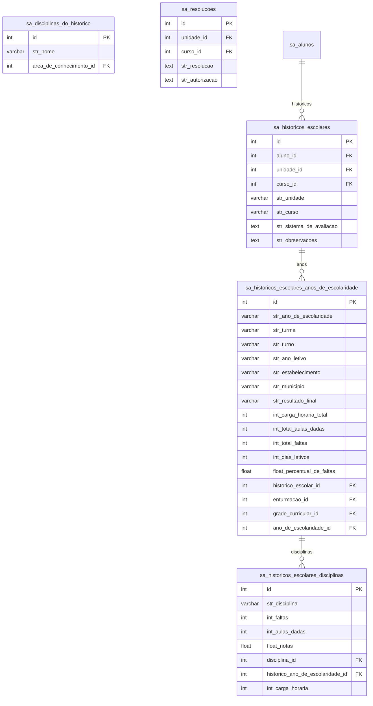

---

## 10. Ambiente Virtual - Dados do Aluno (5 tabelas)

Progresso, respostas e acessos do aluno no AVA — todos vinculados a enturmacao.

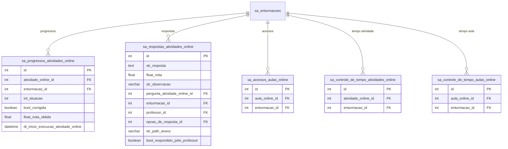

---

## 11. Quesitos Descritivos e Gamificacao (3 tabelas)

Respostas de avaliacao descritiva e conquistas de gamificacao — vinculados a enturmacao.

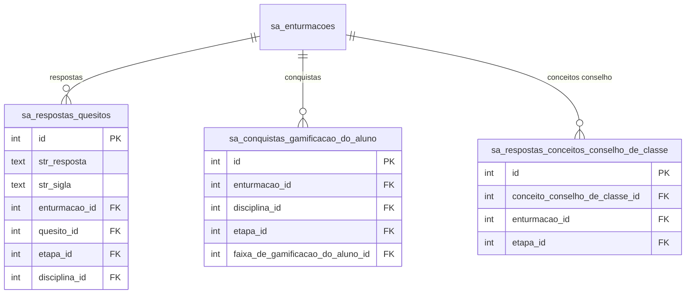

Tabela auxiliar: `sa_respostas_quesitos_por_turma` (turma_id FK, etapa_id FK).

---

## 12. Avaliacoes Especiais do Aluno (3 tabelas)

Anamnese, PEI e atendimento especializado — vinculados diretamente a aluno_id.

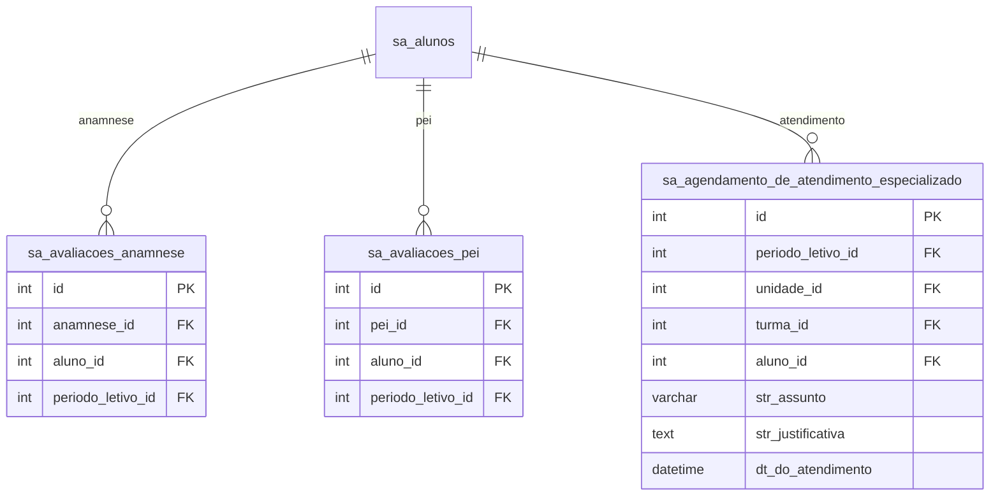

Tabela auxiliar: `sa_avaliacoes_anamnese_dos_alunos` (aluno_id FK).

---

## 13. Enums do Modulo Academico

Valores possiveis para colunas `int_situacao`, `int_status`, `int_tipo_*` e similares. Fonte: `app/Extras/Enums/Academico/`.

### Aluno e Enturmacao

| Enum | Coluna | Valores |
|---|---|---|
| **StatusAlunoEnum** | `sa_alunos.int_situacao` | 1=Regular, 2=Falecido |
| **StatusEnturmacaoEnum** | `sa_enturmacoes.int_situacao` | 1=Regular, 2=Pendente, 3=Transferido fora da rede, 4=Transferido dentro da rede, 5=Remanejado, 6=Cancelado, 7=Desistente, 8=Falecido, 9=Aprovado, 10=Reprovado, 11=Reprovado por nota, 12=Reprovado por falta, 13=Avancado, 14=Reclassificado, 15=Evadido, 16=Transferido entre cursos, 17=Transferencia pendente |
| **SituacaoRegistroRematriculaEnum** | `sa_registros_rematricula.int_situacao` | 1=Pendente, 2=Em validacao da unidade, 3=Aceito, 4=Rejeitado |

### Notas e Avaliacoes

| Enum | Coluna | Valores |
|---|---|---|
| **TipoDeAvaliacaoEnum** | `sa_avaliacoes.int_tipo_avaliacao` | 1=Atividade, 2=Prova |
| **SituacaoSolicitacaoDeCalculoDeNotasEnum** | `sa_solicitacoes_de_calculo_de_notas.int_situacao` | 1=Aguardando processamento, 2=Processando, 3=Erro ao processar, 4=Concluido |
| **TipoDeRespostaConceitoConselhoDeClasseEnum** | `sa_conceitos_conselho_de_classe.int_tipo_resposta` | 1=Texto, 2=Checkbox |

### Frequencia e Faltas

> Colunas `bool_ausente` em `sa_frequencias` e `sa_faltas_diarias` sao booleanas (true=falta, false=presenca), nao enums.

### Movimentacao

| Enum | Coluna | Valores |
|---|---|---|
| **StatusPedidoDeTransferenciaEnum** | `sa_pedidos_de_transferencia.int_status` | 1=Pendente, 2=Concluido, 3=Cancelado, 4=Rejeitado |
| **SolicitantePedidoDeTransferenciaEnum** | `sa_pedidos_de_transferencia.int_solicitante` | 1=Unidade origem, 2=Unidade destino |
| **StatusPedidoDeTransferenciaResponsavelEnum** | `sa_pedidos_de_transferencia_responsavel.int_status` | 1=Aguardando convocacao, 2=Convocado, 3=Concluido, 4=Cancelado, 5=Rejeitado |
| **TipoDeAvancoEnum** | `sa_avancos.int_tipo_avanco` | 1=Avanco, 2=Reclassificacao |
| **SituacaoEncaminhamentoEntrePeriodoLetivoEnum** | `sa_encaminhamentos_entre_periodos_letivos.int_situacao` | 1=Pendente, 2=Aceito, 3=Rejeitado |
| **CategoriaDaOcorrenciaEnum** | `sa_ocorrencias.int_categoria` | 1=Comportamental, 2=Pedagogica |
| **StatusAutorizacaoDeSaidaDoAluno** | `sa_responsaveis_por_saida_dos_alunos.int_status` | 1=Autorizado, 2=Cancelado |

### Historico Escolar

| Enum | Coluna | Valores |
|---|---|---|
| **TipoDeSituacaoAcademicaDoHistoricoEnum** | `sa_historicos_escolares` | 1=Aprovacao, 2=Reprovacao, 3=Evasao, 4=Desistencia, 5=Avanco, 6=Reclassificacao |

### Ambiente Virtual (AVA)

| Enum | Coluna | Valores |
|---|---|---|
| **ProgressoAtividadeOnlineEnum** | `sa_progressos_atividades_online.int_situacao` | 1=Nao iniciada, 2=Em andamento, 3=Finalizada, 4=Nao respondido no prazo |

### Estrutura Academica

| Enum | Coluna | Valores |
|---|---|---|
| **StatusGradeCurricularEnum** | `sa_grades_curriculares.int_status` | 1=Ativo, 2=Inativo |
| **TipoDaEtapaEnum** | `sa_etapas.int_tipo_da_etapa` | 1=Regular, 2=Recuperacao final, 3=Resultado final |
| **EstruturaCurricularEnum** | `sa_cursos.int_estrutura_curricular` | 1=Formacao geral basica, 2=Itinerario informativo, 3=Nao se aplica |
| **ModalidadeDeEnsinoEnum** | `sa_cursos.int_modalidade_de_ensino` | 1=Ensino regular, 2=Educacao especial, 3=EJA, 4=Educacao profissional |
| **MetodologiaDeEnsinoEnum** | `sa_cursos.int_metodologia_de_ensino` | 1=Presencial, 2=Semipresencial, 3=EAD |
| **FormaDeOrganizacaoDaTurmaEnum** | `sa_turmas.int_forma_de_organizacao` | 1=Serie/Ano, 2=Periodo semestral, 3=Ciclo, 4=Grupo nao seriado, 5=Modulo |
| **TipoDeAtendimentoEnsinoEnum** | `sa_turmas.int_tipo_de_atendimento_ensino` | 1=Escolarizacao, 2=AEE, 3=Atividade complementar |
| **DiaDaSemanaEnum** | `sa_horarios_aulas.int_dia_da_semana` | 1=Segunda, 2=Terca, 3=Quarta, 4=Quinta, 5=Sexta, 6=Sabado, 7=Domingo |

### Quesitos e Campos Personalizados

| Enum | Coluna | Valores |
|---|---|---|
| **QuesitoEnum** | `sa_quesitos.int_tipo_resposta` | 1=Texto, 2=Selecao, 3=Imagem |
| **CampoPersonalizadoEnum** | `sa_campos_personalizados.int_tipo_resposta` | 1=Texto, 2=Selecao |

---

## Resumo

| # | Grupo | Tabelas | Vinculo |
|---|---|---|---|
| 1 | Pessoa e Endereco | 12 | sg_pessoas.id (base) |
| 2 | Estrutura Academica | 22 | Unidades, cursos, turmas, disciplinas, etapas |
| 3 | Aluno | 12 | sa_alunos.pessoa_id → sg_pessoas |
| 4 | Responsaveis | 5 | sa_alunos.id |
| 5 | Enturmacao | 5 | sa_alunos.id → sa_enturmacoes |
| 6 | Notas e Avaliacoes | 12 | sa_enturmacoes.id |
| 7 | Frequencia e Faltas | 5 | sa_enturmacoes.id |
| 8 | Movimentacao | 10 | sa_enturmacoes.id |
| 9 | Historico Escolar | 5 | sa_alunos.id |
| 10 | AVA - Dados do Aluno | 5 | sa_enturmacoes.id |
| 11 | Quesitos e Gamificacao | 3 | sa_enturmacoes.id |
| 12 | Avaliacoes Especiais | 3 | sa_alunos.id |
| 13 | Enums | — | Referencia de valores inteiros |
| | **TOTAL** | **99** | |
