# ER - Modulo Academico (Prefixo: sa_*)

Coracao do sistema educacional: 259 tabelas (+ 33 de censo + 3 portal do professor + 6 legado SISLAME) organizadas em 20 grupos logicos.

> Fonte: consulta direta ao banco PostgreSQL. Campos de auditoria (`criado_em`, `atualizado_em`, `removido_em`) omitidos por brevidade.

---

## 1. Alunos e Responsaveis (14 tabelas)

Cadastro de alunos, responsaveis, deficiencias e documentacao.

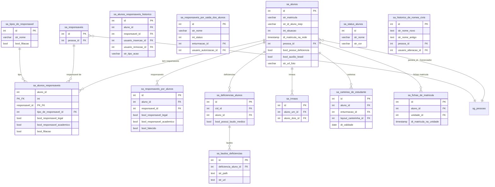

---

## 2. Unidades e Estrutura (18 tabelas)

Escolas, cursos, periodos letivos, turnos e regioes.

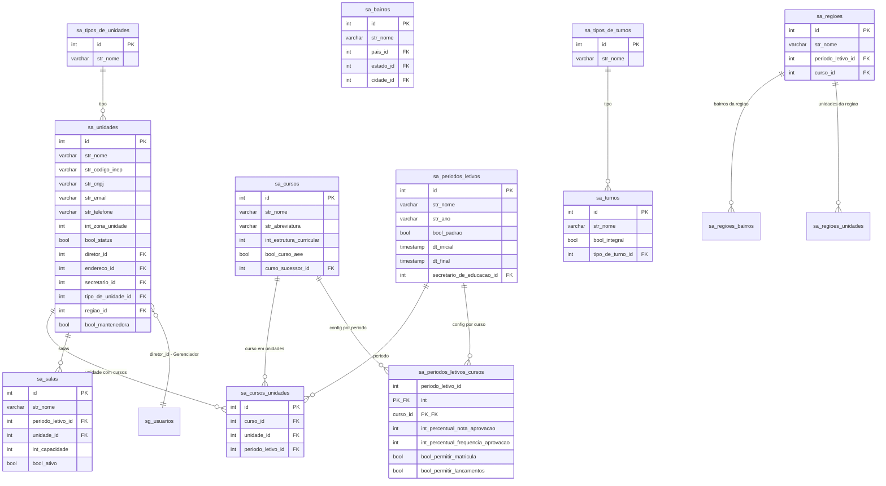

Tabelas pivot adicionais: `sa_regioes_bairros`, `sa_regioes_unidades`, `sa_unidades_bairros`, `sa_unidades_bairros_cursos_periodos_letivos`, `sa_unidades_usuarios`, `sa_unidades_usuarios_ambiente_online`, `sa_unidades_historico`, `sa_cursos_modelos_de_documentos`, `sa_cursos_tipos_de_documento`.

---

## 3. Turmas e Enturmacoes (12 tabelas)

Turmas, anos de escolaridade, enturmacao de alunos e vinculos profissionais.

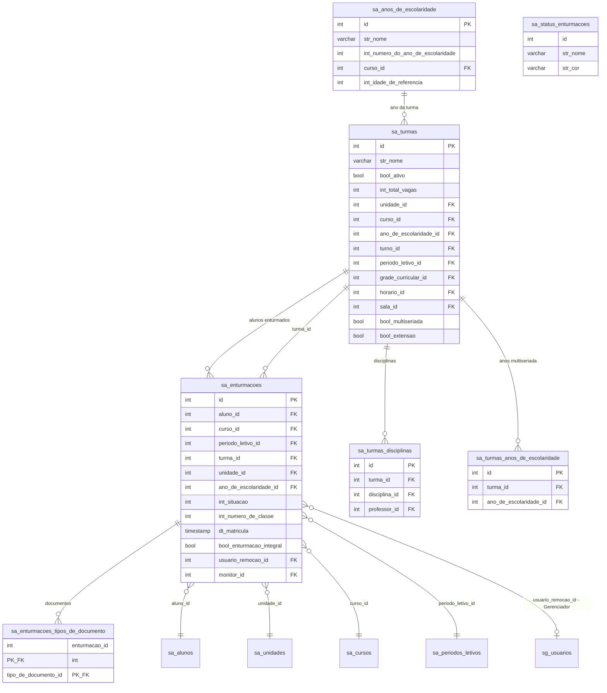

Tabelas pivot profissionais por turma: `sa_turmas_coordenadores_de_ensino`, `sa_turmas_inspetores_escolares`, `sa_turmas_monitores`, `sa_turmas_pedagogos`, `sa_turmas_professores_especialistas`.

---

## 4. Disciplinas e Grades Curriculares (13 tabelas)

Disciplinas, areas de conhecimento, grades curriculares e etapas.

```mermaid
erDiagram
    sa_disciplinas {
        int id PK
        varchar str_nome
        varchar str_abreviatura
        int area_de_conhecimento_id FK
        smallint int_codigo_inep
    }

    sa_areas_de_conhecimento {
        int id PK
        varchar str_nome
        int area_principal_id FK
    }

    sa_grades_curriculares {
        int id PK
        varchar str_nome
        int int_status
        int curso_id FK
        int periodo_letivo_id FK
    }

    sa_grades_curriculares_disciplinas {
        int grade_curricular_id PK_FK
        int disciplina_id PK_FK
        int ano_de_escolaridade_id PK_FK
        bool bool_apura_nota
        bool bool_apura_falta
        int int_carga_horaria
        int arredondamento_id FK
        bool bool_avaliar_em_conceito
    }

    sa_grades_curriculares_eletivas {
        int grade_curricular_id FK
        int disciplina_id FK
        int ano_de_escolaridade_id FK
        int etapa_id FK
        bool bool_apura_frequencia
        int int_carga_horaria
        int int_minutos_equivalente_aula
        int base_de_conhecimento_id FK
        int disciplina_referencia_id FK
        bool bool_considerar_nota_para_resultado_final
        bool bool_considerar_falta_para_resultado_final
    }

    sa_etapas {
        int id PK
        varchar str_nome
        varchar str_abreviatura
        int int_valor
        timestamp dt_inicial
        timestamp dt_final
        int curso_id FK
        int periodo_letivo_id FK
        int int_tipo_da_etapa
        bool bool_possui_recuperacao
        int tipo_de_etapa_id FK
    }

    sa_tipos_de_etapas {
        int id PK
        varchar str_nome
        bool bool_resultado_final
        bool bool_recuperacao_final
    }

    sa_etapas_disciplinas {
        int id PK
        int etapa_id FK
        int disciplina_id FK
        float float_nota_maxima_bnc
    }

    sa_etapas_unidades {
        int id PK
        int etapa_id FK
        int unidade_id FK
        timestamp dt_inicial
        timestamp dt_final
    }

    sa_areas_de_conhecimento ||--o{ sa_disciplinas : "area"
    sa_grades_curriculares ||--o{ sa_grades_curriculares_disciplinas : "disciplinas"
    sa_disciplinas ||--o{ sa_grades_curriculares_disciplinas : "em grades"
    sa_grades_curriculares ||--o{ sa_grades_curriculares_eletivas : "eletivas"
    sa_etapas ||--o{ sa_etapas_disciplinas : "disciplinas da etapa"
    sa_etapas ||--o{ sa_etapas_unidades : "datas por unidade"
    sa_tipos_de_etapas ||--o{ sa_etapas : "tipo"
    sa_cursos ||--o{ sa_grades_curriculares : "grade do curso"
    sa_cursos ||--o{ sa_etapas : "etapas do curso"
```

Tabelas auxiliares: `sa_disciplinas_referenciais`, `sa_etapas_por_tela`, `sa_observacoes_das_disciplinas_eletivas`, `sa_observacoes_das_turmas`.

---

## 5. Notas e Avaliacoes (20 tabelas)

Lancamento de notas, avaliacoes, fichas de disciplina e arredondamentos.

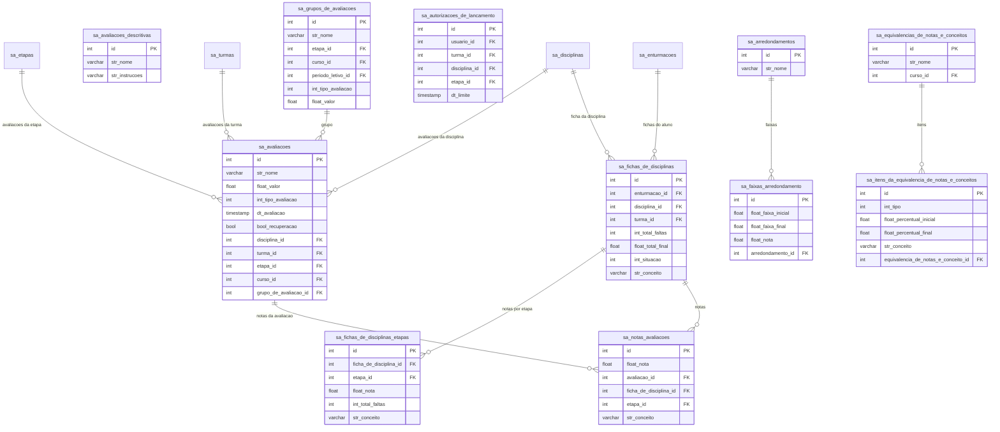

Tabelas complementares: `sa_avaliacoes_descritivas_etapas`, `sa_vinculos_avaliacoes_descritivas`, `sa_faixas_de_proficiencia`, `sa_solicitacoes_de_calculo_de_notas`, `sa_notas_oriundas_de_transferencia`, `sa_notas_pos_transferencia`, `sa_notas_e_faltas_transferencias_externas`, `sa_notas_avancos`, `sa_faltas_avulsas_ata_de_resultado_final`.

---

## 6. Frequencia (4 tabelas)

Registro de presencas, faltas e justificativas.

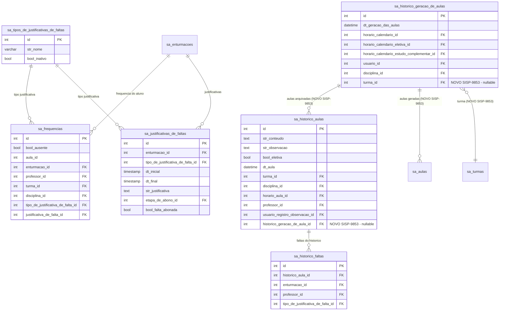

---

## 7. Aulas e Horarios (18 tabelas)

Registro de aulas, horarios, calendarios academicos e escolares.

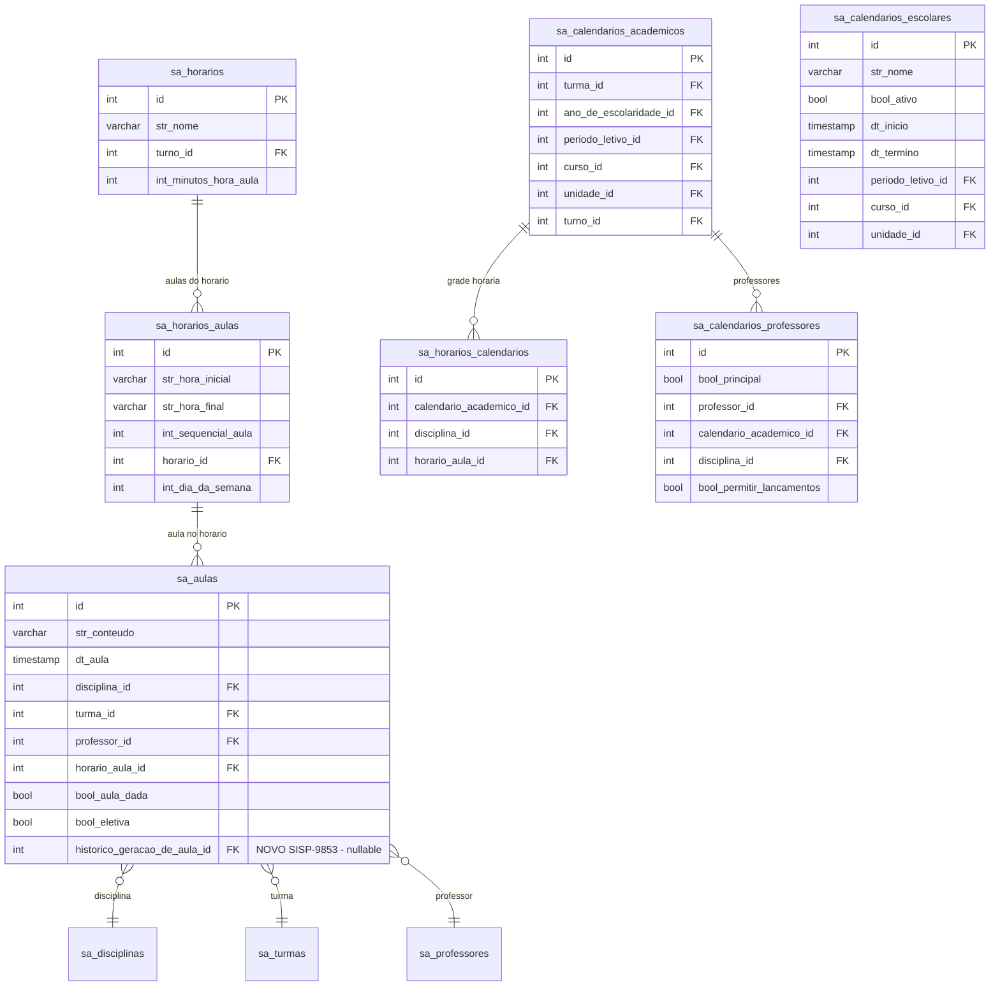

Tabelas complementares: `sa_aulas_complementares`, `sa_calendarios_academicos_eletivas`, `sa_calendarios_escolares_periodos_letivos_cursos`, `sa_horarios_calendarios_eletivas`, `sa_horarios_calendario_de_estudo_complementar`, `sa_horarios_quadros_de_atendimento`, `sa_quadros_de_atendimento`, `sa_atividades_complementares`, `sa_historico_disciplinas_horarios_calendarios`.

---

## 8. Profissionais (12 tabelas)

Professores, diretores, coordenadores e demais profissionais da educacao.

```mermaid
erDiagram
    sa_professores {
        int id PK
        int pessoa_id FK
        bool bool_ativo
    }

    sa_professores_especialistas {
        int id PK
        int pessoa_id FK
        bool bool_ativo
    }

    sa_diretores {
        int id PK
        int pessoa_id FK
        bool bool_ativo
    }

    sa_secretarios {
        int id PK
        int pessoa_id FK
        bool bool_ativo
        varchar str_autorizacao
    }

    sa_coordenadores_de_ensino {
        int id PK
        int pessoa_id FK
        bool bool_ativo
    }

    sa_inspetores_escolares {
        int id PK
        int pessoa_id FK
        bool bool_ativo
    }

    sa_pedagogos {
        int id PK
        int pessoa_id FK
        bool bool_ativo
    }

    sa_monitores {
        int id PK
        int pessoa_id FK
        bool bool_ativo
        int int_forma_de_ingresso
    }

    sa_auxiliares_de_secretaria {
        int id PK
        int pessoa_id FK
        bool bool_ativo
    }

    sa_gestores {
        int id PK
        int pessoa_id FK
        bool bool_ativo
    }

    sa_professores }o--|| sg_pessoas : "pessoa_id - Gerenciador"
    sa_diretores }o--|| sg_pessoas : "pessoa_id - Gerenciador"
    sa_secretarios }o--|| sg_pessoas : "pessoa_id - Gerenciador"
    sa_coordenadores_de_ensino }o--|| sg_pessoas : "pessoa_id - Gerenciador"
    sa_pedagogos }o--|| sg_pessoas : "pessoa_id - Gerenciador"
    sa_monitores }o--|| sg_pessoas : "pessoa_id - Gerenciador"
```

Tabelas adicionais: `sa_professores_secundarios`, `sa_professores_calendarios_eletivas`.

---

## 9. Movimentacao de Alunos (15 tabelas)

Transferencias, cancelamentos, desistencias, evasoes, avancos e encaminhamentos.

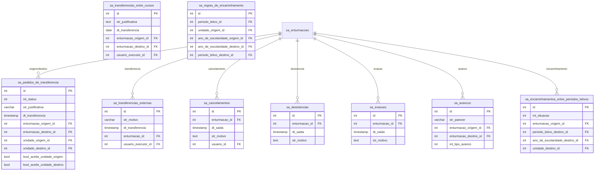

Tabelas complementares: `sa_pedidos_de_transferencia_responsavel`, `sa_anexos_do_avanco`, `sa_notas_avancos`, `sa_regras_de_encaminhamento_necessidade_especial`, `sa_regras_de_encaminhamento_unidade`, `sa_historico_remanejamentos`, `sa_status_pedidos_de_transferencia_responsavel`.

---

## 10. Ambiente Virtual de Aprendizagem (16 tabelas)

Aulas online, atividades online, conteudos e respostas.

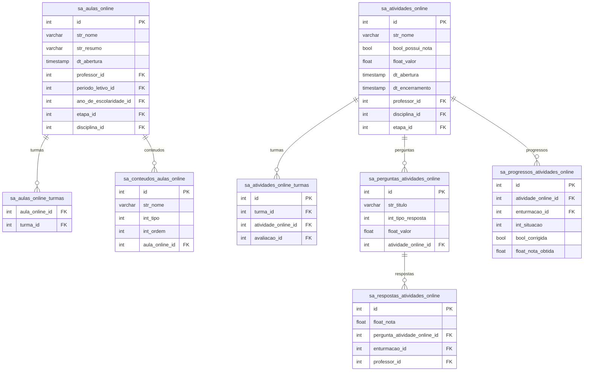

Tabelas complementares: `sa_acessos_aulas_online`, `sa_bloqueios_de_atividades_online`, `sa_controle_de_tempo_atividades_online`, `sa_controle_de_tempo_aulas_online`, `sa_opcoes_de_resposta_atividades_online`, `sa_conteudos_perguntas_atividades_online`, `sa_anexos_respostas_atividades_online`, `sa_conquistas_gamificacao_do_ava`.

---

## 11. Planejamento de Aulas (25 tabelas)

Planos de ensino e planejamentos pedagogicos dos professores.

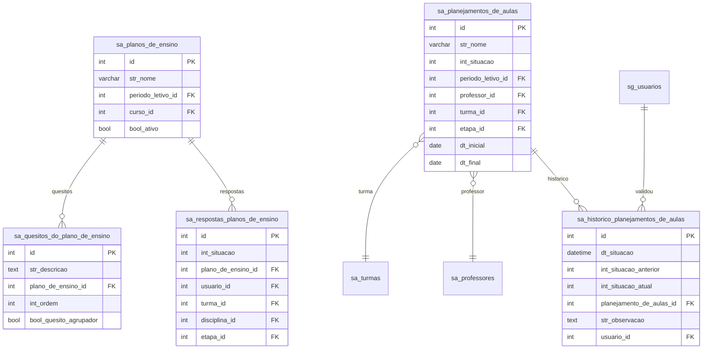

Sub-tabelas do planejamento: `sa_planejamentos_de_aulas_acolhidas`, `sa_planejamentos_de_aulas_avaliacoes_e_orientacoes`, `sa_planejamentos_de_aulas_competencias_especificas`, `sa_planejamentos_de_aulas_competencias_gerais`, `sa_planejamentos_de_aulas_datas`, `sa_planejamentos_de_aulas_disciplinas`, `sa_planejamentos_de_aulas_habilidades_especificas`, `sa_planejamentos_de_aulas_habilidades_gerais`, `sa_planejamentos_de_aulas_imagens`, `sa_planejamentos_de_aulas_observacoes`, `sa_planejamentos_de_aulas_praticas_de_linguagem`, `sa_planejamentos_de_aulas_praticas_sociais`, `sa_planejamentos_de_aulas_rotinas`, `sa_planejamentos_de_aulas_rotinas_diarias`, `sa_planejamentos_de_aulas_vivencias`.

Todas vinculadas a `sa_planejamentos_de_aulas` via `planejamento_de_aulas_id` FK.

Tabelas auxiliares: `sa_planos_de_ensino_individualizado`, `sa_respostas_quesitos_planos_de_ensino`, `sa_anexos_do_plano_de_ensino`, `sa_historico_planos_de_ensino`, `sa_historico_planejamentos_de_aulas`, `sa_rotinas_diarias`, `sa_planejamento_de_aulas_matrizes_de_descritores`.

---

## 12. Avaliacoes Especiais (33 tabelas)

Anamnese, avaliacao diagnostica, PEI (Plano Educacional Individualizado) e PDI (Plano de Desenvolvimento Individual). Seguem padrao: formulario > quesitos > perguntas > opcoes > respostas > anexos.

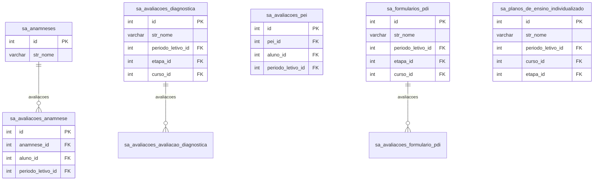

**Padrao de tabelas por formulario (cada um segue a mesma estrutura):**

| Formulario | Quesitos | Perguntas | Opcoes | Respostas | Anexos |
|---|---|---|---|---|---|
| `sa_anamneses` | `sa_quesitos_anamnese` | `sa_perguntas_anamnese` | `sa_opcoes_resposta_anamnese` | `sa_respostas_anamnese` | `sa_anexos_da_anamnese` |
| `sa_avaliacoes_diagnostica` | `sa_quesitos_avaliacao_diagnostica` | `sa_perguntas_avaliacao_diagnostica` | `sa_opcoes_resposta_avaliacao_diagnostica` | `sa_respostas_avaliacao_diagnostica` | `sa_anexos_da_avaliacao_diagnostica` |
| (PEI) | `sa_quesitos_pei` | `sa_perguntas_pei` | `sa_opcoes_resposta_pei` | `sa_respostas_pei` | `sa_anexos_do_pei` |
| `sa_formularios_pdi` | `sa_quesitos_formulario_pdi` | `sa_perguntas_formulario_pdi` | `sa_opcoes_resposta_formulario_pdi` | `sa_respostas_formulario_pdi` | `sa_anexos_da_pdi` |

Tabelas adicionais: `sa_avaliacoes_anamnese_dos_alunos`, `sa_quesitos_da_anamnese`, `sa_respostas_dos_quesitos_anamnese`, `sa_grupos_de_quesitos_da_anamnese`, `sa_formularios_anamnese`, `sa_avaliacoes_avaliacao_diagnostica`, `sa_avaliacoes_formulario_pdi`.

---

## 13. Banco de Questoes (7 tabelas)

Repositorio de questoes para atividades online.

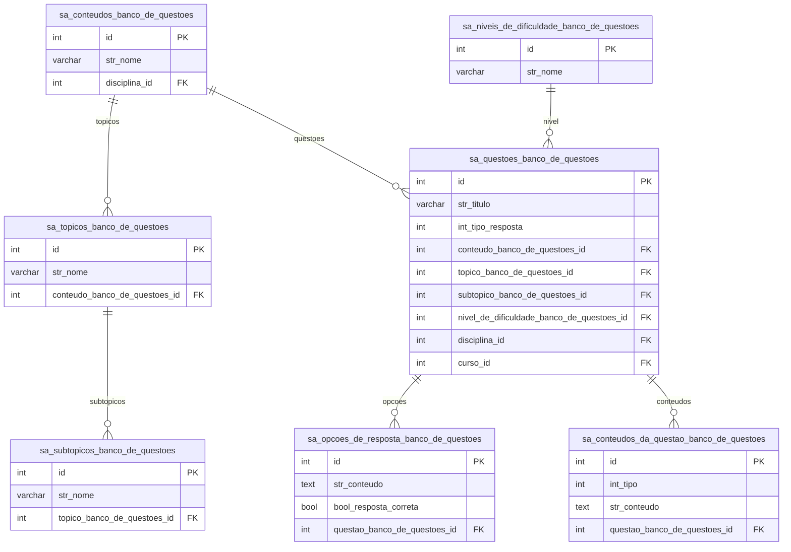

---

## 14. Historico Escolar (5 tabelas)

Documentacao do historico escolar do aluno.

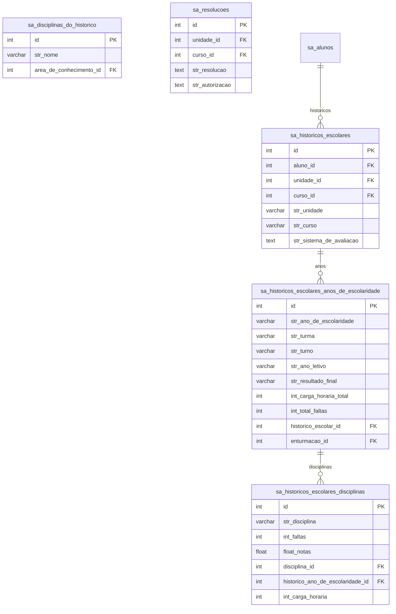

---

## 15. Conselho de Classe, Eventos e Ocorrencias (15 tabelas)

Conselhos de classe, eventos escolares, ocorrencias e atendimento especializado.

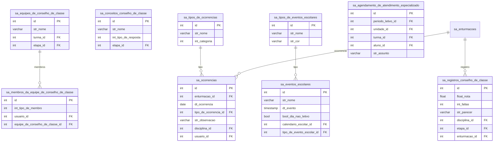

Tabelas complementares: `sa_conceitos_conselho_de_classe_anos_de_escolaridade`, `sa_respostas_conceitos_conselho_de_classe`, `sa_eventos_escolares_unidades`, `sa_grupos_de_eventos_escolares`, `sa_registro_de_atendimento_especializado`, `sa_anexos_do_atendimento_educacional_especializado`.

---

## 16. Documentos e Configuracoes (15 tabelas)

Modelos de documentos, assinaturas digitais, carteirinhas e rematricula.

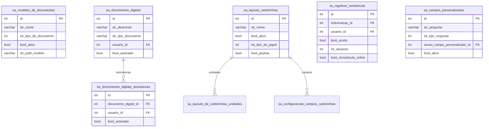

Tabelas complementares: `sa_modelos_de_relatorios`, `sa_configuracoes_de_modelo_de_documento`, `sa_assinaturas_configuracao_modelo_de_documento`, `sa_layouts_de_carteirinhas_unidades`, `sa_configuracoes_campos_carteirinhas`, `sa_secoes_campos_personalizados`, `sa_respostas_campos_personalizados`, `sa_motivos_de_rejeicao_registro_rematricula`, `sa_tipos_de_documentos_rematricula`.

---

## 17. Tabelas Auxiliares e Quesitos (18 tabelas)

Tipos, quesitos de avaliacao descritiva, gamificacao e tabelas de apoio.

| Tabela | Descricao | Colunas Principais |
|---|---|---|
| `sa_tipos_de_documento` | Tipos de documentos do aluno | `id`, `str_nome`, `bool_sexo_masculino`, `bool_sexo_feminino` |
| `sa_tipos_de_documentos_enturmacoes` | Documentos por enturmacao | `enturmacao_id` FK, `tipo_de_documento_id` FK |
| `sa_tipos_de_papel` | Tamanhos de papel para impressao | `id`, `str_nome`, `int_altura`, `int_largura` |
| `sa_tipos_de_turnos` | Tipos de turno | `id`, `str_nome` |
| `sa_tipos_de_unidades` | Tipos de unidade escolar | `id`, `str_nome` |
| `sa_etnias` | Etnias | `id`, `str_nome` |
| `sa_base_de_conhecimento` | Areas do conhecimento (referencia) | `id`, `str_nome` |
| `sa_cargos_da_comissao` | Cargos da comissao de eleicao | `id`, `str_nome`, `int_perfil_de_acesso` |
| `sa_quesitos` | Quesitos de avaliacao descritiva | `id`, `str_pergunta`, `int_tipo_resposta`, `bool_obrigatorio` |
| `sa_grupos_de_quesitos` | Agrupamento de quesitos | `id`, `str_nome`, `avaliacao_descritiva_id` FK |
| `sa_grupos_de_quesitos_disciplinas` | Quesitos por disciplina | `disciplina_id` FK, `grupo_de_quesitos_id` FK |
| `sa_grupos_de_quesitos_quesitos` | Quesitos no grupo | `quesito_id` FK, `grupo_de_quesitos_id` FK |
| `sa_respostas_quesitos` | Respostas de avaliacao descritiva | `enturmacao_id` FK, `quesito_id` FK, `etapa_id` FK |
| `sa_respostas_quesitos_por_turma` | Respostas por turma | `quesito_id` FK, `turma_id` FK, `etapa_id` FK |
| `sa_respostas_fichas_de_acompanhamento` | Fichas de acompanhamento | `enturmacao_id` FK, `usuario_id` FK |
| `sa_gamificacoes_do_aluno` | Configuracao de gamificacao | `id`, `str_nome`, `periodo_letivo_id` FK |
| `sa_conquistas_gamificacao_do_aluno` | Conquistas do aluno | `enturmacao_id` FK, `disciplina_id` FK, `etapa_id` FK |
| `sa_faixas_de_gamificacao_do_aluno` | Faixas de pontuacao | `curso_id` FK, `etapa_id` FK, `float_faixa_inicial`, `float_faixa_final` |

---

## 18. Tabelas de Censo (33 tabelas)

Tabelas anuais para exportacao de dados ao Censo Escolar (INEP). Seguem padrao `sa_censo_{tipo}_{ano}_fase{n}`.

| Tipo | Anos | Tabelas |
|---|---|---|
| `sa_censo_alunos` | 2021-2025 | 5 tabelas (fase 1) |
| `sa_censo_gestores` | 2021-2025 | 5 tabelas (fase 1) |
| `sa_censo_pessoas_fisicas` | 2021-2025 | 5 tabelas (fase 1) |
| `sa_censo_profissionais_escolares` | 2021-2025 | 5 tabelas (fase 1) |
| `sa_censo_turmas` | 2021-2025 | 5 tabelas (fase 1) |
| `sa_censo_unidades` | 2021-2025 | 5 tabelas (fase 1) |
| `sa_censo2021_arquivo*_fase2` | 2021 | 3 tabelas (fase 2) |

---

## 19. Portal do Professor - Grupos de Aulas e Faltas Diarias (2 novas + 1 modificada)

Novas entidades para grupos de aulas e faltas diarias desvinculadas de aulas.

> **Fluxo principal:** Professor registra um grupo de aulas (com ou sem horario definido) e, de forma independente, registra faltas diarias por aluno/turma sem necessidade de vincular a uma aula especifica.

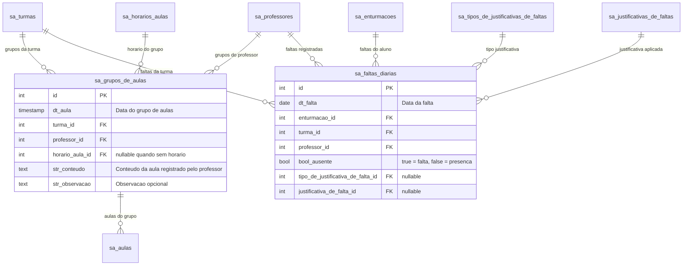

**Campo novo em `sa_aulas`:** `grupo_de_aula_id` (int FK nullable) — associa aulas a um grupo. Nullable para retrocompatibilidade com aulas existentes.

**Notas de retrocompatibilidade:**
- `sa_frequencias` permanece inalterada para frequencia vinculada a aula (mecanismo original)
- `sa_faltas_diarias` e o novo mecanismo para faltas independentes de aula
- Quando `sa_grupos_de_aulas.bool_sem_horario = true`, o campo `horario_aula_id` fica `null`

---

## 20. Importacao Legado SISLAME (6 tabelas)

Dados importados do sistema legado SISLAME: ata de resultado final, diario de classe (notas, frequencia, conteudo) e carga horaria. Tabelas independentes sem FK para o SISP — usam IDs do SISLAME como referencia.

```mermaid
erDiagram
    sa_carga_horaria_ata_legado {
        bigint id PK
        int int_turma_id_sislame
        varchar str_programa_pedagogico
        int int_programa_pedagogico_item_id_sislame
        float float_carga_horaria
    }

    sa_resultado_ata_legado {
        bigint id PK
        int int_turma_id_sislame
        varchar str_programa_pedagogico
        int int_aluno_id_sislame
        int int_programa_pedagogico_item_id_sislame
        float float_nota
        varchar str_conceito
        int int_faltas
    }

    sa_diario_consolidado_legado {
        bigint id PK
        int int_turma_id_sislame
        int int_programa_pedagogico_item_id_sislame
        int int_aluno_id_sislame
        int int_divisao_id_sislame
        float float_nota
        varchar str_conceito
        int int_faltas
    }

    sa_diario_notas_legado {
        bigint id PK
        int int_turma_id_sislame
        int int_programa_pedagogico_item_id_sislame
        int int_divisao_id_sislame
        int int_aluno_id_sislame
        int int_avaliacao_id_sislame
        float float_nota
        varchar str_conceito
    }

    sa_diario_frequencia_legado {
        bigint id PK
        int int_turma_id_sislame
        int int_programa_pedagogico_item_id_sislame
        int int_divisao_id_sislame
        int int_aluno_id_sislame
        date dt_aula
        bool bool_presenca
    }

    sa_diario_conteudo_legado {
        bigint id PK
        int int_turma_id_sislame
        int int_programa_pedagogico_item_id_sislame
        int int_divisao_id_sislame
        date dt_aula
        int int_ordem
        text str_plano_aula
    }
```

**Nota:** Todas as tabelas usam `int_turma_id_sislame` e `int_programa_pedagogico_item_id_sislame` como chaves de referencia ao sistema legado. Nao possuem foreign keys para tabelas do SISP.

---

## Resumo

| # | Grupo | Tabelas | Descricao |
|---|---|---|---|
| 1 | Alunos e Responsaveis | 14 | Cadastro, deficiencias, documentacao |
| 2 | Unidades e Estrutura | 18 | Escolas, cursos, periodos, turnos |
| 3 | Turmas e Enturmacoes | 12 | Turmas, enturmacao, vinculos |
| 4 | Disciplinas e Grades | 13 | Disciplinas, grades curriculares, etapas |
| 5 | Notas e Avaliacoes | 20 | Lancamento de notas, arredondamentos |
| 6 | Frequencia | 4 | Presencas, faltas, justificativas |
| 7 | Aulas e Horarios | 18 | Aulas, horarios, calendarios |
| 8 | Profissionais | 12 | Professores, diretores, coordenadores |
| 9 | Movimentacao | 15 | Transferencias, cancelamentos, evasoes |
| 10 | Ambiente Virtual | 16 | Aulas online, atividades, respostas |
| 11 | Planejamento | 24 | Planos de ensino, planejamentos |
| 12 | Avaliacoes Especiais | 33 | Anamnese, diagnostica, PEI, PDI |
| 13 | Banco de Questoes | 7 | Repositorio de questoes |
| 14 | Historico Escolar | 5 | Documentacao do historico |
| 15 | Conselho e Eventos | 15 | Conselhos, eventos, ocorrencias |
| 16 | Documentos e Config | 15 | Modelos, assinaturas, carteirinhas |
| 17 | Auxiliares e Quesitos | 18 | Tipos, quesitos, gamificacao |
| 18 | Censo | 33 | Exportacao dados INEP |
| 19 | Portal do Professor | 2+1 | Grupos de aulas, faltas diarias |
| 20 | Legado SISLAME | 6 | Importacao dados sistema legado |
| | **TOTAL** | **301** | |
