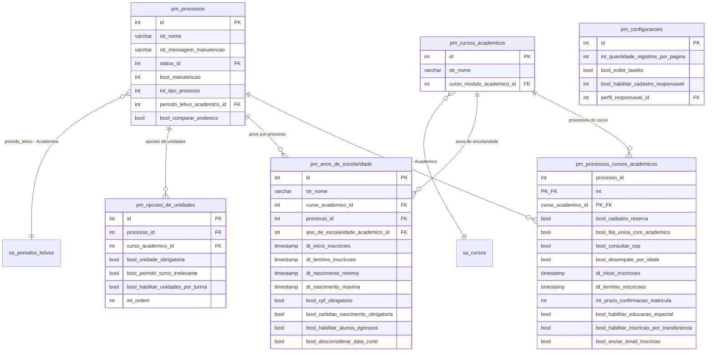
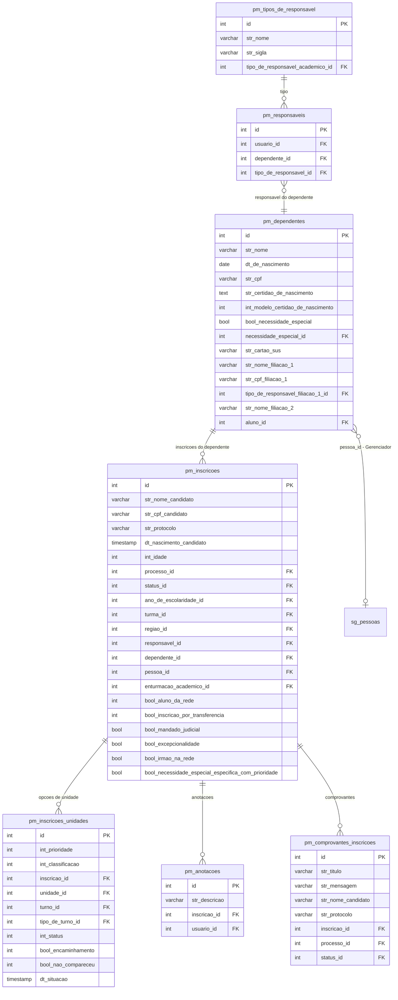
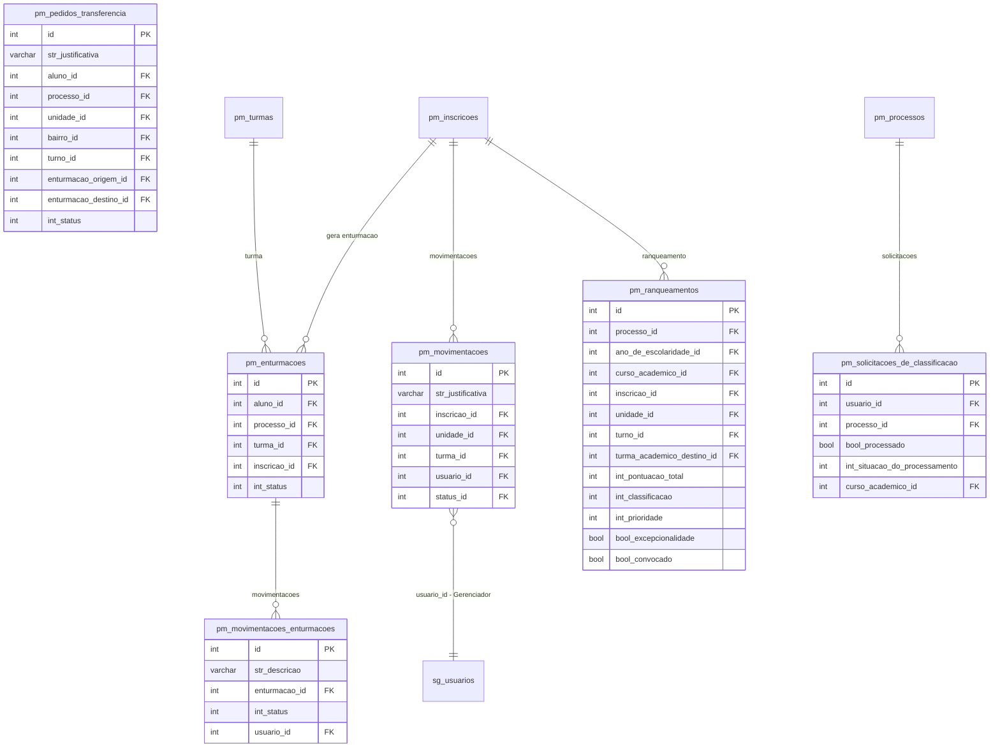
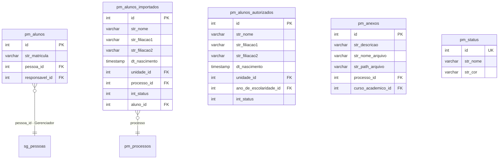
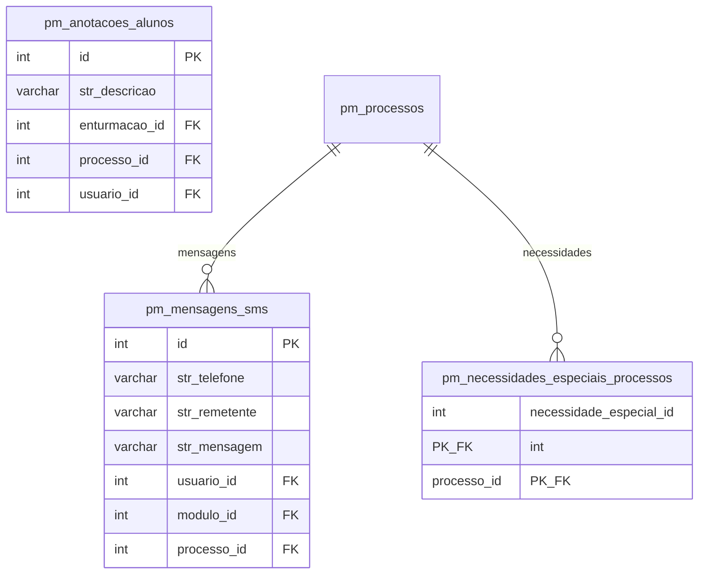

# ER - Modulo Pre-Matricula / Gestao de Vagas (Prefixo: pm_*)

Processo de inscricao e matricula de novos alunos na rede. 36 tabelas com integracao ao modulo Academico.

> Fonte: consulta direta ao banco PostgreSQL. Campos de auditoria (`criado_em`, `atualizado_em`, `removido_em`) omitidos por brevidade.

---

## 1. Processos e Configuracao (6 tabelas)

Configuracao dos processos seletivos, cursos e criterios de selecao.



---

## 2. Inscricoes e Candidatos (7 tabelas)

Inscricoes de candidatos, dependentes e responsaveis.



---

## 3. Estrutura: Unidades, Turmas e Turnos (9 tabelas)

Espelho das unidades/turmas do modulo Academico para o contexto da pre-matricula.

```mermaid
erDiagram
    pm_unidades {
        int id PK
        varchar str_nome
        int unidade_academico_id FK
        int bairro_id FK
    }

    pm_turmas {
        int id PK
        varchar str_nome
        int turno_id FK
        int ano_de_escolaridade_id FK
        int unidade_id FK
        int int_qtd_total_vagas
        int int_qtd_vagas_disponiveis
        int turma_academico_id FK
        bool bool_disponivel_pre_matricula
        int int_qtd_max_alunos_nec_esp
    }

    pm_turnos {
        int id PK
        varchar str_nome
        int turno_academico_id FK
    }

    pm_regioes {
        int id PK
        varchar str_nome
        int processo_id FK
    }

    pm_bairros {
        int id PK
        varchar str_nome
    }

    pm_bairros_regioes {
        int regiao_id PK_FK
        int bairro_id PK_FK
    }

    pm_unidades_bairros {
        int processo_id PK_FK
        int unidade_id PK_FK
        int bairro_id PK_FK
    }

    pm_unidades_bairros_cursos {
        int processo_id PK_FK
        int unidade_id PK_FK
        int curso_id PK_FK
        int bairro_id PK_FK
    }

    pm_unidades_usuarios {
        int unidade_id PK_FK
        int usuario_id PK_FK
        int curso_academico_id PK_FK
    }

    pm_unidades ||--o{ pm_turmas : "turmas da unidade"
    pm_turnos ||--o{ pm_turmas : "turno"
    pm_anos_de_escolaridade ||--o{ pm_turmas : "ano"
    pm_regioes ||--o{ pm_bairros_regioes : "bairros"
    pm_bairros ||--o{ pm_bairros_regioes : "regioes"
    pm_unidades ||--o{ pm_unidades_bairros : "bairros atendidos"

    pm_unidades }o--|| sa_unidades : "unidade - Academico"
    pm_turmas }o--o| sa_turmas : "turma - Academico"
    pm_turnos }o--|| sa_turnos : "turno - Academico"
```

---

## 4. Enturmacao e Movimentacao (6 tabelas)

Resultado do processo: enturmacao, movimentacoes e ranqueamento.



---

## 5. Alunos e Importacao (5 tabelas)

Alunos da pre-matricula, alunos importados e autorizados.



---

## 6. Comunicacao e Auxiliares (3 tabelas)

SMS, anotacoes de alunos e necessidades especiais por processo.



---

## Resumo

| # | Grupo | Tabelas | Descricao |
|---|---|---|---|
| 1 | Processos e Configuracao | 6 | Processos seletivos, criterios de selecao |
| 2 | Inscricoes e Candidatos | 7 | Inscricoes, dependentes, responsaveis |
| 3 | Estrutura | 9 | Unidades, turmas, turnos, regioes (espelho Academico) |
| 4 | Enturmacao e Movimentacao | 6 | Resultados, ranqueamento, transferencias |
| 5 | Alunos e Importacao | 5 | Alunos, importacao, status |
| 6 | Comunicacao e Auxiliares | 3 | SMS, anotacoes, necessidades especiais |
| | **TOTAL** | **36** | |

## Integracao com Modulo Academico

O modulo Pre-Matricula espelha diversas entidades do modulo Academico:

| Pre-Matricula | Academico | FK |
|---|---|---|
| `pm_processos` | `sa_periodos_letivos` | `periodo_letivo_academico_id` |
| `pm_cursos_academicos` | `sa_cursos` | `curso_modulo_academico_id` |
| `pm_unidades` | `sa_unidades` | `unidade_academico_id` |
| `pm_turmas` | `sa_turmas` | `turma_academico_id` |
| `pm_turnos` | `sa_turnos` | `turno_academico_id` |
| `pm_anos_de_escolaridade` | `sa_anos_de_escolaridade` | `ano_de_escolaridade_academico_id` |
