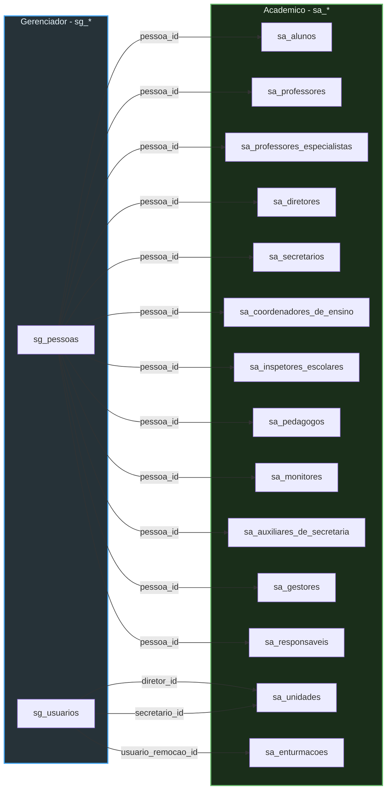
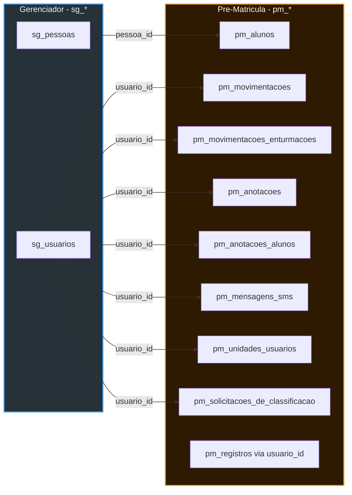
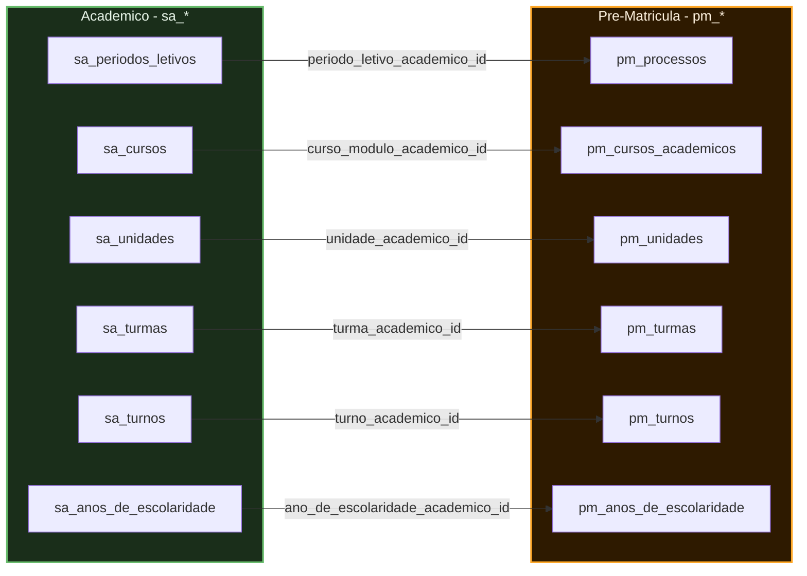

# ER - Relacionamentos Cross-Module

Mapa de todas as foreign keys que cruzam entre os 3 modulos principais.

---

## Gerenciador para Academico

---

## Gerenciador para Pre-Matricula

---

## Academico para Pre-Matricula

---

## Tabela Resumo de FKs Cross-Module

| Origem | FK | Destino | Descricao |
|---|---|---|---|
| **sg_pessoas** | `pessoa_id` | sa_alunos | Dados pessoais do aluno |
| **sg_pessoas** | `pessoa_id` | sa_professores | Dados pessoais do professor |
| **sg_pessoas** | `pessoa_id` | sa_professores_especialistas | Professor especialista |
| **sg_pessoas** | `pessoa_id` | sa_diretores | Diretor |
| **sg_pessoas** | `pessoa_id` | sa_secretarios | Secretario |
| **sg_pessoas** | `pessoa_id` | sa_coordenadores_de_ensino | Coordenador |
| **sg_pessoas** | `pessoa_id` | sa_inspetores_escolares | Inspetor |
| **sg_pessoas** | `pessoa_id` | sa_pedagogos | Pedagogo |
| **sg_pessoas** | `pessoa_id` | sa_monitores | Monitor |
| **sg_pessoas** | `pessoa_id` | sa_auxiliares_de_secretaria | Auxiliar |
| **sg_pessoas** | `pessoa_id` | sa_gestores | Gestor |
| **sg_pessoas** | `pessoa_id` | sa_responsaveis | Responsavel do aluno |
| **sg_pessoas** | `pessoa_id` | pm_alunos | Aluno pre-matricula |
| **sg_usuarios** | `diretor_id` | sa_unidades | Diretor da unidade |
| **sg_usuarios** | `secretario_id` | sa_unidades | Secretario da unidade |
| **sg_usuarios** | `usuario_remocao_id` | sa_enturmacoes | Quem removeu enturmacao |
| **sg_usuarios** | `usuario_id` | pm_movimentacoes | Quem movimentou inscricao |
| **sg_usuarios** | `usuario_id` | pm_unidades_usuarios | Acesso a unidade |
| **sa_periodos_letivos** | `periodo_letivo_academico_id` | pm_processos | Periodo do processo |
| **sa_cursos** | `curso_modulo_academico_id` | pm_cursos_academicos | Curso espelhado |
| **sa_unidades** | `unidade_academico_id` | pm_unidades | Unidade espelhada |
| **sa_turmas** | `turma_academico_id` | pm_turmas | Turma espelhada |
| **sa_turnos** | `turno_academico_id` | pm_turnos | Turno espelhado |
| **sa_anos_de_escolaridade** | `ano_escolaridade_academico_id` | pm_anos_de_escolaridade | Ano espelhado |
