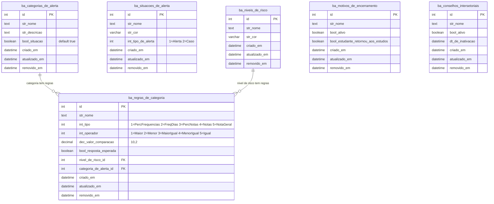
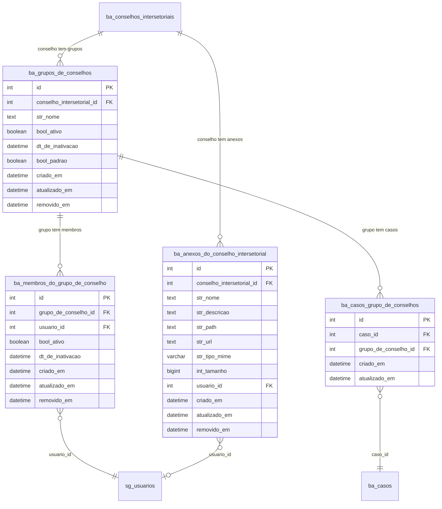
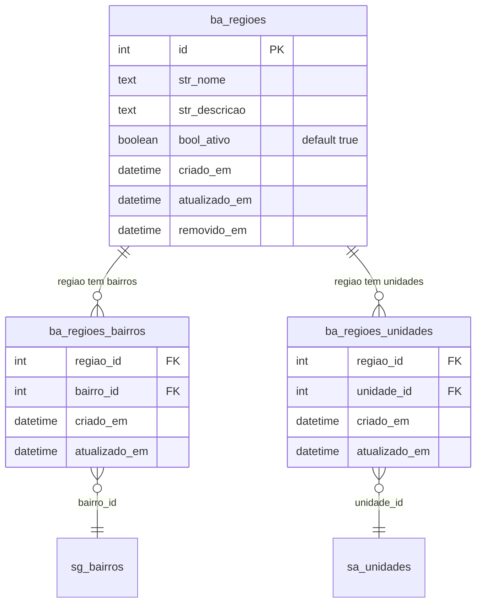
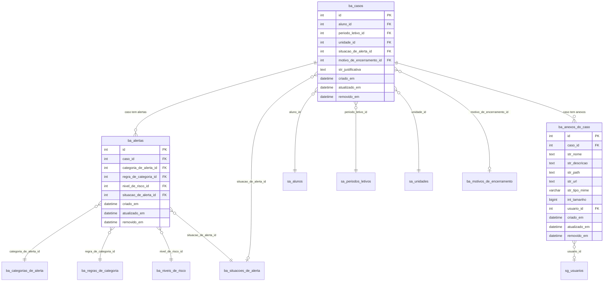
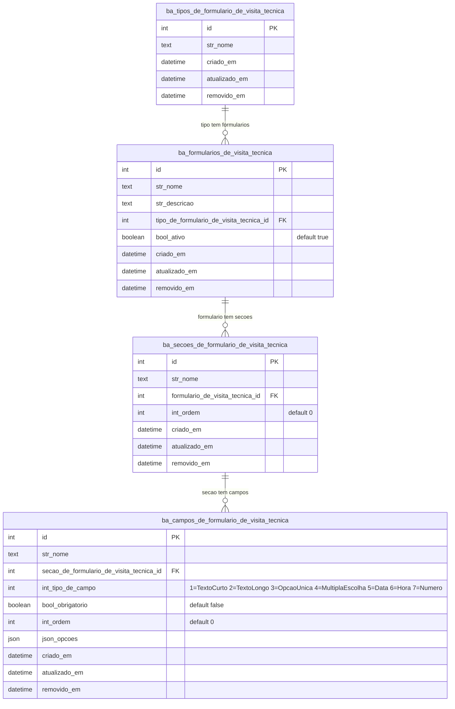
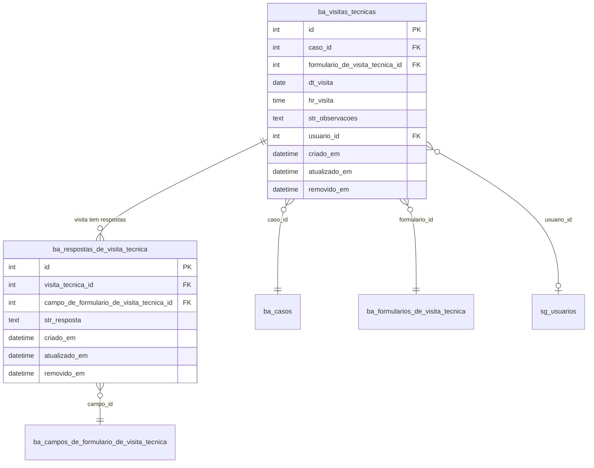
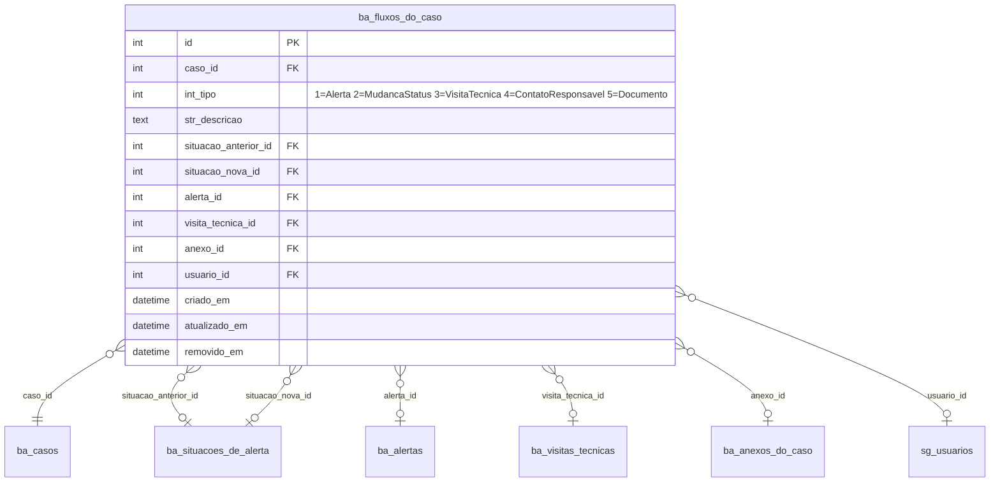
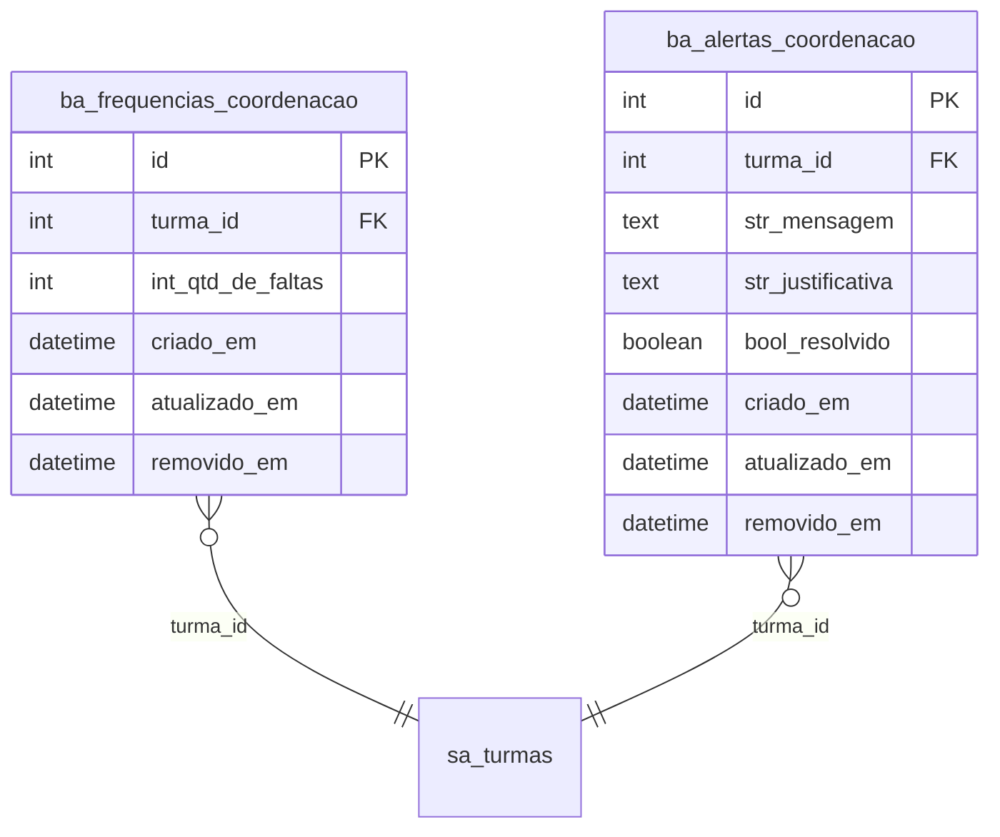
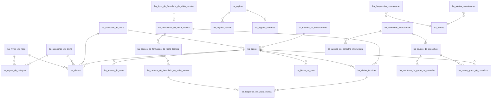

# ER - Modulo Busca Ativa (Prefixo: ba_*)

25 tabelas (22 principais + 3 pivos). Modulo de acompanhamento de alunos em risco de evasao escolar: alertas, casos, visitas tecnicas e formularios.

## 1. Cadastros Base (Niveis de Risco, Situacoes e Categorias)

## 2. Conselhos e Grupos

## 3. Regioes e Associacoes

## 4. Casos e Alertas

## 5. Formularios de Visita Tecnica

## 6. Visitas Tecnicas e Respostas

## 7. Fluxo do Caso (Timeline)

## 8. Frequencias da Coordenacao

## 9. Visao Geral - Relacionamentos entre Entidades

## Dependencias Externas (Cross-Module)

| FK no Busca Ativa | Tabela Externa | Modulo |
|---|---|---|
| `ba_casos.aluno_id` | `sa_alunos` | Academico |
| `ba_casos.periodo_letivo_id` | `sa_periodos_letivos` | Academico |
| `ba_casos.unidade_id` | `sa_unidades` | Academico |
| `ba_regioes_bairros.bairro_id` | `sg_bairros` | Gerenciador |
| `ba_regioes_unidades.unidade_id` | `sa_unidades` | Academico |
| `ba_anexos_do_caso.usuario_id` | `sg_usuarios` | Gerenciador |
| `ba_visitas_tecnicas.usuario_id` | `sg_usuarios` | Gerenciador |
| `ba_fluxos_do_caso.usuario_id` | `sg_usuarios` | Gerenciador |
| `ba_membros_do_grupo_de_conselho.usuario_id` | `sg_usuarios` | Gerenciador |
| `ba_anexos_do_conselho_intersetorial.usuario_id` | `sg_usuarios` | Gerenciador |
| `ba_frequencias_coordenacao.turma_id` | `sa_turmas` | Academico |
| `ba_alertas_coordenacao.turma_id` | `sa_turmas` | Academico |
