# ER - Modulo Caixa Escolar (Prefixo: ce_*)

56 tabelas. Modulo de gestao financeira escolar: contas bancarias, receitas, despesas, cotacoes de preco, conselhos, programas governamentais, conciliacao bancaria, doacoes e categorias de fornecedores.

> **Fluxo de vinculacao de fornecedores:** Fornecedores sao classificados por categorias (`ce_categorias_do_fornecedor`). Na tela de Cotacao de Preco, itens podem ser vinculados a fornecedores (`ce_fornecedores_itens_da_cotacao_de_preco`). Na guia Lancamento, ao adicionar cotacao recebida, o sistema filtra apenas itens vinculados ao fornecedor selecionado (ou todos se nenhum vinculo existir).

## 1. Infraestrutura Bancaria

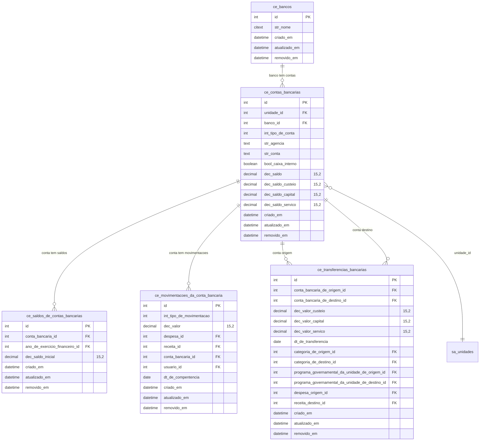

## 2. Programas Governamentais e Plano de Contas

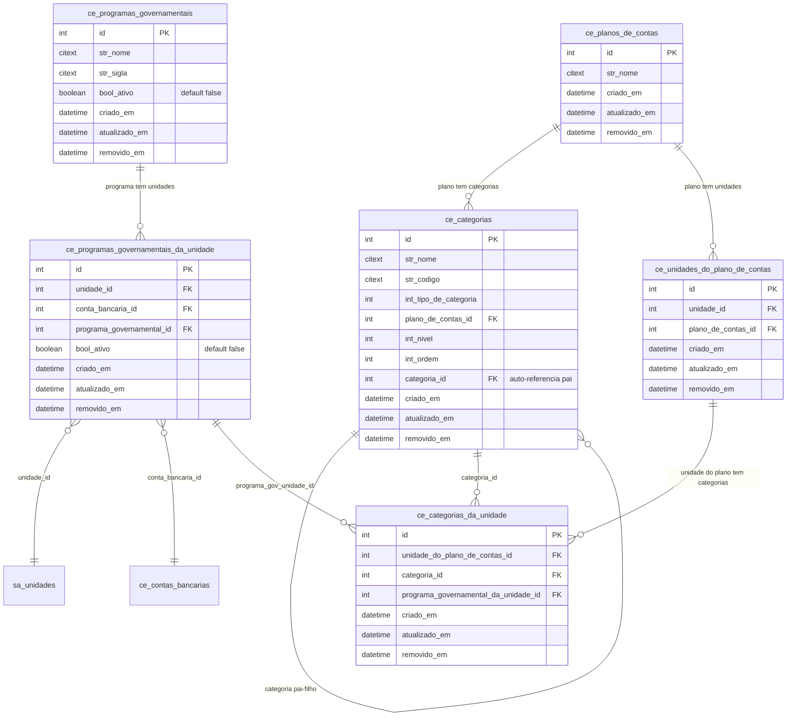

## 3. Ano de Exercicio Financeiro e Gestao de Recursos

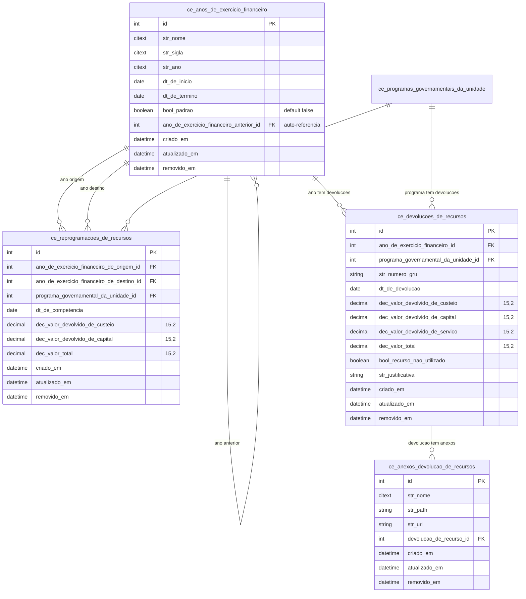

## 4. Conselhos e Governanca

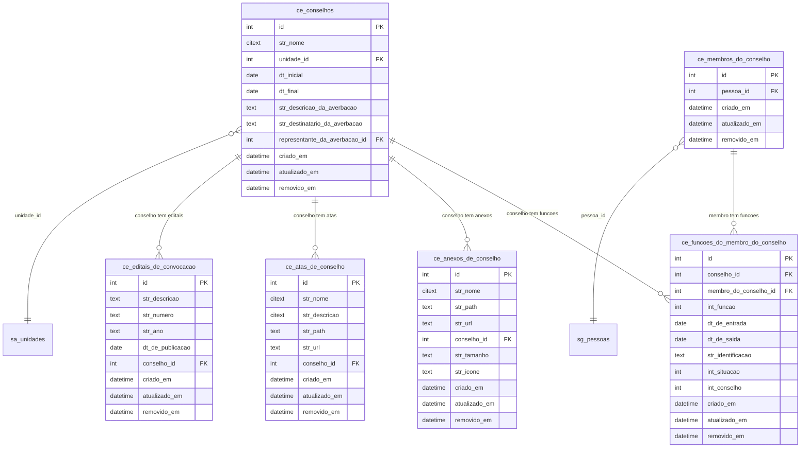

## 5. Pareceres e Termos de Compromisso

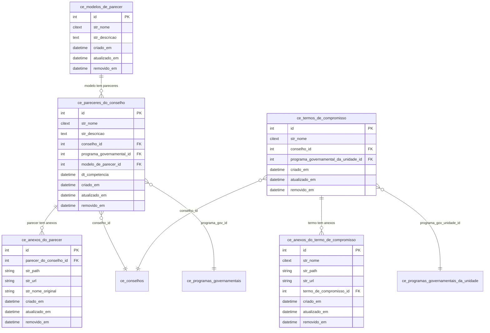

## 6. Fornecedores e Parcerias

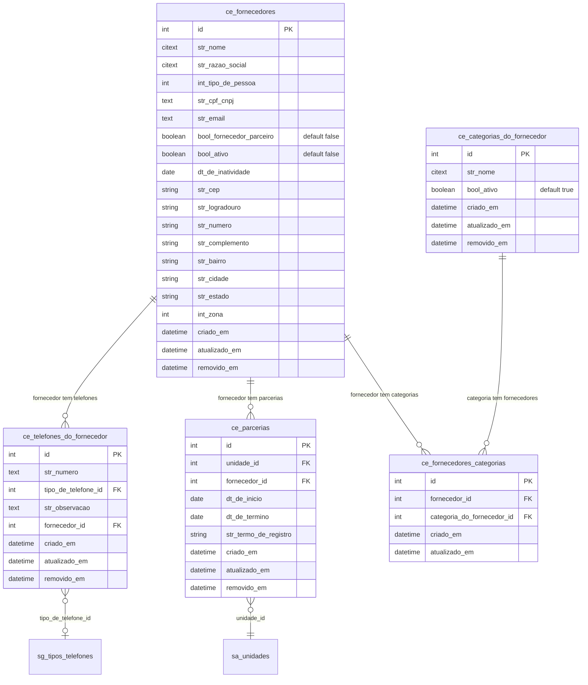

## 7. Cotacoes de Preco e Pedidos de Compra

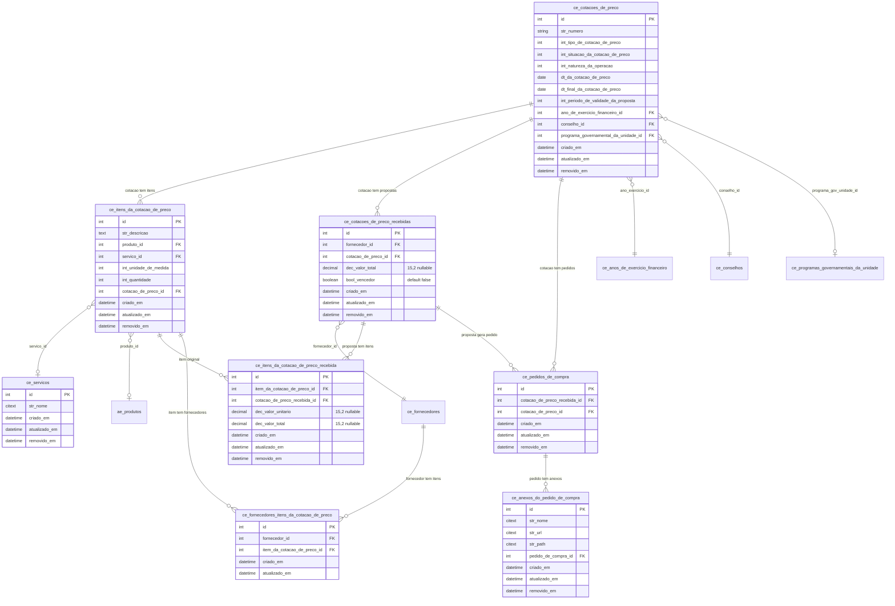

## 8. Receitas

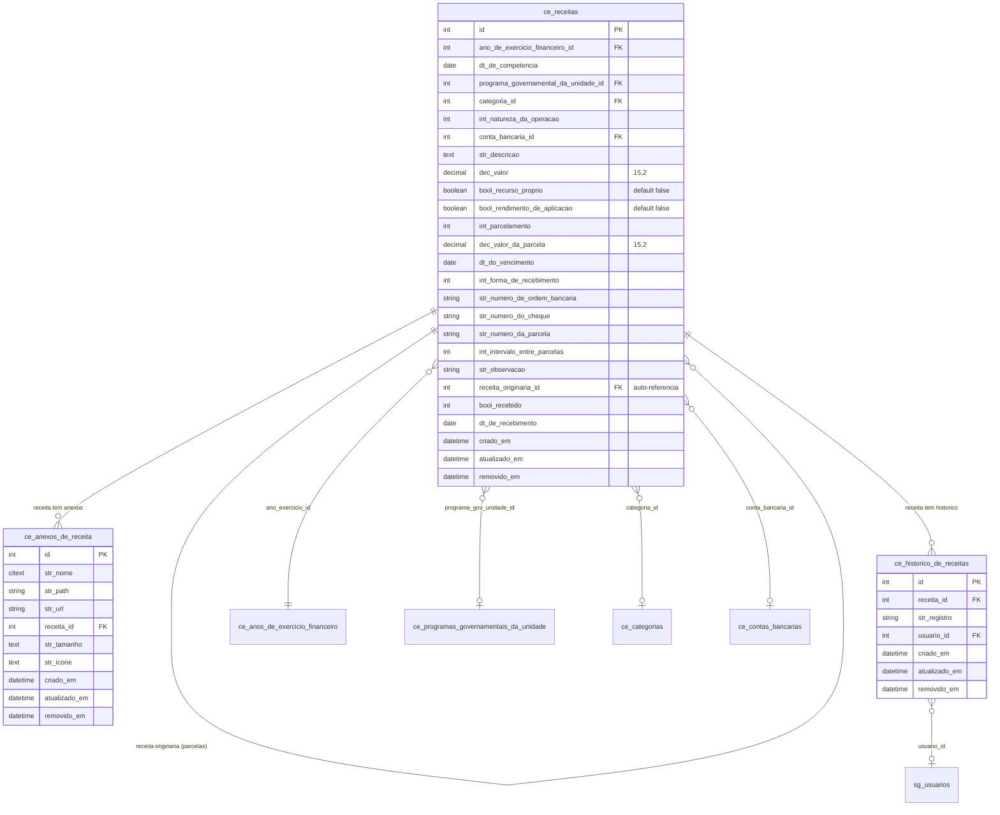

## 9. Despesas

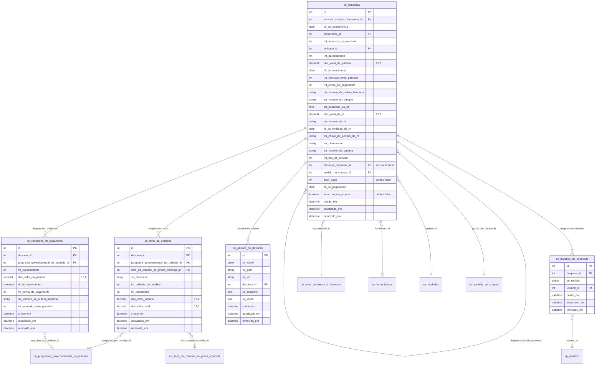

## 10. Conciliacao Bancaria

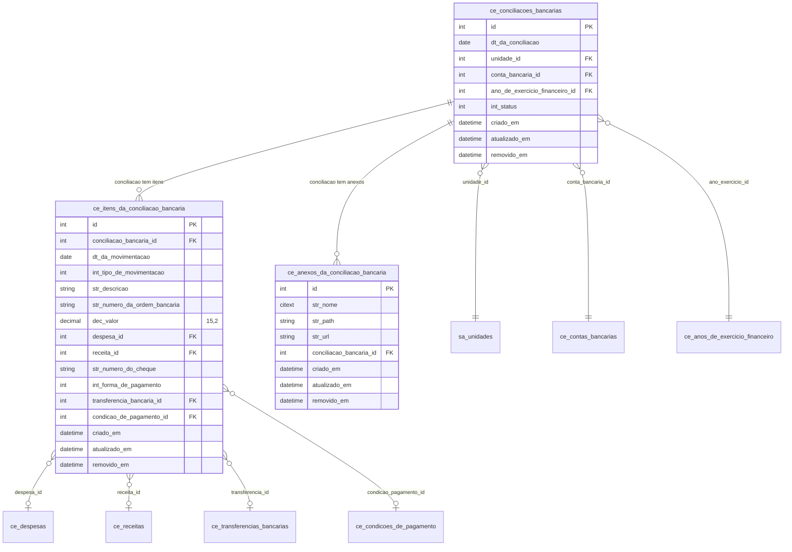

## 11. Doacoes

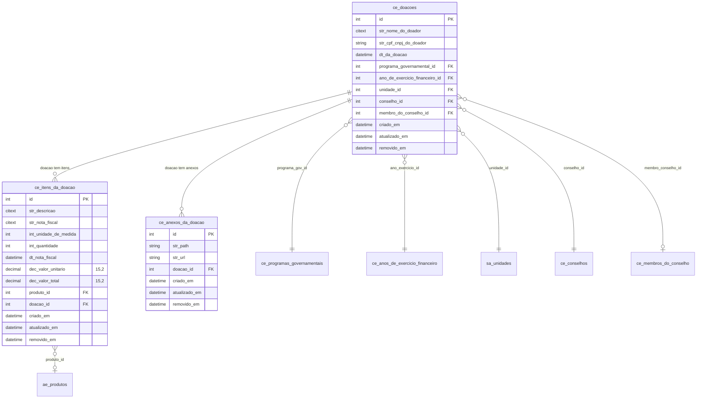

## 12. Plano de Aplicacao

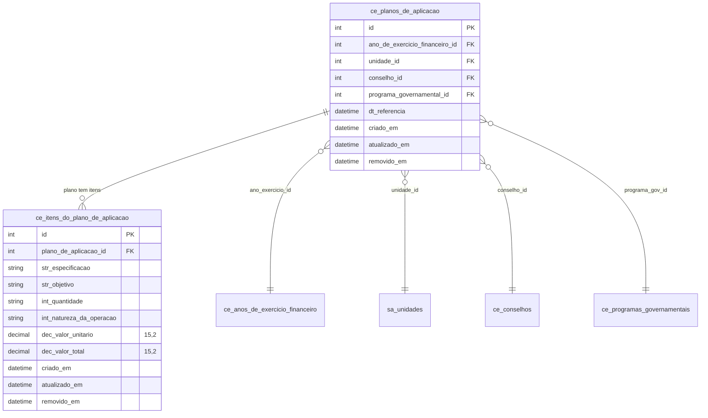

## 13. Diretores da Unidade

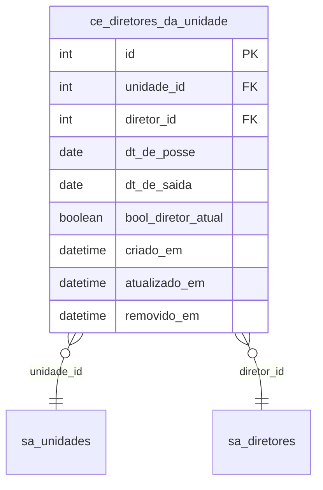

## 14. Visao Geral - Relacionamentos entre Entidades

```mermaid
erDiagram
    ce_bancos ||--o{ ce_contas_bancarias : ""
    ce_contas_bancarias ||--o{ ce_saldos_de_contas_bancarias : ""
    ce_contas_bancarias ||--o{ ce_movimentacoes_da_conta_bancaria : ""
    ce_contas_bancarias ||--o{ ce_transferencias_bancarias : ""
    ce_contas_bancarias ||--o{ ce_receitas : ""
    ce_contas_bancarias ||--o{ ce_conciliacoes_bancarias : ""
    ce_contas_bancarias ||--o{ ce_programas_governamentais_da_unidade : ""
    ce_programas_governamentais ||--o{ ce_programas_governamentais_da_unidade : ""
    ce_programas_governamentais ||--o{ ce_pareceres_do_conselho : ""
    ce_programas_governamentais ||--o{ ce_doacoes : ""
    ce_programas_governamentais ||--o{ ce_planos_de_aplicacao : ""
    ce_programas_governamentais_da_unidade ||--o{ ce_categorias_da_unidade : ""
    ce_programas_governamentais_da_unidade ||--o{ ce_reprogramacoes_de_recursos : ""
    ce_programas_governamentais_da_unidade ||--o{ ce_devolucoes_de_recursos : ""
    ce_programas_governamentais_da_unidade ||--o{ ce_itens_da_despesa : ""
    ce_programas_governamentais_da_unidade ||--o{ ce_condicoes_de_pagamento : ""
    ce_programas_governamentais_da_unidade ||--o{ ce_termos_de_compromisso : ""
    ce_planos_de_contas ||--o{ ce_categorias : ""
    ce_planos_de_contas ||--o{ ce_unidades_do_plano_de_contas : ""
    ce_categorias ||--o{ ce_categorias : ""
    ce_categorias ||--o{ ce_categorias_da_unidade : ""
    ce_categorias ||--o{ ce_receitas : ""
    ce_unidades_do_plano_de_contas ||--o{ ce_categorias_da_unidade : ""
    ce_anos_de_exercicio_financeiro ||--o{ ce_anos_de_exercicio_financeiro : ""
    ce_anos_de_exercicio_financeiro ||--o{ ce_receitas : ""
    ce_anos_de_exercicio_financeiro ||--o{ ce_despesas : ""
    ce_anos_de_exercicio_financeiro ||--o{ ce_cotacoes_de_preco : ""
    ce_anos_de_exercicio_financeiro ||--o{ ce_conciliacoes_bancarias : ""
    ce_anos_de_exercicio_financeiro ||--o{ ce_reprogramacoes_de_recursos : ""
    ce_anos_de_exercicio_financeiro ||--o{ ce_devolucoes_de_recursos : ""
    ce_anos_de_exercicio_financeiro ||--o{ ce_doacoes : ""
    ce_anos_de_exercicio_financeiro ||--o{ ce_saldos_de_contas_bancarias : ""
    ce_anos_de_exercicio_financeiro ||--o{ ce_planos_de_aplicacao : ""
    ce_conselhos ||--o{ ce_funcoes_do_membro_do_conselho : ""
    ce_conselhos ||--o{ ce_anexos_de_conselho : ""
    ce_conselhos ||--o{ ce_atas_de_conselho : ""
    ce_conselhos ||--o{ ce_editais_de_convocacao : ""
    ce_conselhos ||--o{ ce_cotacoes_de_preco : ""
    ce_conselhos ||--o{ ce_pareceres_do_conselho : ""
    ce_conselhos ||--o{ ce_termos_de_compromisso : ""
    ce_conselhos ||--o{ ce_doacoes : ""
    ce_conselhos ||--o{ ce_planos_de_aplicacao : ""
    ce_membros_do_conselho ||--o{ ce_funcoes_do_membro_do_conselho : ""
    ce_membros_do_conselho ||--o{ ce_doacoes : ""
    ce_modelos_de_parecer ||--o{ ce_pareceres_do_conselho : ""
    ce_pareceres_do_conselho ||--o{ ce_anexos_do_parecer : ""
    ce_fornecedores ||--o{ ce_telefones_do_fornecedor : ""
    ce_fornecedores ||--o{ ce_parcerias : ""
    ce_fornecedores ||--o{ ce_fornecedores_categorias : ""
    ce_fornecedores ||--o{ ce_fornecedores_itens_da_cotacao_de_preco : ""
    ce_fornecedores ||--o{ ce_cotacoes_de_preco_recebidas : ""
    ce_fornecedores ||--o{ ce_despesas : ""
    ce_categorias_do_fornecedor ||--o{ ce_fornecedores_categorias : ""
    ce_cotacoes_de_preco ||--o{ ce_itens_da_cotacao_de_preco : ""
    ce_cotacoes_de_preco ||--o{ ce_cotacoes_de_preco_recebidas : ""
    ce_cotacoes_de_preco ||--o{ ce_pedidos_de_compra : ""
    ce_cotacoes_de_preco_recebidas ||--o{ ce_itens_da_cotacao_de_preco_recebida : ""
    ce_cotacoes_de_preco_recebidas ||--o{ ce_pedidos_de_compra : ""
    ce_itens_da_cotacao_de_preco ||--o{ ce_itens_da_cotacao_de_preco_recebida : ""
    ce_itens_da_cotacao_de_preco ||--o{ ce_fornecedores_itens_da_cotacao_de_preco : ""
    ce_pedidos_de_compra ||--o{ ce_anexos_do_pedido_de_compra : ""
    ce_pedidos_de_compra ||--o{ ce_despesas : ""
    ce_receitas ||--o{ ce_receitas : ""
    ce_receitas ||--o{ ce_anexos_de_receita : ""
    ce_receitas ||--o{ ce_historico_de_receitas : ""
    ce_receitas ||--o{ ce_movimentacoes_da_conta_bancaria : ""
    ce_despesas ||--o{ ce_despesas : ""
    ce_despesas ||--o{ ce_itens_da_despesa : ""
    ce_despesas ||--o{ ce_condicoes_de_pagamento : ""
    ce_despesas ||--o{ ce_anexos_de_despesa : ""
    ce_despesas ||--o{ ce_historico_de_despesas : ""
    ce_despesas ||--o{ ce_movimentacoes_da_conta_bancaria : ""
    ce_conciliacoes_bancarias ||--o{ ce_itens_da_conciliacao_bancaria : ""
    ce_conciliacoes_bancarias ||--o{ ce_anexos_da_conciliacao_bancaria : ""
    ce_devolucoes_de_recursos ||--o{ ce_anexos_devolucao_de_recursos : ""
    ce_doacoes ||--o{ ce_itens_da_doacao : ""
    ce_doacoes ||--o{ ce_anexos_da_doacao : ""
    ce_planos_de_aplicacao ||--o{ ce_itens_do_plano_de_aplicacao : ""
    ce_termos_de_compromisso ||--o{ ce_anexos_do_termo_de_compromisso : ""
```

## Dependencias Externas (Cross-Module)

| FK no Caixa Escolar | Tabela Externa | Modulo |
|---|---|---|
| `ce_contas_bancarias.unidade_id` | `sa_unidades` | Academico |
| `ce_conselhos.unidade_id` | `sa_unidades` | Academico |
| `ce_parcerias.unidade_id` | `sa_unidades` | Academico |
| `ce_despesas.unidade_id` | `sa_unidades` | Academico |
| `ce_conciliacoes_bancarias.unidade_id` | `sa_unidades` | Academico |
| `ce_doacoes.unidade_id` | `sa_unidades` | Academico |
| `ce_planos_de_aplicacao.unidade_id` | `sa_unidades` | Academico |
| `ce_programas_governamentais_da_unidade.unidade_id` | `sa_unidades` | Academico |
| `ce_unidades_do_plano_de_contas.unidade_id` | `sa_unidades` | Academico |
| `ce_diretores_da_unidade.unidade_id` | `sa_unidades` | Academico |
| `ce_diretores_da_unidade.diretor_id` | `sa_diretores` | Academico |
| `ce_membros_do_conselho.pessoa_id` | `sg_pessoas` | Gerenciador |
| `ce_telefones_do_fornecedor.tipo_de_telefone_id` | `sg_tipos_telefones` | Gerenciador |
| `ce_movimentacoes_da_conta_bancaria.usuario_id` | `sg_usuarios` | Gerenciador |
| `ce_historico_de_despesas.usuario_id` | `sg_usuarios` | Gerenciador |
| `ce_historico_de_receitas.usuario_id` | `sg_usuarios` | Gerenciador |
| `ce_itens_da_cotacao_de_preco.produto_id` | `ae_produtos` | Almoxarifado |
| `ce_itens_da_doacao.produto_id` | `ae_produtos` | Almoxarifado |
