# ER - Modulo Portal de Cursos (Prefixo: pc_*)

52 tabelas (34 presenciais + 15 online + 3 credenciamento). Modulo de gestao de cursos e capacitacoes: cadastro de cursos, turmas, inscricoes, aulas, frequencia, certificados, campos personalizados, filtros de inscricao integrados ao Academico, recursos/emprestimos, atividades complementares, questionarios, **trilhas de aprendizagem, cursos online com modulos/aulas/questionarios, progresso e favoritos**, **credenciamento com controle de acesso, layout de cracha e campos variaveis**.

> **Fluxo principal:** Cursos (`pc_cursos`) possuem Turmas (`pc_turmas`), que recebem Inscricoes (`pc_inscricoes`). Turmas tem Aulas (`pc_aulas`) com controle de Presenca (`pc_presencas`). Ao final, Certificados (`pc_certificados`) sao gerados. Filtros (`pc_filtros`) permitem restringir inscricoes por periodo letivo, unidade, disciplina e ano de escolaridade do modulo Academico.

## 1. Cursos e Cadastros Base

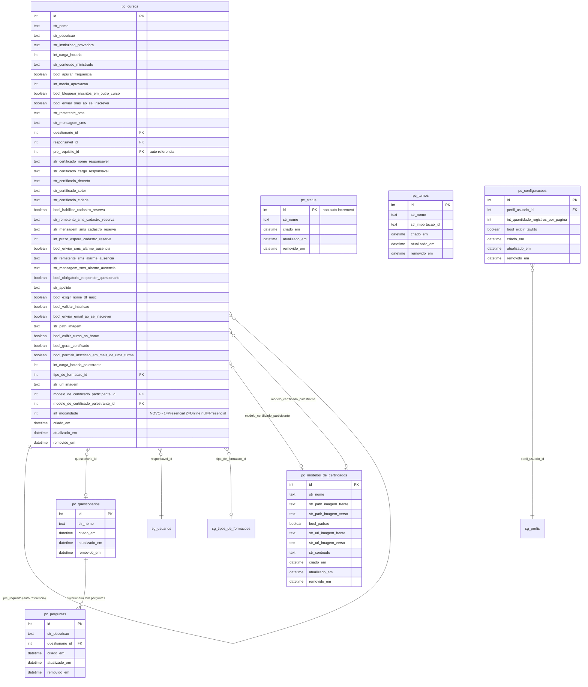

## 2. Turmas e Inscricoes

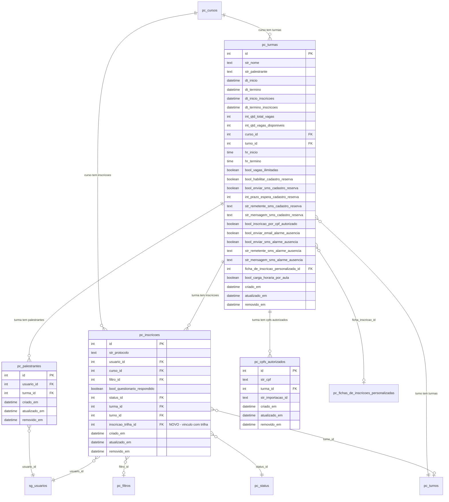

## 3. Aulas e Frequencia

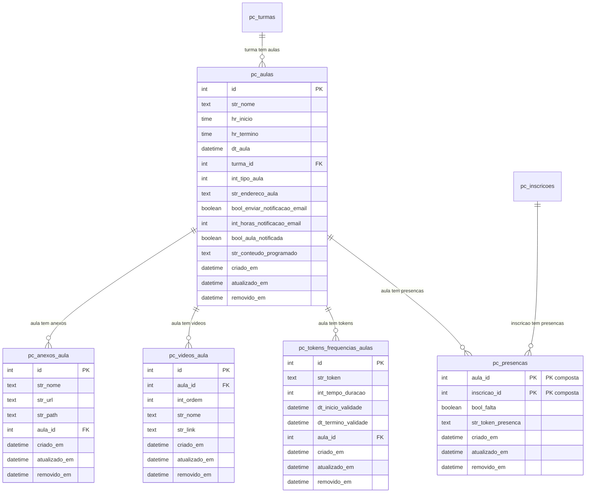

## 4. Certificados e Anexos

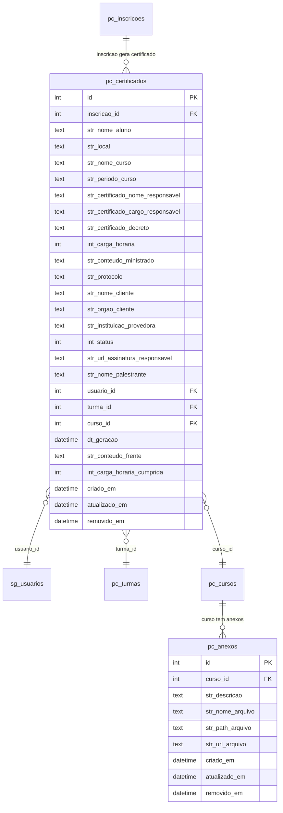

## 5. Campos Personalizados

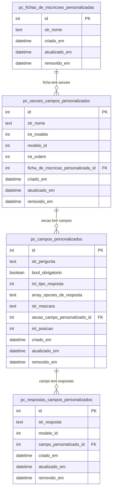

## 6. Filtros de Inscricao (Integrados ao Academico)

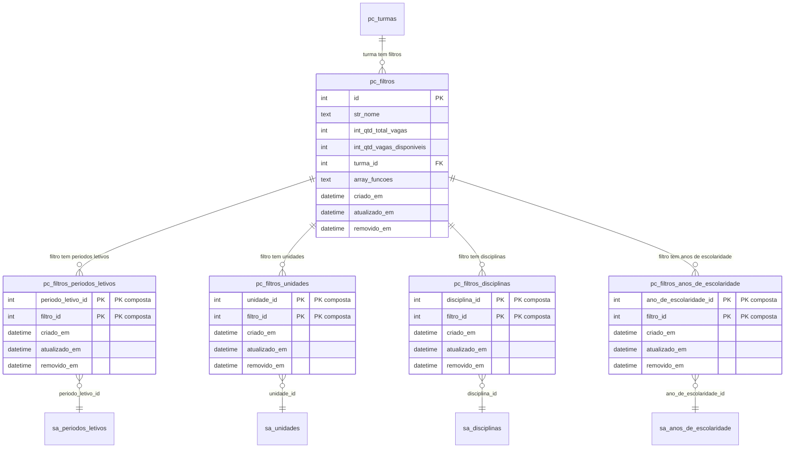

## 7. Recursos, Emprestimos e Atividades

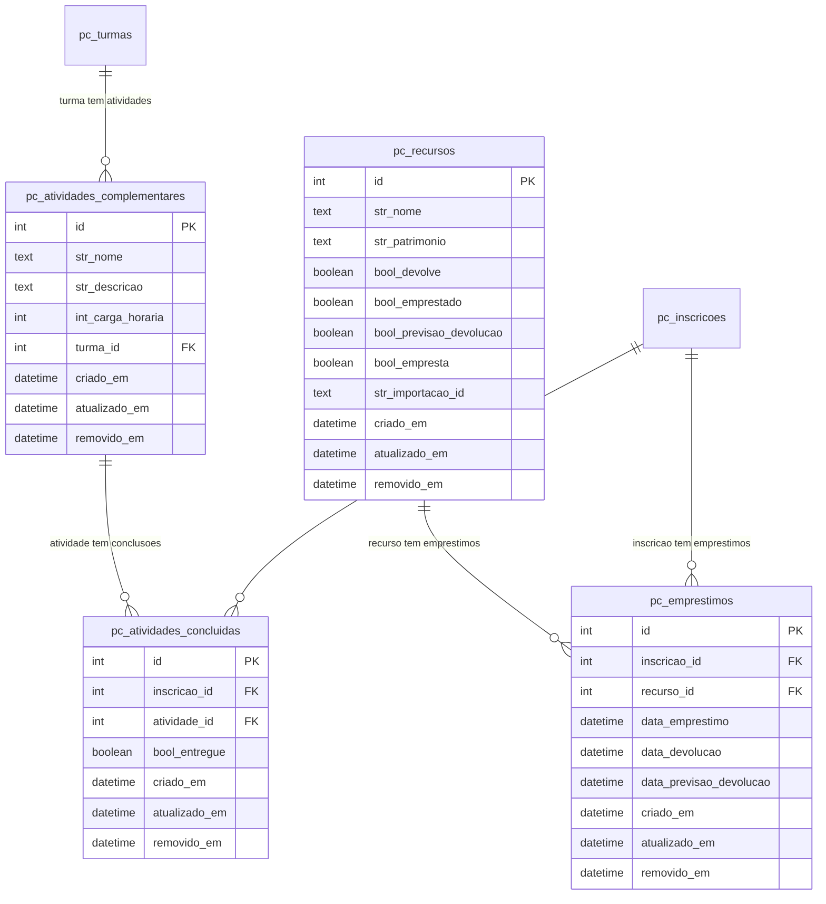

## 8. Administracao, Mensagens e Respostas Questionario

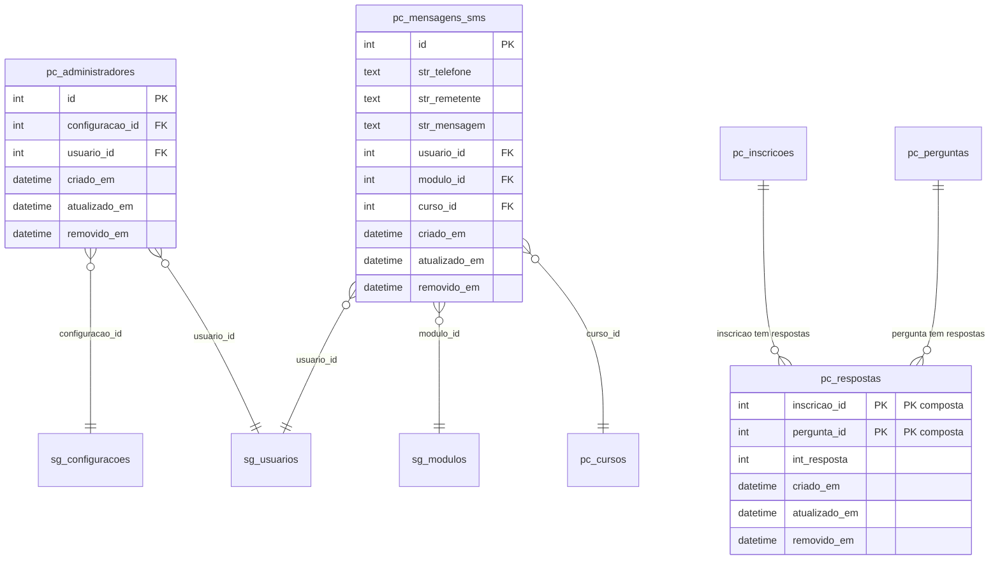

---

## 9. Trilhas de Aprendizagem (NOVO)

```mermaid
erDiagram
    pc_trilhas {
        int id PK
        text str_nome
        text str_descricao
        text str_path_imagem
        text str_url_imagem
        int int_ordem
        boolean bool_ativo "default true"
        datetime criado_em
        datetime atualizado_em
        datetime removido_em
    }

    pc_trilhas_cursos {
        int trilha_id PK_FK "PK composta"
        int curso_id PK_FK "PK composta - apenas int_modalidade=2"
        int int_ordem
        datetime criado_em
        datetime atualizado_em
        datetime removido_em
    }

    pc_inscricoes_trilhas {
        int id PK
        int usuario_id FK
        int trilha_id FK
        datetime dt_inscricao
        boolean bool_concluida "default false"
        datetime dt_conclusao
        datetime criado_em
        datetime atualizado_em
        datetime removido_em
    }

    pc_trilhas ||--o{ pc_trilhas_cursos : "trilha contem cursos"
    pc_cursos ||--o{ pc_trilhas_cursos : "curso pertence a trilhas"
    pc_trilhas ||--o{ pc_inscricoes_trilhas : "trilha tem inscricoes"
    sg_usuarios ||--o{ pc_inscricoes_trilhas : "usuario_id"
    pc_inscricoes_trilhas ||--o{ pc_inscricoes : "inscricao_trilha_id"
```

**Restricao (Service):** `pc_trilhas_cursos.curso_id` so aceita cursos com `int_modalidade = 2`.

## 10. Conteudo Programatico (NOVO)

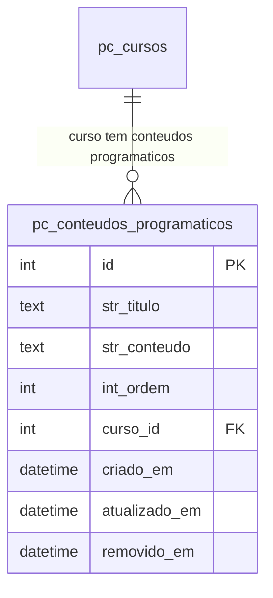

Serve para **ambas** modalidades (online e presencial).

## 11. Modulos e Aulas Online (NOVO)

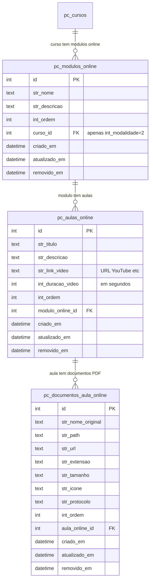

## 12. Questionarios Online (NOVO)

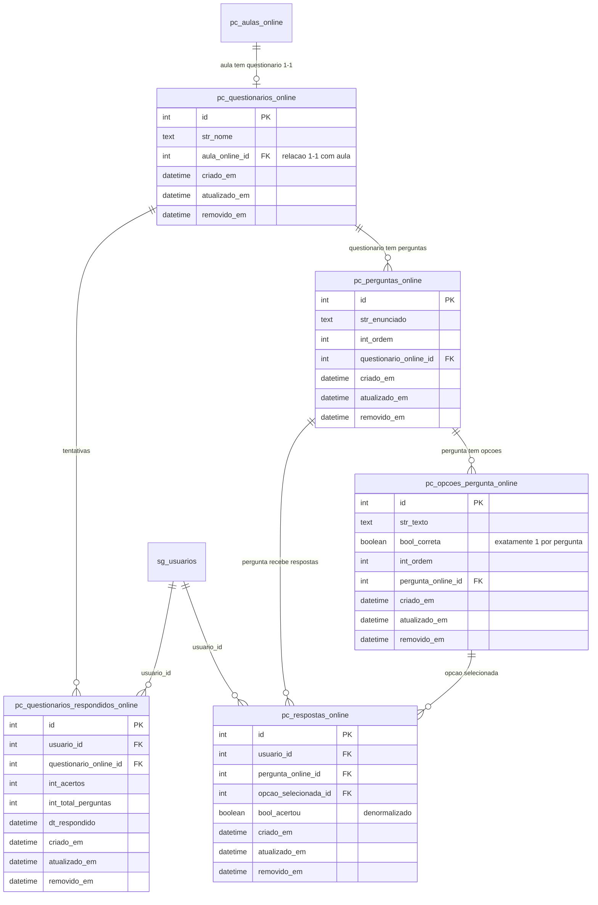

**Regras (Service):**
- Cada pergunta: minimo 2 opcoes, exatamente 1 `bool_correta = true`
- Multiplas tentativas: soft-delete respostas anteriores, insere novas

## 13. Progresso e Favoritos (NOVO)

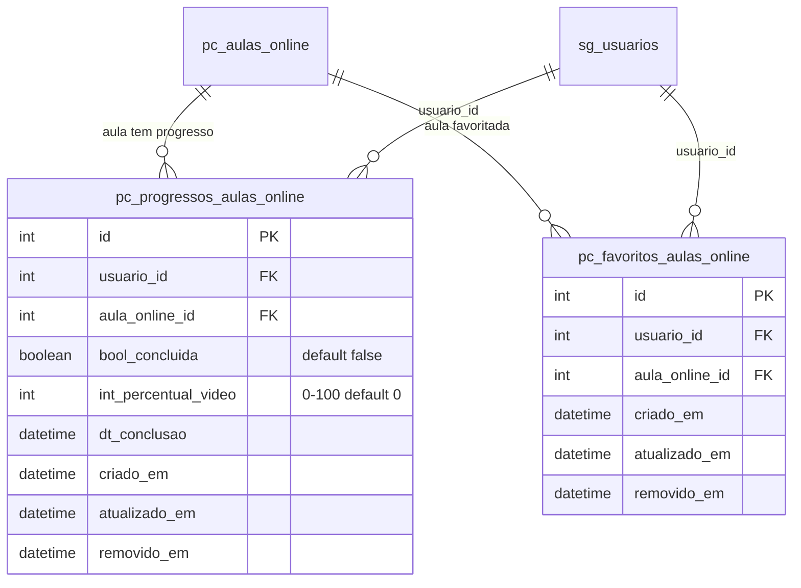

**Chave logica:** `usuario_id + aula_online_id` (progresso compartilhado entre trilhas).

**Regras de conclusao automatica (Service):**

| Tipo de aula | Condicao de conclusao |
|---|---|
| So texto/PDF (sem video, sem questionario) | Concluida automaticamente ao visualizar |
| Com video (sem questionario) | `int_percentual_video >= 80` |
| Com questionario (sem video) | Questionario respondido |
| Com video + questionario | Video >= 80% **E** questionario respondido |

**Progresso de video:** Frontend envia a cada 10-15s. Service nunca retrocede o percentual.

## 14. Credenciamento: Controle de Acesso e Cracha (NOVO)

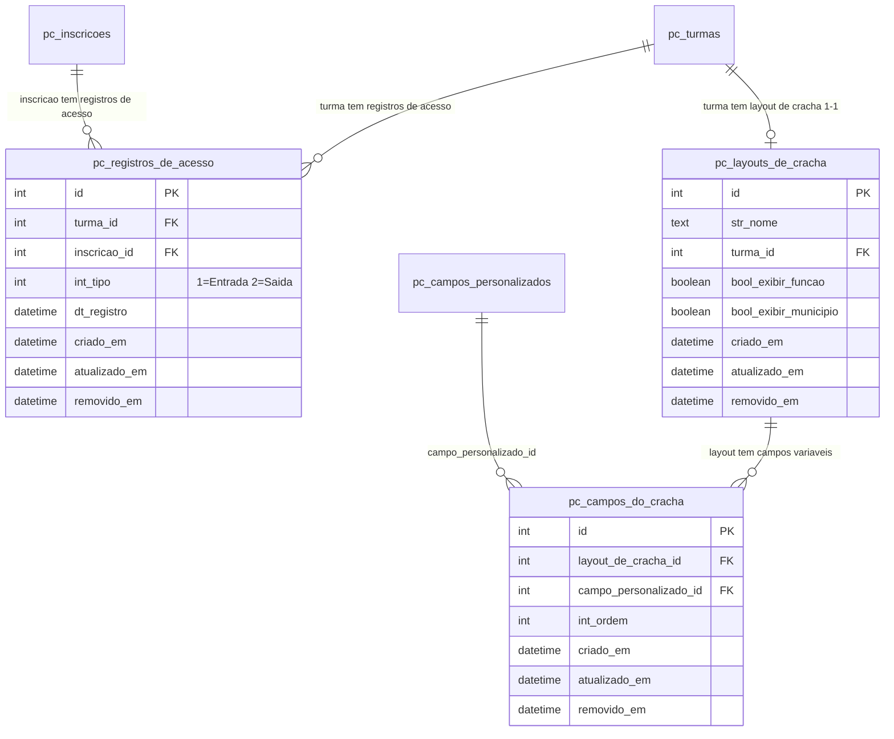

**Notas de Implementacao:**
- **`pc_registros_de_acesso`**: sem UNIQUE — registros duplicados (leituras erroneas) sao permitidos e removidos manualmente pelo atendente. Soft-delete via `removido_em`.
- **`pc_layouts_de_cracha`**: relacao 1-1 com `pc_turmas`. Campos fixos (QR Code, nome do participante, nome do evento) nao sao armazenados — sao sempre impressos.
- **`pc_campos_do_cracha`**: vincula `pc_campos_personalizados` ao layout, com ordenacao por `int_ordem`. A impressao do cracha nao cria registros adicionais — e operacao em tempo de execucao.
- **Enum `TipoDeRegistroDeAcessoEnum`**: `ENTRADA = 1`, `SAIDA = 2` (no Service, nao no banco).

---

## Dependencias Externas (Cross-Module)

| FK no Portal de Cursos | Tabela Externa | Modulo |
|---|---|---|
| `pc_cursos.responsavel_id` | `sg_usuarios` | Gerenciador |
| `pc_cursos.tipo_de_formacao_id` | `sg_tipos_de_formacoes` | Gerenciador |
| `pc_cursos.modelo_de_certificado_participante_id` | `pc_modelos_de_certificados` | Portal de Cursos |
| `pc_cursos.modelo_de_certificado_palestrante_id` | `pc_modelos_de_certificados` | Portal de Cursos |
| `pc_inscricoes.usuario_id` | `sg_usuarios` | Gerenciador |
| `pc_palestrantes.usuario_id` | `sg_usuarios` | Gerenciador |
| `pc_certificados.usuario_id` | `sg_usuarios` | Gerenciador |
| `pc_administradores.configuracao_id` | `sg_configuracoes` | Gerenciador |
| `pc_administradores.usuario_id` | `sg_usuarios` | Gerenciador |
| `pc_configuracoes.perfil_usuario_id` | `sg_perfis` | Gerenciador |
| `pc_mensagens_sms.usuario_id` | `sg_usuarios` | Gerenciador |
| `pc_mensagens_sms.modulo_id` | `sg_modulos` | Gerenciador |
| `pc_filtros_periodos_letivos.periodo_letivo_id` | `sa_periodos_letivos` | Academico |
| `pc_filtros_unidades.unidade_id` | `sa_unidades` | Academico |
| `pc_filtros_disciplinas.disciplina_id` | `sa_disciplinas` | Academico |
| `pc_filtros_anos_de_escolaridade.ano_de_escolaridade_id` | `sa_anos_de_escolaridade` | Academico |
| `pc_inscricoes_trilhas.usuario_id` | `sg_usuarios` | Gerenciador |
| `pc_respostas_online.usuario_id` | `sg_usuarios` | Gerenciador |
| `pc_progressos_aulas_online.usuario_id` | `sg_usuarios` | Gerenciador |
| `pc_questionarios_respondidos_online.usuario_id` | `sg_usuarios` | Gerenciador |
| `pc_favoritos_aulas_online.usuario_id` | `sg_usuarios` | Gerenciador |
| `pc_registros_de_acesso.turma_id` | `pc_turmas` | Portal de Cursos (interno) |
| `pc_registros_de_acesso.inscricao_id` | `pc_inscricoes` | Portal de Cursos (interno) |
| `pc_layouts_de_cracha.turma_id` | `pc_turmas` | Portal de Cursos (interno) |
| `pc_campos_do_cracha.layout_de_cracha_id` | `pc_layouts_de_cracha` | Portal de Cursos (interno) |
| `pc_campos_do_cracha.campo_personalizado_id` | `pc_campos_personalizados` | Portal de Cursos (interno) |
