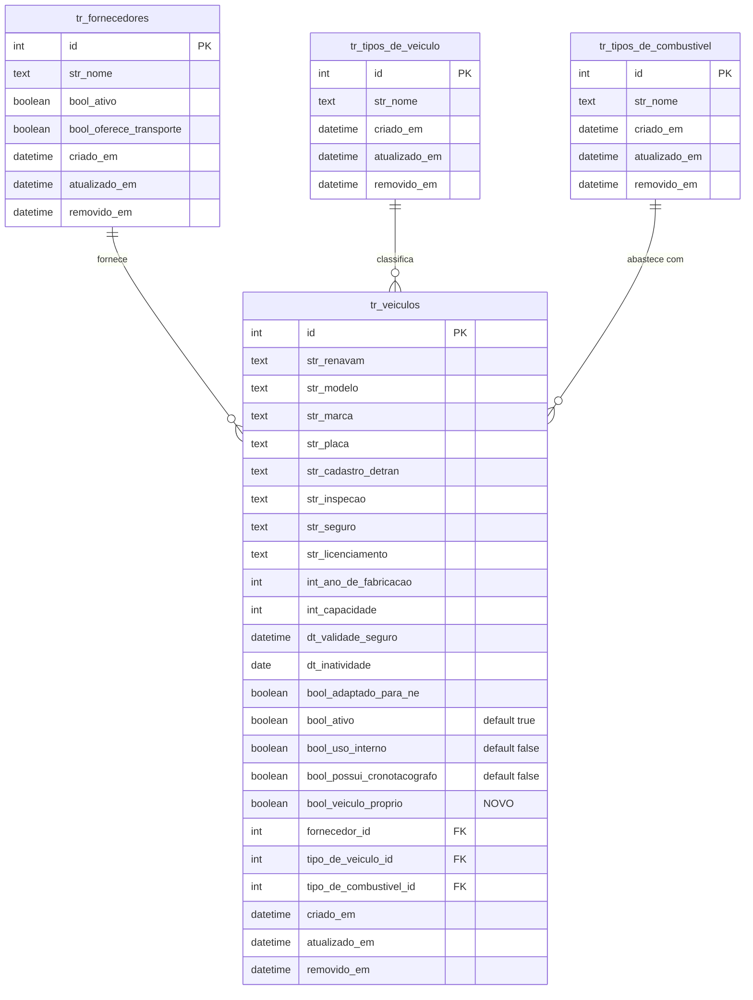
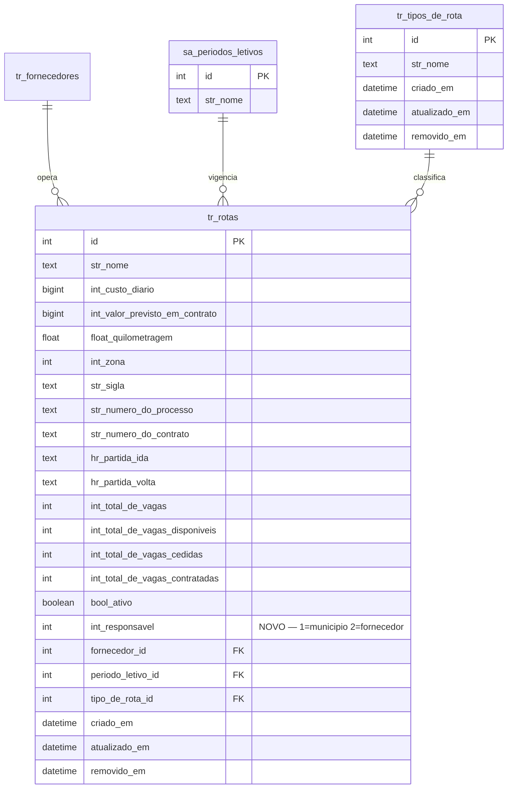
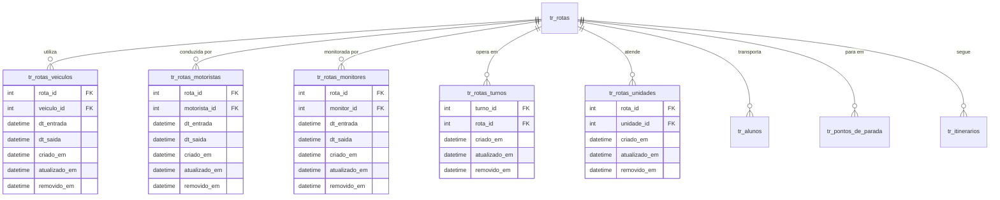
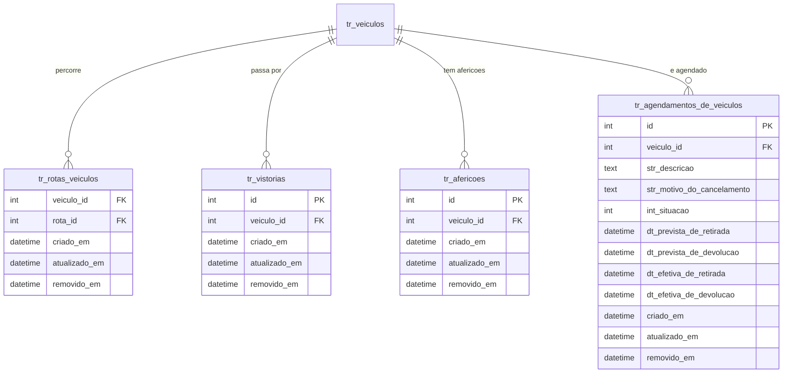

# ER - Modulo Transporte (Prefixo: tr_*)

2 tabelas documentadas (tr_veiculos, tr_rotas). Modulo de gestao de transporte escolar: veiculos, rotas, motoristas, monitores, alunos, frequencias, vistorias, afericoes e agendamentos.

> **Fluxo principal:** Veiculos (`tr_veiculos`) sao vinculados a Fornecedores (`tr_fornecedores`) e possuem Tipo de Veiculo (`tr_tipos_de_veiculo`) e Tipo de Combustivel (`tr_tipos_de_combustivel`). Veiculos percorrem Rotas (`tr_rotas`) via `tr_rotas_veiculos`. Passam por Vistorias (`tr_vistorias`), Afericoes (`tr_afericoes`) e podem ser Agendados (`tr_agendamentos_de_veiculos`).

## 1. Veiculo

## 2. Rota

## 3. Relacionamentos da Rota

## 4. Relacionamentos do Veiculo

## Novos Campos (SPRINT-163)

| Tabela | Campo | Tipo | Valores | Descricao |
|--------|-------|------|---------|-----------|
| `tr_veiculos` | `bool_veiculo_proprio` | `boolean` | true/false | Indica se o veiculo e de propriedade da secretaria/municipio (`true`) ou pertence a terceiro/fornecedor (`false`) |
| `tr_rotas` | `int_responsavel` | `integer` | 1=municipio, 2=fornecedor | Indica quem e o responsavel pela operacao da rota |

> **Nota:** Campos adicionados via migration de atualizacao (SPRINT-163). Sem UNIQUE ou CHECK no banco — validacao de negocio no Service/DTO conforme padrao do projeto. O campo `int_responsavel` utiliza enum `ResponsavelDaRotaEnum`.

## Dependencias Externas (Cross-Module)

| FK em tr_veiculos | Tabela Externa | Modulo |
|---|---|---|
| `tr_veiculos.fornecedor_id` | `tr_fornecedores` | Transporte (interno) |
| `tr_veiculos.tipo_de_veiculo_id` | `tr_tipos_de_veiculo` | Transporte (interno) |
| `tr_veiculos.tipo_de_combustivel_id` | `tr_tipos_de_combustivel` | Transporte (interno) |
