# ER - Modulo Gestao de Conselho (Prefixo: gc_*)

> **Status:** em construcao - documentacao incremental conforme o usuario descreve as funcionalidades. As secoes abaixo sao atualizadas a cada novo bloco recebido.

Modulo de gestao de conselhos (governanca, atos legais e documentacao). Inclui menu de Cadastros (entidades auxiliares), os Conselhos propriamente ditos, seus Membros e os documentos vinculados (Decretos, Resolucoes, Editais, Atas, Regimentos) e o Mural de publicacoes.

> **Prefixo de tabelas:** `gc_*` (a confirmar - verificar se nao conflita com modulo Caixa Escolar que tem `ce_conselhos`).
>
> **Observacao:** ja existe `ce_conselhos` no modulo Caixa Escolar, com escopo financeiro. O novo modulo Gestao de Conselho tem escopo mais amplo (atos legais, hierarquia de cargos, documentacao). A confirmar se sao modulos distintos ou se este e uma evolucao do existente.

---

## 1. Menu de Cadastros - Visao Geral

```mermaid
erDiagram
    gc_tipos_de_nomeacao {
        int id PK
        citext str_nome
        citext str_descricao
        boolean bool_ativo "default true"
        datetime criado_em
        datetime atualizado_em
        datetime removido_em
    }

    gc_cargos {
        int id PK
        citext str_nome
        int int_ordem_hierarquia "menor=maior hierarquia"
        boolean bool_ativo "default true"
        datetime criado_em
        datetime atualizado_em
        datetime removido_em
    }

    gc_status_de_cargos {
        int id PK
        citext str_nome
        string str_cor "hex - default #22c55e"
        boolean bool_ativo "default true"
        datetime criado_em
        datetime atualizado_em
        datetime removido_em
    }

    gc_objetos {
        int id PK
        citext str_nome
        boolean bool_aplica_lei "default false"
        boolean bool_aplica_decreto "default false"
        boolean bool_aplica_resolucao "default false"
        boolean bool_aplica_edital "default false"
        boolean bool_ativo "default true"
        datetime criado_em
        datetime atualizado_em
        datetime removido_em
    }

    gc_tipos_de_documentos {
        int id PK
        citext str_nome
        boolean bool_classifica_lei "default false"
        boolean bool_classifica_decreto "default false"
        boolean bool_classifica_resolucao "default false"
        boolean bool_classifica_edital "default false"
        boolean bool_ativo "default true"
        datetime criado_em
        datetime atualizado_em
        datetime removido_em
    }

    gc_entidades {
        int id PK
        citext str_nome
        int endereco_id FK "sg_enderecos"
        string str_email
        string str_telefone "fixo ou celular"
        datetime criado_em
        datetime atualizado_em
        datetime removido_em
    }

    sg_enderecos {
        int id PK
        string str_cep
        string str_logradouro
        string str_numero
        string str_complemento
        int estado_id FK
        int bairro_id FK
        int cidade_id FK
    }

    gc_configuracoes {
        int id PK
        int int_dias_alerta_vigencia_decreto
        int int_dias_alerta_vigencia_publicacao
        boolean bool_habilitar_chat_helpdesk
        string str_chave_chat_helpdesk
        datetime criado_em
        datetime atualizado_em
        datetime removido_em
    }

    gc_regras_de_renovacao {
        int id PK
        int conselho_id FK "gc_conselhos, nullable"
        int cargo_id FK "gc_cargos"
        boolean bool_reconducoes_ilimitadas "default false"
        int int_maximo_reconducoes "nullable"
        int int_intervalo_entre_mandatos_meses "nullable"
        boolean bool_ativo "default true"
        datetime criado_em
        datetime atualizado_em
        datetime removido_em
    }

    gc_entidades }o--|| sg_enderecos : "endereco_id"
    gc_regras_de_renovacao }o--|| gc_cargos : "cargo_id"
    gc_regras_de_renovacao }o--o| gc_conselhos : "conselho_id (opcional)"
```

> **Nota:** `gc_entidades` nao tem coluna `bool_ativo` - a listagem nao tem filtro de status (decisao do usuario).
>
> **Endereco:** os campos de endereco sao normalizados via FK para `sg_enderecos` (modulo Gerenciador), que ja possui FKs para `sg_estados`, `sg_cidades` e `sg_bairros`. O frontend usa ViaCEP para autopreencher esses dados, mas a persistencia ocorre nas tabelas existentes.

---

## 2. Detalhamento das Entidades de Cadastros

### 2.1 Tipos de Nomeacao (`gc_tipos_de_nomeacao`)

Identifica como um membro foi nomeado para o conselho (ex: "Decreto", "Portaria", "Eleicao", "Indicacao").

| Campo | Tipo | Obrigatorio | Observacoes |
|-------|------|-------------|-------------|
| `id` | PK | - | - |
| `str_nome` | citext | Sim | Nome do tipo |
| `str_descricao` | citext | Nao | Textarea livre - detalha o tipo de nomeacao |
| `bool_ativo` | boolean | Sim | Default: true |

**Onde e usado:** dropdown no formulario de criacao/edicao de Conselhos.
**Listagem:** com filtro de Status (Ativo/Inativo).

---

### 2.2 Cargos (`gc_cargos`)

Define os cargos disponiveis para membros dos conselhos (ex: "Presidente", "Vice", "Secretario", "Conselheiro").

| Campo | Tipo | Obrigatorio | Observacoes |
|-------|------|-------------|-------------|
| `id` | PK | - | - |
| `str_nome` | citext | Sim | Nome do cargo |
| `int_ordem_hierarquia` | integer | Sim | Default ao criar = `count(cargos)`. Menor valor = maior hierarquia |
| `bool_ativo` | boolean | Sim | Default: true |

**Regra de negocio:** `int_ordem_hierarquia` ordena exibicao de membros e cargos (Presidente=0, Vice=1, etc). Valor menor = maior hierarquia. Usado em listagens de membros e cargos.
**Onde e usado:** dropdown no cadastro de Membros do Conselho.
**Listagem:** com filtro de Status.

---

### 2.3 Status de Cargos (`gc_status_de_cargos`)

Define o estado atual de um membro em determinado cargo (ex: "Ativo", "Exonerado", "Licenciado", "Suplente").

| Campo | Tipo | Obrigatorio | Observacoes |
|-------|------|-------------|-------------|
| `id` | PK | - | - |
| `str_nome` | citext | Sim | Nome do status |
| `str_cor` | string | Sim | Hex - color picker + campo manual. Default: `#22c55e` (verde) |
| `bool_ativo` | boolean | Sim | Default: true |

**Onde e usado:** dropdown no cadastro de Membros do Conselho. A cor e renderizada em badges em todas as telas que exibem o status.
**Componentes Vue (reuso):** `resources/js/components/Common/Form/ColorPickerField.vue` e `resources/js/components/Common/ColorBadge.vue`.
**Listagem:** com filtro de Status.

---

### 2.4 Objetos (`gc_objetos`)

Categoriza a finalidade de documentos (Decretos, Resolucoes, Editais, Publicacoes do Mural). Ex: "Nomeacao de membros", "Eleicao de diretoria".

| Campo | Tipo | Obrigatorio | Observacoes |
|-------|------|-------------|-------------|
| `id` | PK | - | - |
| `str_nome` | citext | Sim | Nome do objeto |
| `bool_aplica_lei` | boolean | Nao | Checkbox "Lei" |
| `bool_aplica_decreto` | boolean | Nao | Checkbox "Decreto" |
| `bool_aplica_resolucao` | boolean | Nao | Checkbox "Resolucao" |
| `bool_aplica_edital` | boolean | Nao | Checkbox "Edital" |
| `bool_ativo` | boolean | Sim | Default: true |

**Modelagem:** as 4 opcoes "Tipos Aplicaveis" sao flags booleanas (decisao do usuario). Como sao valores fixos, evita-se tabela auxiliar.
**Onde e usado:** selecao em Decretos, Resolucoes, Editais e Publicacoes do Mural.
**Listagem:** com filtro de Status.

---

### 2.5 Tipos de Documentos (`gc_tipos_de_documentos`)

Classifica documentos da gestao dos conselhos (ex: "Regimento Interno", "Ata de Posse").

| Campo | Tipo | Obrigatorio | Observacoes |
|-------|------|-------------|-------------|
| `id` | PK | - | - |
| `str_nome` | citext | Sim | Nome do tipo de documento |
| `bool_classifica_lei` | boolean | Nao | Checkbox "Lei" |
| `bool_classifica_decreto` | boolean | Nao | Checkbox "Decreto" |
| `bool_classifica_resolucao` | boolean | Nao | Checkbox "Resolucao" |
| `bool_classifica_edital` | boolean | Nao | Checkbox "Edital" |
| `bool_ativo` | boolean | Sim | Default: true |

**Modelagem:** classificacoes modeladas como flags booleanas (mesmo padrao de Objetos), conforme decisao do usuario.
**Onde e usado:** classifica documentos dentro da gestao dos conselhos (ex: aba Regimentos).
**Listagem:** com filtro de Status.

---

### 2.6 Entidades (`gc_entidades`)

Representa a entidade juridica/orgao (ex: Prefeitura) a qual cada Conselho esta vinculado.

| Campo | Tipo | Obrigatorio | Observacoes |
|-------|------|-------------|-------------|
| `id` | PK | - | - |
| `str_nome` | citext | Sim | Nome completo (ex: "Prefeitura Municipal de Sao Paulo") |
| `endereco_id` | FK -> `sg_enderecos` | Sim | Endereco normalizado no modulo Gerenciador. Inclui CEP, logradouro, numero, complemento, bairro_id, cidade_id, estado_id |
| `str_email` | string | Nao | E-mail institucional de contato |
| `str_telefone` | string | Nao | Mascaras: fixo `(00) 0000-0000` ou celular `(00) 00000-0000` |

**Mapeamento campo de tela -> coluna em `sg_enderecos`:**

| Campo da tela | Coluna em `sg_enderecos` | Observacoes |
|---------------|--------------------------|-------------|
| CEP | `str_cep` | Mascara `00000-000`. Frontend usa ViaCEP para autopreencher os demais |
| Rua / Logradouro | `str_logradouro` | - |
| Numero | `str_numero` | String (aceita "S/N") |
| Complemento | `str_complemento` | Opcional |
| Bairro | `bairro_id` -> `sg_bairros` | Resolvido via ViaCEP ou cadastro manual |
| Cidade | `cidade_id` -> `sg_cidades` | Resolvida via ViaCEP ou cadastro manual |
| Estado / UF | `estado_id` -> `sg_estados` | Dropdown com 27 UFs ja cadastradas |

**Onde e usado:** referenciada como entidade em todos os Conselhos do sistema (futura FK `id_entidade` em `gc_conselhos`).
**Sem `bool_ativo`:** listagem nao tem filtro de status (decisao do usuario).

**Pontos a investigar antes da implementacao:**

- Componente Vue para mascara CEP/telefone + integracao ViaCEP - verificar reuso de componentes ja existentes no Gerenciador.
- Confirmar se `sg_enderecos.pessoa_id` deve ficar nulo para enderecos de entidades (parece aceitavel - o campo e nullable no Model).

---

### 2.7 Configuracoes (`gc_configuracoes`)

Tabela **singleton** de parametros operacionais do modulo. Possui **apenas um registro** com colunas tipadas para cada parametro. Para adicionar um novo parametro no futuro, basta adicionar uma nova coluna na migration.

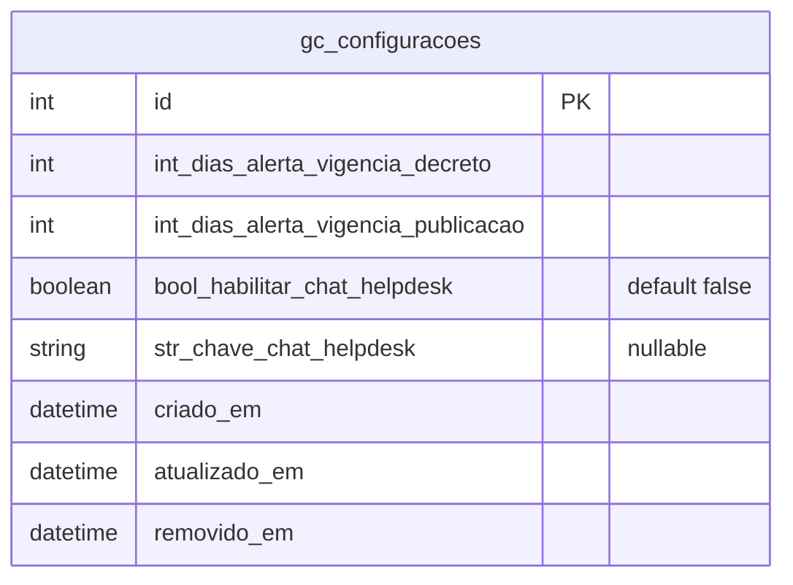

| Campo | Tipo | Obrigatorio | Observacoes |
|-------|------|-------------|-------------|
| `id` | PK | - | - |
| `int_dias_alerta_vigencia_decreto` | integer | Sim | Quantidade de dias antes do fim da vigencia para disparar alerta na listagem de Decretos. Valor inicial: `90` |
| `int_dias_alerta_vigencia_publicacao` | integer | Sim | Quantidade de dias antes do fim do periodo de exibicao para disparar alerta na listagem de Publicacoes do Mural. Valor inicial: `90` |
| `bool_habilitar_chat_helpdesk` | boolean | Sim | Default `false`. Liga/desliga o chat de helpdesk dentro do modulo |
| `str_chave_chat_helpdesk` | string | Nao | Chave/token de integracao do chat de helpdesk. Padrao observado em `Gerenciador\Configuracao` (campos `bool_habilitar_chat_helpdesk_academico` / `str_chave_chat_helpdesk_academico`) |

**Regras de negocio:**

- A tabela e um **singleton**: a aplicacao garante que existe **apenas 1 registro** (criado via seeder ou na primeira execucao). Edicoes sempre atualizam esse registro - nao se cria novos.
- A tela "Configuracoes" do modulo carrega o unico registro e expoe seus campos para edicao.
- Se o registro nao existir (situacao excepcional), os Models devem usar valores padrao definidos como constante de classe (ex: `Decreto::DIAS_ALERTA_VIGENCIA_PADRAO = 90`).
- Soft delete (`removido_em`): nao se aplica na pratica - o registro singleton nao deve ser removido.

---

### 2.8 Regras de Renovacao (`gc_regras_de_renovacao`)

Configura limites de renovacao de mandato (reconducoes maximas e intervalo entre mandatos) para um **cargo**, podendo ser **global** (aplica-se a todos os conselhos) ou **especifica de um conselho** (sobrescreve a global). Regras inativas (`bool_ativo = false`) sao ignoradas pela "hierarquia efetiva" - sistema de validacao de elegibilidade de membros para um novo mandato.

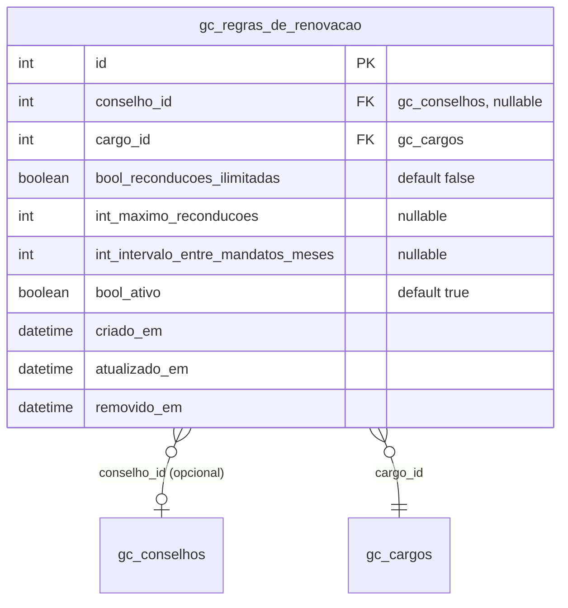

| Campo | Tipo | Obrigatorio | Observacoes |
|-------|------|-------------|-------------|
| `id` | PK | - | - |
| `conselho_id` | FK -> `gc_conselhos` | Nao | Quando `null`, a regra e **global** (aplica-se a todos os conselhos para o cargo). Quando preenchido, e **especifica** daquele conselho e sobrescreve a global |
| `cargo_id` | FK -> `gc_cargos` | Sim | Cargo regulado. **Constraint unica composta** em `(conselho_id, cargo_id)` - cada cargo tem no maximo uma regra global e no maximo uma regra por conselho. Ao editar, o campo fica desabilitado |
| `bool_reconducoes_ilimitadas` | boolean | Sim | Default `false`. Switch "Reconducoes ilimitadas". Quando `true`, oculta o campo de maximo na tela e grava `int_maximo_reconducoes = null` |
| `int_maximo_reconducoes` | integer | Nao | Quantidade maxima de reconducoes permitidas (>= 0). Obrigatorio na tela quando `bool_reconducoes_ilimitadas = false`; ignorado/nulificado quando `true` |
| `int_intervalo_entre_mandatos_meses` | integer | Nao | Intervalo minimo (em meses) que o membro deve aguardar entre o fim de um mandato e o inicio de uma reconducao |
| `bool_ativo` | boolean | Sim | Default `true`. Switch "Regra ativa". Regras com `false` sao ignoradas pela hierarquia efetiva |

**Regras de negocio:**

- **Escopo da regra:**
  - `conselho_id IS NULL` → regra **global** aplicavel a qualquer conselho que use o cargo.
  - `conselho_id` preenchido → regra **especifica** que **sobrescreve** a regra global daquele conselho + cargo.
- **Unicidade composta:** constraint unica em `(conselho_id, cargo_id)` - apenas uma regra global por cargo (`conselho_id = NULL`) e uma regra especifica por conselho + cargo. No PostgreSQL, `NULL` em colunas distintas e tratado como distinto - para garantir unicidade real entre regras globais, considerar implementar via unique partial index `(cargo_id) WHERE conselho_id IS NULL` ou validacao no FormRequest. No SQL Server, ajuste similar via filtered unique index.
- **Hierarquia de aplicacao na validacao de elegibilidade:** ao verificar se um membro pode ser renomeado para um cargo em um conselho:
  1. Buscar regra especifica (`conselho_id = X AND cargo_id = Y AND bool_ativo = true`).
  2. Se nao encontrar, buscar regra global (`conselho_id IS NULL AND cargo_id = Y AND bool_ativo = true`).
  3. Se nem global existir, nao ha restricao aplicavel.
- **Edicao:** ao abrir o modal para editar uma regra existente, os campos `conselho_id` e `cargo_id` permanecem desabilitados (read-only). Trocar conselho/cargo exige deletar a regra e criar uma nova.
- **Validacoes condicionais (FormRequest):**
  - Se `bool_reconducoes_ilimitadas = true`, forcar `int_maximo_reconducoes = null` antes de persistir.
  - Se `bool_reconducoes_ilimitadas = false`, exigir `int_maximo_reconducoes >= 0`.
  - `int_intervalo_entre_mandatos_meses` aceita `null` ou inteiro >= 0.
- **Hierarquia efetiva:** somente regras com `bool_ativo = true` sao avaliadas. Regras inativas servem como historico/preservacao de configuracoes antigas.

---

## 3. Conselhos

Cadastro principal do modulo. Cada Conselho esta vinculado a uma Entidade (`gc_entidades`) e possui imagem de perfil, atribuicoes proprias e (futuramente) Membros, Documentos e Publicacoes.

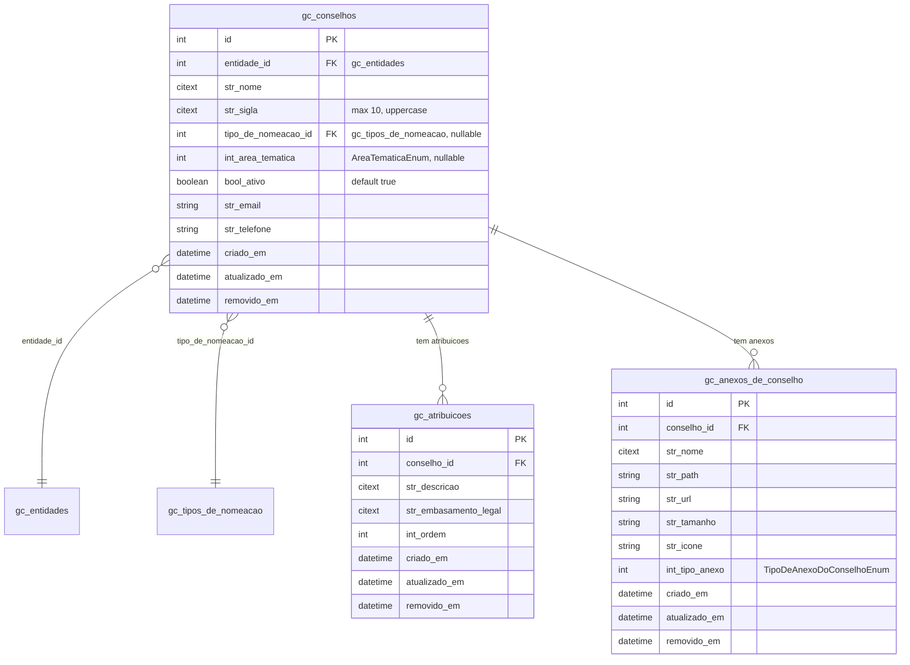

---

### 3.1 Conselho (`gc_conselhos`)

| Campo | Tipo | Obrigatorio | Observacoes |
|-------|------|-------------|-------------|
| `id` | PK | - | - |
| `entidade_id` | FK -> `gc_entidades` | Sim | Dropdown "Entidade Vinculada" - lista todas as entidades cadastradas no modulo |
| `str_nome` | citext | Sim | Nome completo do conselho (ex: "Conselho Municipal de Saude") |
| `str_sigla` | citext | Sim | Maximo 10 caracteres. Convertida automaticamente para maiuscula antes de persistir (no FormRequest via `prepareForValidation`) |
| `tipo_de_nomeacao_id` | FK -> `gc_tipos_de_nomeacao` | Nao | Dropdown - apenas tipos com `bool_ativo = true` |
| `int_area_tematica` | integer | Nao | Valor mapeado por `AreaTematicaEnum` (PHP). Ver 3.4 |
| `bool_ativo` | boolean | Sim | Default: `true`. Tela apresenta como dropdown "Ativo / Inativo" |
| `str_email` | string | Nao | E-mail especifico do conselho. Validacao Laravel `email` |
| `str_telefone` | string | Nao | Mascara fixo `(00) 0000-0000` ou celular `(00) 00000-0000` |

**Imagem de Perfil:** nao e coluna em `gc_conselhos`. Persistida em `gc_anexos_de_conselho` com `int_tipo_anexo = IMAGEM_PERFIL` (ver 3.3). Upload aceita PNG/JPG ate 5 MB no bucket padrao do sistema, dentro da pasta `/gestao-de-conselhos/anexos-do-conselho`.

**Regras de negocio:**

- Sigla: a conversao para UPPERCASE ocorre no FormRequest, nao no banco. Nao existe trigger.
- "Tipo de Nomeacao" no conselho e informativo - nao impoe o tipo de nomeacao dos membros individuais (esse fica em `gc_membros_do_conselho`, a documentar).
- Sem unique constraint em escopo atual - duplicidade de nome/sigla por entidade nao e bloqueada.

---

### 3.2 Atribuicoes do Conselho (`gc_atribuicoes`)

Lista de competencias/atribuicoes do conselho, inseridas individualmente e em ordem sequencial. Relacao 1:N com `gc_conselhos`.

| Campo | Tipo | Obrigatorio | Observacoes |
|-------|------|-------------|-------------|
| `id` | PK | - | - |
| `conselho_id` | FK -> `gc_conselhos` | Sim | - |
| `str_descricao` | citext | Sim | Textarea descrevendo a competencia. **Maximo 2000 caracteres** - validacao no FormRequest (`max:2000`) |
| `str_embasamento_legal` | citext | Nao | Referencia legal (ex: "Art. 7o, Lei no 438/1992") |
| `int_ordem` | integer | Sim | Ordem sequencial de exibicao. **Auto-calculada** ao criar: `count(atribuicoes do conselho) + 1`. Mesmo padrao de `sa_quesitos_do_plano_de_ensino`. Nao e exposta como campo editavel no modal |

**Listagem na tela do conselho:** sempre ordenada por `int_ordem ASC`. Reordenar/remover atribuicoes recalcula os indices.

---

### 3.3 Anexos do Conselho (`gc_anexos_de_conselho`)

Tabela polimorfica de anexos do conselho. Atualmente armazena apenas **Imagem de Perfil** (PNG/JPG ate 5 MB). Os arquivos sao gravados no **bucket padrao do sistema**, dentro da pasta `/gestao-de-conselhos/anexos-do-conselho`. Estrutura preparada para acomodar futuros tipos de anexo (regimentos, atas etc) sem nova tabela. Segue o padrao de `ce_anexos_de_conselho` (Caixa Escolar).

| Campo | Tipo | Obrigatorio | Observacoes |
|-------|------|-------------|-------------|
| `id` | PK | - | - |
| `conselho_id` | FK -> `gc_conselhos` | Sim | - |
| `str_nome` | citext | Sim | Nome original do arquivo |
| `str_path` | string | Sim | Path interno no bucket padrao do sistema. Convencao: `/gestao-de-conselhos/anexos-do-conselho/{nome_do_arquivo}` |
| `str_url` | string | Sim | URL publica resolvida |
| `str_tamanho` | string | Nao | Tamanho legivel (ex: "1.2 MB") |
| `str_icone` | string | Nao | Icone para preview (Material/FontAwesome) |
| `int_tipo_anexo` | integer | Sim | Valor mapeado por `TipoDeAnexoDoConselhoEnum`. Inicial: `1 = IMAGEM_PERFIL` |

**Regras de negocio:**

- Apenas 1 anexo ativo com `int_tipo_anexo = IMAGEM_PERFIL` por conselho (validacao no Service).
- Ao remover (soft delete) ou substituir, o arquivo S3 deve ser apagado via `ArquivoService::removerArquivoS3()`, conforme padrao em `app/Modelos/PortalDeComunicacao/Foto.php`.
- Os arquivos sao gravados no bucket padrao do sistema (sem novo disco), apenas em pasta dedicada `/gestao-de-conselhos/anexos-do-conselho`.

---

### 3.4 Area Tematica (`AreaTematicaEnum`)

Enum PHP de dominio que mapeia os valores de `gc_conselhos.int_area_tematica`. Opcoes fixas (nao admin-editaveis), por isso modeladas como enum de codigo em vez de lookup table.

| Valor | Constante | Rotulo na tela |
|-------|-----------|----------------|
| 1 | `SAUDE` | Saude |
| 2 | `EDUCACAO` | Educacao |
| 3 | `ASSISTENCIA_SOCIAL` | Assistencia Social |
| 4 | `MEIO_AMBIENTE` | Meio Ambiente |
| 5 | `CRIANCA_E_ADOLESCENTE` | Crianca e Adolescente |
| 6 | `CULTURA` | Cultura |
| 7 | `ESPORTE` | Esporte |
| 8 | `OUTROS` | Outros |

Filtro de listagem inclui opcao "Todas" (frontend envia `null`, backend ignora o filtro).

---

### 3.5 Tipo de Anexo do Conselho (`TipoDeAnexoDoConselhoEnum`)

Enum PHP que mapeia `gc_anexos_de_conselho.int_tipo_anexo`.

| Valor | Constante | Rotulo na tela |
|-------|-----------|----------------|
| 1 | `IMAGEM_PERFIL` | Imagem de Perfil |

Outros valores serao adicionados conforme Regimentos, Atas e Decretos forem modelados.

---

### 3.6 Listagem de Conselhos - Filtros e Regras

A tela de listagem aplica os seguintes filtros e regras (todas implementadas no Repository/Service do backend, nao geram colunas no banco):

| Filtro | Comportamento |
|--------|---------------|
| Busca por texto | `WHERE str_nome ILIKE %termo% OR str_sigla ILIKE %termo%` (PostgreSQL) / equivalente SQL Server |
| Status | Todos (default) / Ativo (`bool_ativo = true`) / Inativo (`bool_ativo = false`) |
| Area Tematica | Todas (default) ou um dos 8 valores de `AreaTematicaEnum` |

**Coluna Mandato (alerta de fim de mandato):** o sistema exibe um alerta visual (badge) na coluna Mandato quando existir pelo menos um **mandato** (`gc_mandatos`, secao 4.2) de membro do conselho com `dt_fim` no intervalo `[today, today + 45 dias]`.

- O numero **45** deve ser exposto como constante de classe no Model (ex: `Mandato::DIAS_ALERTA_FIM_MANDATO = 45`), permitindo ajuste sem migration.
- Query SQL consolidada documentada na secao 4.2.

---

## 4. Membros do Conselho

Cadastro de membros vinculados a um Conselho. **O membro nao referencia `sg_pessoas`** - Nome Completo e CPF sao campos proprios da tabela. Isso permite registrar membros que nao sao usuarios do sistema (representantes externos, sociedade civil etc).

As datas de mandato ficam em tabela filha `gc_mandatos` (secao 4.2) - cada membro pode ter **multiplos mandatos** no mesmo conselho/cargo, permitindo o registro de reconducoes e o historico de alteracoes de mandato.

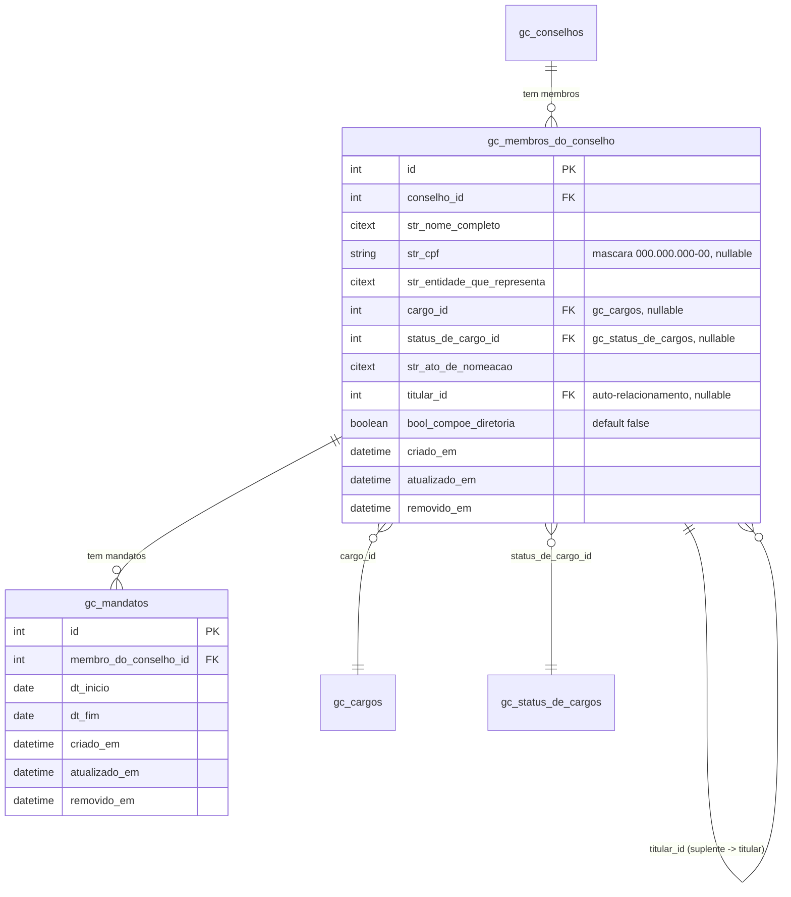

---

### 4.1 Membro do Conselho (`gc_membros_do_conselho`)

| Campo | Tipo | Obrigatorio | Observacoes |
|-------|------|-------------|-------------|
| `id` | PK | - | - |
| `conselho_id` | FK -> `gc_conselhos` | Sim | A qual conselho o membro pertence |
| `str_nome_completo` | citext | Sim | Nome completo do membro |
| `str_cpf` | string | Nao | Mascara `000.000.000-00`. Validacao de digitos verificadores no FormRequest. **Nao exibido publicamente** - filtrar no Resource publico |
| `str_entidade_que_representa` | citext | Nao | Texto livre - organizacao ou segmento (ex: "Representante de Organizacoes da Sociedade Civil") |
| `cargo_id` | FK -> `gc_cargos` | Nao | Dropdown - apenas cargos com `bool_ativo = true`, ordenados por `int_ordem_hierarquia ASC` |
| `status_de_cargo_id` | FK -> `gc_status_de_cargos` | Nao | Dropdown - apenas com `bool_ativo = true`. Renderiza com bolinha colorida usando `str_cor` |
| `str_ato_de_nomeacao` | citext | Nao | Texto livre - referencia do documento (ex: "Decreto no 202/2024") |
| `titular_id` | FK -> `gc_membros_do_conselho` | Nao | **Auto-relacionamento.** Se preenchido, o membro e **suplente** do `titular_id` informado. Se nulo, e **titular** |
| `bool_compoe_diretoria` | boolean | Nao | Default: `false`. Se `true`, listagem exibe estrela (estrela) ao lado do nome |

**Regras de negocio:**

- **Suplencia (`titular_id`):**
  - Dropdown "E suplente de" lista apenas membros do **mesmo `conselho_id`** com `titular_id IS NULL` (ou seja, apenas titulares).
  - Opcao "Nenhum" no dropdown deixa `titular_id = NULL` (membro vira titular).
  - Validacao: nao pode ser suplente de si mesmo (`titular_id != id`).
  - Cardinalidade: um titular pode ter N suplentes (1:N via auto-relacionamento).
  - Se um titular for removido (soft delete), avaliar se os suplentes vinculados ficam orfaos ou viram titulares.

- **Privacidade do CPF:** o campo deve ser omitido em qualquer Resource publico do conselho. Apenas usuarios autenticados com permissao adequada visualizam o CPF.

- **Diretoria:** o campo `bool_compoe_diretoria` e independente do cargo. Um Conselheiro pode ou nao compor a diretoria conforme decisao formal do conselho.

- **Mandatos do membro:** ver secao 4.2. As datas de inicio/fim ficam em `gc_mandatos`. O "mandato atual" e derivado da consulta a `gc_mandatos` do membro - tipicamente o registro com `dt_inicio <= today` E (`dt_fim IS NULL OR dt_fim >= today`).

---

### 4.2 Mandatos (`gc_mandatos`)

Tabela filha 1:N de `gc_membros_do_conselho`. Registra o **historico de mandatos** de cada membro. Um mesmo membro pode ter multiplos mandatos no mesmo conselho/cargo (reconducoes), e a presenca de varios registros permite consultar o historico de periodos servidos.

| Campo | Tipo | Obrigatorio | Observacoes |
|-------|------|-------------|-------------|
| `id` | PK | - | - |
| `membro_do_conselho_id` | FK -> `gc_membros_do_conselho` | Sim | Membro proprietario deste mandato |
| `dt_inicio` | date | Sim | Inicio do mandato. Date picker em portugues |
| `dt_fim` | date | Nao | Fim do mandato. Date picker em portugues. **Usado no alerta de 45 dias** da listagem de Conselhos (secao 3.6) |

**Regras de negocio:**

- Validacao temporal: se `dt_fim` estiver preenchido, deve ser >= `dt_inicio`.
- **Mandato atual** de um membro: registro mais recente com `dt_inicio <= today` E (`dt_fim IS NULL OR dt_fim >= today`).
- Listagem de mandatos por membro: ordenada por `dt_inicio DESC` (mais recentes primeiro).
- Sem unique constraint - permite explicitamente que um membro tenha multiplos registros, inclusive sobrepostos no tempo (ex: correcao historica). A validacao de sobreposicao, se necessaria, fica a cargo do FormRequest.

**Query do alerta de fim de mandato (referenciada na secao 3.6):**

```sql
-- Para cada conselho na listagem, exibir alerta se houver pelo menos 1 mandato
-- de membro do conselho com dt_fim no intervalo [hoje, hoje + 45 dias]
SELECT 1
FROM gc_mandatos man
JOIN gc_membros_do_conselho mem ON mem.id = man.membro_do_conselho_id
WHERE mem.conselho_id = :conselho_id
  AND mem.removido_em IS NULL
  AND man.removido_em IS NULL
  AND man.dt_fim BETWEEN CURRENT_DATE AND CURRENT_DATE + INTERVAL '45 days'
LIMIT 1;
```

---

## 5. Documentos

Documentos vinculados a um Conselho. A estrutura prevista contempla **Regimento Interno** (modelado nesta secao), Decretos, Resolucoes, Editais e Atas (a documentar conforme o usuario descrever).

### 5.1 Regimento Interno (`gc_regimentos_internos`)

Cadastro do(s) regimento(s) interno(s) do conselho. Permite registrar tanto a criacao do primeiro regimento quanto suas alteracoes posteriores. O(s) PDF(s) ficam em tabela filha `gc_anexos_de_regimento_interno` (secao 5.2).

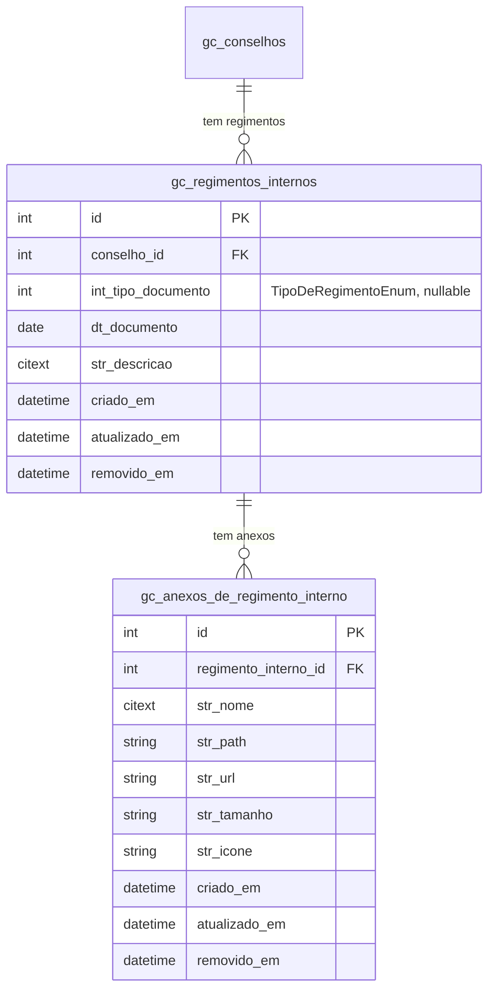

| Campo | Tipo | Obrigatorio | Observacoes |
|-------|------|-------------|-------------|
| `id` | PK | - | - |
| `conselho_id` | FK -> `gc_conselhos` | Sim | Conselho ao qual o regimento pertence |
| `int_tipo_documento` | integer | Nao | Valor mapeado por `TipoDeRegimentoEnum`. Opcoes: `1 = CRIACAO`, `2 = ALTERACAO` |
| `dt_documento` | date | Sim | Data do documento. Date picker em portugues |
| `str_descricao` | citext | Nao | Texto longo descrevendo o regimento ou a alteracao |

**Regras de negocio:**

- O regimento e opcional - um conselho pode existir sem regimento cadastrado.
- Nao ha unicidade entre `conselho_id + int_tipo_documento = CRIACAO` no escopo atual.
- O PDF do regimento e opcional e fica em `gc_anexos_de_regimento_interno` (modelagem em 5.2). Cada regimento pode ter 0..N anexos.

---

### 5.2 Anexos do Regimento Interno (`gc_anexos_de_regimento_interno`)

Tabela filha 1:N de `gc_regimentos_internos`. Armazena o(s) PDF(s) do regimento (ou de cada alteracao). Estrutura segue o mesmo padrao de `gc_anexos_de_conselho` (secao 3.3) e `ce_anexos_de_conselho` (Caixa Escolar).

| Campo | Tipo | Obrigatorio | Observacoes |
|-------|------|-------------|-------------|
| `id` | PK | - | - |
| `regimento_interno_id` | FK -> `gc_regimentos_internos` | Sim | - |
| `str_nome` | citext | Sim | Nome original do arquivo |
| `str_path` | string | Sim | Path interno no bucket padrao do sistema. Convencao: `/gestao-de-conselhos/anexos-de-regimento-interno/{nome_do_arquivo}` |
| `str_url` | string | Sim | URL publica resolvida |
| `str_tamanho` | string | Nao | Tamanho legivel (ex: "1.2 MB") |
| `str_icone` | string | Nao | Icone para preview (ex: PDF) |

**Regras de negocio:**

- Restricao de tipo: aceitar apenas PDF na validacao do FormRequest (extensao `.pdf` e MIME `application/pdf`).
- Limite de tamanho: a definir na implementacao (sugestao: igual a Imagem de Perfil, 5 MB - confirmar).
- Limpeza S3: ao remover (soft delete) ou substituir o anexo, apagar o arquivo via `ArquivoService::removerArquivoS3()` no `boot()` do Model, conforme padrao de `app/Modelos/PortalDeComunicacao/Foto.php`.

---

### 5.3 Tipo de Regimento (`TipoDeRegimentoEnum`)

Enum PHP de dominio que mapeia `gc_regimentos_internos.int_tipo_documento`.

| Valor | Constante | Rotulo na tela |
|-------|-----------|----------------|
| 1 | `CRIACAO` | Criacao |
| 2 | `ALTERACAO` | Alteracao |

---

### 5.4 Lei (`gc_leis`)

Registra leis vinculadas ao conselho. Cada lei tem numero, data e ementa proprios e pode ter um ou mais PDFs anexados (tabela filha em 5.5).

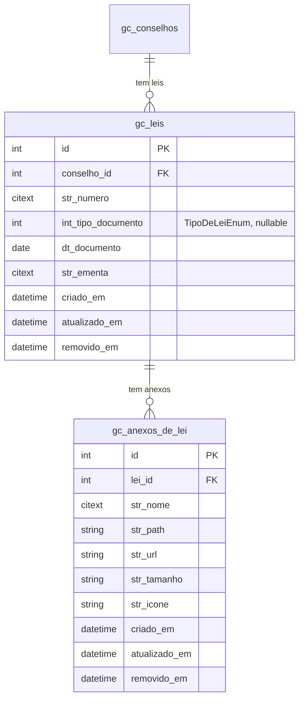

| Campo | Tipo | Obrigatorio | Observacoes |
|-------|------|-------------|-------------|
| `id` | PK | - | - |
| `conselho_id` | FK -> `gc_conselhos` | Sim | Conselho ao qual a lei pertence |
| `str_numero` | citext | Sim | Numero da lei (ex: "1.119/2018"). Texto livre - nao validar formato no banco (frontend pode aplicar mascara opcional) |
| `int_tipo_documento` | integer | Nao | Valor mapeado por `TipoDeLeiEnum`. Opcoes: `1 = CRIACAO`, `2 = ALTERACAO` |
| `dt_documento` | date | Sim | Data unica da lei (sem campo de vigencia). Date picker em portugues |
| `str_ementa` | citext | Sim | Texto longo descrevendo a ementa da lei |

**Regras de negocio:**

- Nao ha unicidade de `str_numero` por conselho no escopo atual (a mesma numeracao pode aparecer mais de uma vez se houver entradas distintas - confirmar com usuario).
- O PDF e opcional - lei pode ser cadastrada sem anexo. Se houver anexo, fica em `gc_anexos_de_lei` (5.5).

---

### 5.5 Anexos da Lei (`gc_anexos_de_lei`)

Tabela filha 1:N de `gc_leis`. Armazena o(s) PDF(s) da lei. Estrutura segue o mesmo padrao de `gc_anexos_de_regimento_interno` (secao 5.2).

| Campo | Tipo | Obrigatorio | Observacoes |
|-------|------|-------------|-------------|
| `id` | PK | - | - |
| `lei_id` | FK -> `gc_leis` | Sim | - |
| `str_nome` | citext | Sim | Nome original do arquivo |
| `str_path` | string | Sim | Path interno no bucket padrao do sistema. Convencao: `/gestao-de-conselhos/anexos-de-lei/{nome_do_arquivo}` |
| `str_url` | string | Sim | URL publica resolvida |
| `str_tamanho` | string | Nao | Tamanho legivel (ex: "1.2 MB") |
| `str_icone` | string | Nao | Icone para preview (ex: PDF) |

**Regras de negocio:**

- Restricao de tipo: aceitar apenas PDF na validacao do FormRequest (extensao `.pdf` e MIME `application/pdf`).
- Limpeza S3: ao remover (soft delete) ou substituir o anexo, apagar o arquivo via `ArquivoService::removerArquivoS3()` no `boot()` do Model.

---

### 5.6 Tipo de Lei (`TipoDeLeiEnum`)

Enum PHP de dominio que mapeia `gc_leis.int_tipo_documento`.

| Valor | Constante | Rotulo na tela |
|-------|-----------|----------------|
| 1 | `CRIACAO` | Criacao |
| 2 | `ALTERACAO` | Alteracao |

> **Nota:** os valores sao identicos a `TipoDeRegimentoEnum` (secao 5.3). Avaliar na implementacao se vale unificar em um unico enum generico (ex: `TipoDeAtoNormativoEnum`).

---

### 5.7 Decreto (`gc_decretos`)

Registra decretos vinculados ao conselho. Diferente de Regimento e Lei, o decreto tem **periodo de vigencia** (data inicio + data fim) e referencia opcional a um Objeto (categoria de finalidade).


| Campo | Tipo | Obrigatorio | Observacoes |
|-------|------|-------------|-------------|
| `id` | PK | - | - |
| `conselho_id` | FK -> `gc_conselhos` | Sim | Conselho ao qual o decreto pertence |
| `objeto_id` | FK -> `gc_objetos` | Nao | Dropdown filtrado: apenas objetos com `bool_ativo = true` **e** `bool_aplica_decreto = true` |
| `str_numero` | citext | Sim | Identificador do decreto (ex: "202/2024"). Texto livre |
| `str_ementa` | citext | Sim | Resumo oficial do decreto. Texto longo |
| `dt_inicio_vigencia` | date | Sim | Inicio da vigencia. Date picker em portugues |
| `dt_fim_vigencia` | date | Nao | Fim da vigencia. **Base para calculo de alertas** (vencimento proximo) |

**Regras de negocio:**

- O dropdown de Objeto considera apenas objetos com `bool_aplica_decreto = true` (ver tabela `gc_objetos`, secao 2.4). Esse filtro acontece no Repository/Service ao montar o select.
- Nao ha unicidade de `str_numero` por conselho no escopo atual.
- Validacao temporal: se `dt_fim_vigencia` estiver preenchido, deve ser >= `dt_inicio_vigencia`.
- **Alerta de fim de vigencia:** decretos com `dt_fim_vigencia` proxima disparam alerta visual em listagens (analogo ao alerta de mandato dos membros, secao 3.6). O **periodo (em dias)** vem da coluna `gc_configuracoes.int_dias_alerta_vigencia_decreto` (secao 2.7). Valor inicial: **90 dias**. Fallback (se o registro singleton nao existir): constante `Decreto::DIAS_ALERTA_VIGENCIA_PADRAO = 90` no Model.

---

### 5.8 Anexos do Decreto (`gc_anexos_de_decreto`)

Tabela filha 1:N de `gc_decretos`. Armazena o(s) PDF(s) do decreto. Estrutura segue o mesmo padrao de `gc_anexos_de_regimento_interno` e `gc_anexos_de_lei`.

| Campo | Tipo | Obrigatorio | Observacoes |
|-------|------|-------------|-------------|
| `id` | PK | - | - |
| `decreto_id` | FK -> `gc_decretos` | Sim | - |
| `str_nome` | citext | Sim | Nome original do arquivo |
| `str_path` | string | Sim | Path interno no bucket padrao do sistema. Convencao: `/gestao-de-conselhos/anexos-de-decreto/{nome_do_arquivo}` |
| `str_url` | string | Sim | URL publica resolvida |
| `str_tamanho` | string | Nao | Tamanho legivel (ex: "1.2 MB") |
| `str_icone` | string | Nao | Icone para preview (ex: PDF) |

**Regras de negocio:**

- Restricao de tipo: aceitar apenas PDF na validacao do FormRequest (extensao `.pdf` e MIME `application/pdf`).
- Limpeza S3: ao remover (soft delete) ou substituir o anexo, apagar o arquivo via `ArquivoService::removerArquivoS3()` no `boot()` do Model.

---

### 5.9 Resolucao (`gc_resolucoes`)

Registra resolucoes vinculadas ao conselho. Estrutura analoga a Decreto (numero + ementa + vigencia + objeto), porem **sem alerta de fim de vigencia configuravel** no escopo atual.

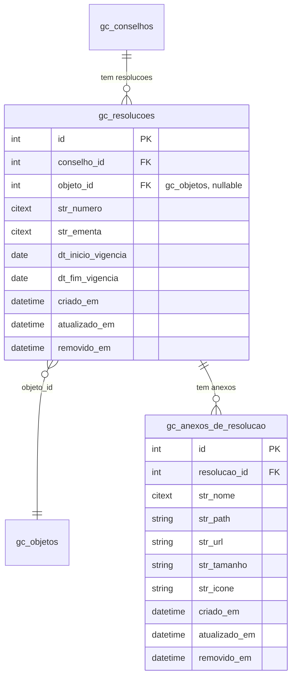

| Campo | Tipo | Obrigatorio | Observacoes |
|-------|------|-------------|-------------|
| `id` | PK | - | - |
| `conselho_id` | FK -> `gc_conselhos` | Sim | Conselho ao qual a resolucao pertence |
| `objeto_id` | FK -> `gc_objetos` | Nao | Dropdown filtrado: apenas objetos com `bool_ativo = true` **e** `bool_aplica_resolucao = true` |
| `str_numero` | citext | Sim | Identificador da resolucao (ex: "001/2024"). Texto livre |
| `str_ementa` | citext | Sim | Resumo oficial da resolucao. Texto longo |
| `dt_inicio_vigencia` | date | Sim | Inicio da vigencia. Date picker em portugues |
| `dt_fim_vigencia` | date | Nao | Fim da vigencia |

**Regras de negocio:**

- O dropdown de Objeto considera apenas objetos com `bool_aplica_resolucao = true` (ver tabela `gc_objetos`, secao 2.4). Esse filtro acontece no Repository/Service ao montar o select.
- Nao ha unicidade de `str_numero` por conselho no escopo atual.
- Validacao temporal: se `dt_fim_vigencia` estiver preenchido, deve ser >= `dt_inicio_vigencia`.

---

### 5.10 Anexos da Resolucao (`gc_anexos_de_resolucao`)

Tabela filha 1:N de `gc_resolucoes`. Armazena o(s) PDF(s) da resolucao. Estrutura segue o mesmo padrao de `gc_anexos_de_lei` e `gc_anexos_de_decreto`.

| Campo | Tipo | Obrigatorio | Observacoes |
|-------|------|-------------|-------------|
| `id` | PK | - | - |
| `resolucao_id` | FK -> `gc_resolucoes` | Sim | - |
| `str_nome` | citext | Sim | Nome original do arquivo |
| `str_path` | string | Sim | Path interno no bucket padrao do sistema. Convencao: `/gestao-de-conselhos/anexos-de-resolucao/{nome_do_arquivo}` |
| `str_url` | string | Sim | URL publica resolvida |
| `str_tamanho` | string | Nao | Tamanho legivel (ex: "1.2 MB") |
| `str_icone` | string | Nao | Icone para preview (ex: PDF) |

**Regras de negocio:**

- Restricao de tipo: aceitar apenas PDF na validacao do FormRequest (extensao `.pdf` e MIME `application/pdf`).
- Limpeza S3: ao remover (soft delete) ou substituir o anexo, apagar o arquivo via `ArquivoService::removerArquivoS3()` no `boot()` do Model.

---

### 5.11 Edital (`gc_editais`)

Registra editais vinculados ao conselho. Estrutura analoga a Resolucao, com a diferenca de que **data fim de vigencia e obrigatoria** - todo edital tem prazo definido.

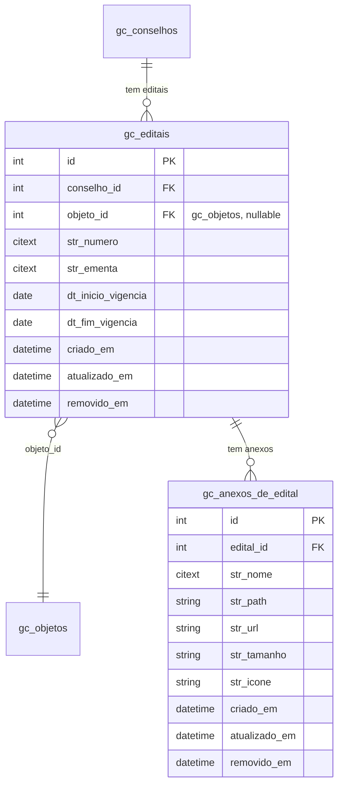

| Campo | Tipo | Obrigatorio | Observacoes |
|-------|------|-------------|-------------|
| `id` | PK | - | - |
| `conselho_id` | FK -> `gc_conselhos` | Sim | Conselho ao qual o edital pertence |
| `objeto_id` | FK -> `gc_objetos` | Nao | Dropdown filtrado: apenas objetos com `bool_ativo = true` **e** `bool_aplica_edital = true` |
| `str_numero` | citext | Sim | Identificador do edital (ex: "001/2024"). Texto livre |
| `str_ementa` | citext | Sim | Resumo oficial do edital. Texto longo |
| `dt_inicio_vigencia` | date | Sim | Inicio da vigencia. Date picker em portugues |
| `dt_fim_vigencia` | date | **Sim** | Fim da vigencia. Diferente de Decreto/Resolucao, **e obrigatorio** - todo edital tem prazo |

**Regras de negocio:**

- O dropdown de Objeto considera apenas objetos com `bool_aplica_edital = true` (ver tabela `gc_objetos`, secao 2.4). Esse filtro acontece no Repository/Service ao montar o select.
- Nao ha unicidade de `str_numero` por conselho no escopo atual.
- Validacao temporal: `dt_fim_vigencia >= dt_inicio_vigencia`.

---

### 5.12 Anexos do Edital (`gc_anexos_de_edital`)

Tabela filha 1:N de `gc_editais`. Armazena o(s) PDF(s) do edital. Estrutura segue o mesmo padrao de `gc_anexos_de_lei`, `gc_anexos_de_decreto` e `gc_anexos_de_resolucao`.

| Campo | Tipo | Obrigatorio | Observacoes |
|-------|------|-------------|-------------|
| `id` | PK | - | - |
| `edital_id` | FK -> `gc_editais` | Sim | - |
| `str_nome` | citext | Sim | Nome original do arquivo |
| `str_path` | string | Sim | Path interno no bucket padrao do sistema. Convencao: `/gestao-de-conselhos/anexos-de-edital/{nome_do_arquivo}` |
| `str_url` | string | Sim | URL publica resolvida |
| `str_tamanho` | string | Nao | Tamanho legivel (ex: "1.2 MB") |
| `str_icone` | string | Nao | Icone para preview (ex: PDF) |

**Regras de negocio:**

- Restricao de tipo: aceitar apenas PDF na validacao do FormRequest (extensao `.pdf` e MIME `application/pdf`).
- Limpeza S3: ao remover (soft delete) ou substituir o anexo, apagar o arquivo via `ArquivoService::removerArquivoS3()` no `boot()` do Model.

---

### 5.13 Ata (`gc_atas`)

Registra atas de reunioes do conselho. Diferente dos demais documentos, **nao tem vigencia** - tem data unica de reuniao - e expoe metadados especificos de governanca (tipo de reuniao, quorum, deliberacoes). Os anexos sao tipados (ata, lista de presenca, foto) - ver 5.14.

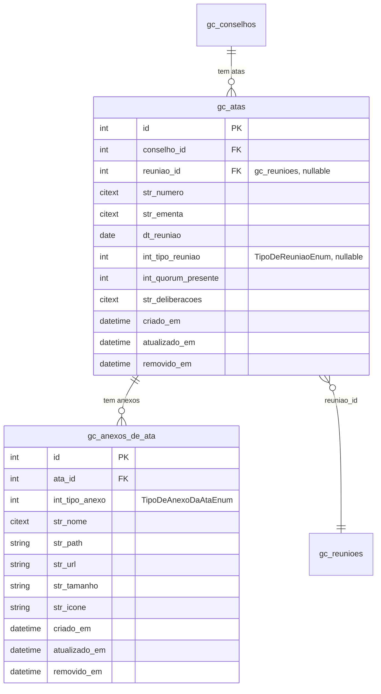

| Campo | Tipo | Obrigatorio | Observacoes |
|-------|------|-------------|-------------|
| `id` | PK | - | - |
| `conselho_id` | FK -> `gc_conselhos` | Sim | Conselho ao qual a ata pertence |
| `reuniao_id` | FK -> `gc_reunioes` | Nao | Vinculo opcional com a reuniao agendada. Pode ser preenchido na criacao da ata ou em momento posterior (edicao). Quando vinculada, o backend pode pre-popular `dt_reuniao` e `int_quorum_presente` a partir de `gc_reunioes` + `gc_frequencias_de_reuniao` |
| `str_numero` | citext | Nao | Numero da ata (ex: "001/2024"). Texto livre |
| `str_ementa` | citext | Sim | Ementa / Pauta. Textarea descrevendo o tema da reuniao |
| `dt_reuniao` | date | Sim | Data da reuniao. Date picker em portugues |
| `int_tipo_reuniao` | integer | Nao | Valor mapeado por `TipoDeReuniaoEnum`. Ver 5.15 |
| `int_quorum_presente` | integer | Nao | Numero de membros presentes na reuniao. **Validacao inteligente:** comparar contra o numero atual de membros ativos do conselho (`gc_membros_do_conselho`) e alertar se quorum < minimo regimental. Regra exata a definir com base no Regimento Interno de cada conselho - implementacao avalia se exibe so warning ou bloqueia o salvamento |
| `str_deliberacoes` | citext | Nao | Textarea para resumo das decisoes tomadas na reuniao |

**Regras de negocio:**

- Nao ha unicidade de `str_numero` por conselho no escopo atual.
- A validacao do quorum (campo `int_quorum_presente`) depende do contexto do conselho: a quantidade minima de membros ativos varia conforme regimento. Documentar como warning na implementacao inicial.
- **Vinculo com Reuniao (`reuniao_id`):**
  - Opcional - uma ata pode existir sem reuniao vinculada (atas avulsas/historicas) e ser vinculada posteriormente via edicao.
  - Quando vinculada, o `gc_reunioes.id` referenciado deve pertencer ao mesmo `conselho_id` da ata (validacao no FormRequest).
  - Ao vincular, o sistema pode oferecer pre-preencher `dt_reuniao` (de `gc_reunioes.dt_reuniao`) e `int_quorum_presente` (calculado a partir de `count(gc_frequencias_de_reuniao com bool_presente = true para reuniao_id)`). Comportamento exato (auto-preencher sempre vs sugerir) e ponto em aberto.
  - Nao ha unicidade em `reuniao_id` no escopo atual - teoricamente uma reuniao poderia ter mais de uma ata vinculada. Confirmar com usuario se deve restringir para 1:1.

---

### 5.14 Anexos da Ata (`gc_anexos_de_ata`)

Tabela filha 1:N de `gc_atas`. Diferente das demais tabelas de anexos do modulo, **tipa cada anexo** via `int_tipo_anexo` para distinguir Ata, Lista de Presenca e Foto - cada tipo aceita extensoes/MIMEs diferentes.

| Campo | Tipo | Obrigatorio | Observacoes |
|-------|------|-------------|-------------|
| `id` | PK | - | - |
| `ata_id` | FK -> `gc_atas` | Sim | - |
| `int_tipo_anexo` | integer | Sim | Valor mapeado por `TipoDeAnexoDaAtaEnum`. Ver 5.16 |
| `str_nome` | citext | Sim | Nome original do arquivo |
| `str_path` | string | Sim | Path interno no bucket padrao do sistema. Convencao: `/gestao-de-conselhos/anexos-de-ata/{nome_do_arquivo}` |
| `str_url` | string | Sim | URL publica resolvida |
| `str_tamanho` | string | Nao | Tamanho legivel (ex: "1.2 MB") |
| `str_icone` | string | Nao | Icone para preview |

**Regras de negocio:**

- A validacao de extensao/MIME depende do `int_tipo_anexo`:
  - `ATA` e `LISTA_DE_PRESENCA`: PDF (`.pdf`, `application/pdf`).
  - `FOTO`: PNG/JPG (`.png`, `.jpg`, `.jpeg`, `image/png`, `image/jpeg`).
- Uma ata pode ter **N anexos** de cada tipo (ex: varias fotos da mesma reuniao). Nao ha restricao de unicidade.
- Limpeza S3: ao remover (soft delete) ou substituir o anexo, apagar o arquivo via `ArquivoService::removerArquivoS3()` no `boot()` do Model.

---

### 5.15 Tipo de Reuniao (`TipoDeReuniaoEnum`)

Enum PHP de dominio que mapeia `gc_atas.int_tipo_reuniao`.

| Valor | Constante | Rotulo na tela |
|-------|-----------|----------------|
| 1 | `ORDINARIA` | Ordinaria |
| 2 | `EXTRAORDINARIA` | Extraordinaria |
| 3 | `ESPECIAL` | Especial |

---

### 5.16 Tipo de Anexo da Ata (`TipoDeAnexoDaAtaEnum`)

Enum PHP de dominio que mapeia `gc_anexos_de_ata.int_tipo_anexo`. Define o conteudo do arquivo anexado e, consequentemente, as extensoes/MIMEs aceitos.

| Valor | Constante | Rotulo na tela | Formatos aceitos |
|-------|-----------|----------------|------------------|
| 1 | `ATA` | Ata | PDF |
| 2 | `LISTA_DE_PRESENCA` | Lista de Presenca | PDF |
| 3 | `FOTO` | Foto | PNG, JPG |

---

## 6. Mural de Publicacoes

Registra as publicacoes exibidas no mural do conselho. Cada publicacao tem um periodo de exibicao (inicio e fim, ambos obrigatorios), pode ser marcada como destaque e pode anexar arquivos (PDFs, imagens etc).

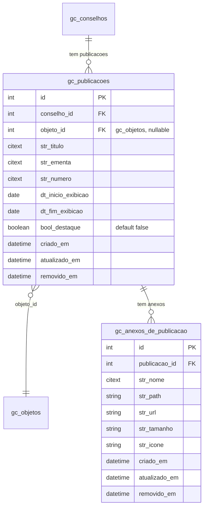

---

### 6.1 Publicacao (`gc_publicacoes`)

| Campo | Tipo | Obrigatorio | Observacoes |
|-------|------|-------------|-------------|
| `id` | PK | - | - |
| `conselho_id` | FK -> `gc_conselhos` | Sim | Conselho ao qual a publicacao pertence |
| `objeto_id` | FK -> `gc_objetos` | Nao | Dropdown. No escopo atual filtra apenas por `bool_ativo = true` - nao existe coluna `bool_aplica_publicacao_mural` em `gc_objetos` (avaliar inclusao na tabela `gc_objetos` para coerencia com Decretos/Resolucoes/Editais) |
| `str_titulo` | citext | Sim | Titulo da publicacao |
| `str_ementa` | citext | Sim | Ementa / corpo da publicacao. Texto longo |
| `str_numero` | citext | Nao | Numero/identificador opcional |
| `dt_inicio_exibicao` | date | Sim | Inicio do periodo de exibicao no mural. Date picker em portugues |
| `dt_fim_exibicao` | date | Sim | Fim do periodo de exibicao no mural |
| `bool_destaque` | boolean | Sim | Default `false`. Quando `true`, a publicacao aparece em destaque visual na listagem do mural |

**Regras de negocio:**

- Validacao temporal: `dt_fim_exibicao >= dt_inicio_exibicao`.
- A listagem do mural exibe apenas publicacoes com `today BETWEEN dt_inicio_exibicao AND dt_fim_exibicao` (publicacoes "vigentes"). Publicacoes fora do periodo continuam consultaveis em uma area de "Historico" pelos administradores.
- `bool_destaque = true` renderiza um marcador visual (ex: badge "Destaque" ou ordenacao prioritaria) na listagem publica.
- **Alerta de fim de exibicao:** publicacoes com `dt_fim_exibicao` proxima disparam alerta visual em listagens administrativas. O **periodo (em dias)** vem da coluna `gc_configuracoes.int_dias_alerta_vigencia_publicacao` (secao 2.7). Valor inicial: **90 dias**. Fallback: constante `Publicacao::DIAS_ALERTA_VIGENCIA_PADRAO = 90` no Model.
- Nao ha unicidade de `str_numero` por conselho no escopo atual.

---

### 6.2 Anexos da Publicacao (`gc_anexos_de_publicacao`)

Tabela filha 1:N de `gc_publicacoes`. Armazena arquivos (PDFs, imagens etc) anexados a publicacao. Estrutura segue o mesmo padrao das demais tabelas de anexos do modulo.

| Campo | Tipo | Obrigatorio | Observacoes |
|-------|------|-------------|-------------|
| `id` | PK | - | - |
| `publicacao_id` | FK -> `gc_publicacoes` | Sim | - |
| `str_nome` | citext | Sim | Nome original do arquivo |
| `str_path` | string | Sim | Path interno no bucket padrao do sistema. Convencao: `/gestao-de-conselhos/anexos-de-publicacao/{nome_do_arquivo}` |
| `str_url` | string | Sim | URL publica resolvida |
| `str_tamanho` | string | Nao | Tamanho legivel (ex: "1.2 MB") |
| `str_icone` | string | Nao | Icone para preview |

**Regras de negocio:**

- Tipos de arquivo aceitos no escopo inicial: PDF, PNG, JPG. Avaliar com o usuario se outros formatos (DOC, XLS) sao necessarios.
- Limpeza S3: ao remover (soft delete) ou substituir o anexo, apagar o arquivo via `ArquivoService::removerArquivoS3()` no `boot()` do Model.

---

## 7. Reunioes

Registra reunioes agendadas do conselho (pre-evento) e a frequencia dos membros em cada reuniao. O registro pos-evento mais formal (deliberacoes, quorum, anexos) e feito em `gc_atas` (secao 5.13) - vinculo entre Reuniao e Ata e ponto em aberto.

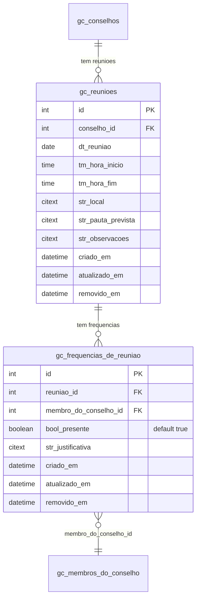

---

### 7.1 Reuniao (`gc_reunioes`)

| Campo | Tipo | Obrigatorio | Observacoes |
|-------|------|-------------|-------------|
| `id` | PK | - | - |
| `conselho_id` | FK -> `gc_conselhos` | Sim | Conselho ao qual a reuniao pertence |
| `dt_reuniao` | date | Sim | Data da reuniao. Date picker em portugues |
| `tm_hora_inicio` | time | Nao | Hora de inicio da reuniao (HH:MM). Time picker no frontend |
| `tm_hora_fim` | time | Nao | Hora de termino prevista (HH:MM) |
| `str_local` | citext | Nao | Local fisico ou virtual da reuniao (ex: "Auditorio da Secretaria de Saude", "Google Meet") |
| `str_pauta_prevista` | citext | Nao | Pauta planejada para a reuniao. Textarea |
| `str_observacoes` | citext | Nao | Observacoes gerais sobre a reuniao. Textarea |

**Regras de negocio:**

- Validacao temporal: se `tm_hora_fim` estiver preenchido, deve ser > `tm_hora_inicio`.
- Listagem na tela do conselho: ordenada por `dt_reuniao DESC, tm_hora_inicio DESC` (reunioes mais recentes primeiro).
- Pode-se filtrar a listagem por status de realizacao (futuras vs ja realizadas) usando `dt_reuniao` comparada com `today`.

> **Prefixo `tm_`:** campos do tipo `time` adotam o prefixo `tm_`, seguindo a logica dos demais prefixos do projeto (`dt_` para date, `int_` para integer etc).

---

### 7.2 Frequencia da Reuniao (`gc_frequencias_de_reuniao`)

Tabela filha 1:N de `gc_reunioes`. Registra a presenca de cada membro do conselho em uma reuniao especifica. A tela "Frequencia" abre um modal que lista todos os membros **ativos** do conselho (filtro por `gc_membros_do_conselho` com `removido_em IS NULL` e status de cargo ativo) e permite marcar presente/falta de cada um.

| Campo | Tipo | Obrigatorio | Observacoes |
|-------|------|-------------|-------------|
| `id` | PK | - | - |
| `reuniao_id` | FK -> `gc_reunioes` | Sim | - |
| `membro_do_conselho_id` | FK -> `gc_membros_do_conselho` | Sim | Membro cuja presenca esta sendo registrada |
| `bool_presente` | boolean | Sim | Default `true`. `true` = presente; `false` = falta |
| `str_justificativa` | citext | Nao | Texto livre. Preenchido apenas quando `bool_presente = false` E houve justificativa. Falta sem justificativa = `bool_presente = false` + `str_justificativa = null`. Falta justificada = `bool_presente = false` + `str_justificativa` preenchido |

**Regras de negocio:**

- **Unicidade:** constraint unica em `(reuniao_id, membro_do_conselho_id)` - cada membro tem no maximo um registro de frequencia por reuniao.
- O modal carrega a lista de membros ativos do conselho da reuniao (`gc_membros_do_conselho` com `removido_em IS NULL`). Se um membro ja tinha frequencia registrada, o estado atual e exibido pre-selecionado.
- Ao salvar, o backend faz upsert (insert ou update) por `(reuniao_id, membro_do_conselho_id)`.
- **Validacao condicional no FormRequest:** se `bool_presente = true`, ignorar/limpar `str_justificativa` antes de persistir (evita justificativa orfa associada a presenca).
- **Derivacao dos 3 estados na UI/Resource:**
  - Presente: `bool_presente = true`
  - Falta: `bool_presente = false` E `str_justificativa IS NULL`
  - Falta justificada: `bool_presente = false` E `str_justificativa IS NOT NULL`
- O quorum da reuniao pode ser calculado dinamicamente: `count(frequencias com bool_presente = true para reuniao_id)`. Esse valor pode alimentar `gc_atas.int_quorum_presente` automaticamente quando a Ata for vinculada (ponto em aberto sobre o vinculo).

---

## 8. Mensagens para o Conselho

Canal de comunicacao publico - permite que cidadaos enviem mensagens diretamente a um conselho. Cada mensagem tem ciclo de vida proprio (`int_situacao`) e e tratada manualmente pelos administradores do conselho.

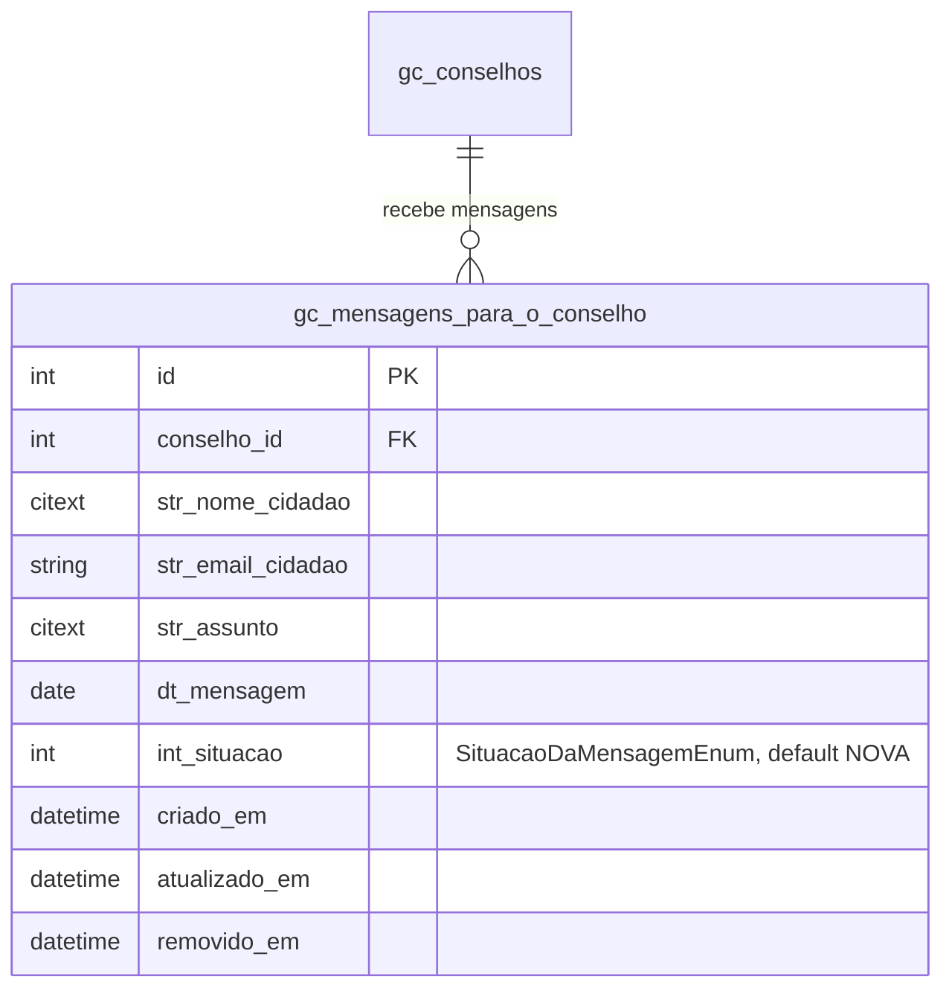

---

### 8.1 Mensagem (`gc_mensagens_para_o_conselho`)

| Campo | Tipo | Obrigatorio | Observacoes |
|-------|------|-------------|-------------|
| `id` | PK | - | - |
| `conselho_id` | FK -> `gc_conselhos` | Sim | Conselho destinatario da mensagem |
| `str_nome_cidadao` | citext | Sim | Nome completo do remetente |
| `str_email_cidadao` | string | Sim | E-mail de contato do remetente. Validacao padrao Laravel `email` |
| `str_assunto` | citext | Sim | Assunto/titulo da mensagem. Pesquisavel em filtros |
| `dt_mensagem` | date | Sim | Data de envio da mensagem |
| `int_situacao` | integer | Sim | Valor mapeado por `SituacaoDaMensagemEnum`. Valor inicial: `1 = NOVA`. Ver 8.2 |

**Regras de negocio:**

- A situacao inicial ao criar uma mensagem e sempre `NOVA`.
- Transicoes esperadas: `NOVA -> EM_ANALISE -> ENCERRADO`. `CANCELADO` pode ocorrer a partir de `NOVA` ou `EM_ANALISE`.
- Listagem na area administrativa pode filtrar por `int_situacao` e ordenar por `dt_mensagem DESC`.

---

### 8.2 Situacao da Mensagem (`SituacaoDaMensagemEnum`)

Enum PHP de dominio que mapeia `gc_mensagens_para_o_conselho.int_situacao`.

| Valor | Constante | Rotulo na tela |
|-------|-----------|----------------|
| 1 | `NOVA` | Nova |
| 2 | `EM_ANALISE` | Em Analise |
| 3 | `ENCERRADO` | Encerrado |
| 4 | `CANCELADO` | Cancelado |

---

## 9. Visao Geral - Relacionamentos (parcial)

Diagrama consolidado das tabelas modeladas ate aqui.

```mermaid
erDiagram
    gc_entidades {
        int id PK
        citext str_nome
        int endereco_id FK
        string str_email
        string str_telefone
    }

    gc_tipos_de_nomeacao {
        int id PK
        citext str_nome
        boolean bool_ativo
    }

    gc_cargos {
        int id PK
        citext str_nome
        int int_ordem_hierarquia
        boolean bool_ativo
    }

    gc_status_de_cargos {
        int id PK
        citext str_nome
        string str_cor
        boolean bool_ativo
    }

    gc_objetos {
        int id PK
        citext str_nome
        boolean bool_ativo
    }

    gc_tipos_de_documentos {
        int id PK
        citext str_nome
        boolean bool_ativo
    }

    gc_conselhos {
        int id PK
        int entidade_id FK
        citext str_nome
        citext str_sigla
        int tipo_de_nomeacao_id FK
        int int_area_tematica
        boolean bool_ativo
        string str_email
        string str_telefone
    }

    gc_atribuicoes {
        int id PK
        int conselho_id FK
        citext str_descricao
        citext str_embasamento_legal
        int int_ordem
    }

    gc_anexos_de_conselho {
        int id PK
        int conselho_id FK
        string str_path
        string str_url
        int int_tipo_anexo
    }

    gc_membros_do_conselho {
        int id PK
        int conselho_id FK
        citext str_nome_completo
        string str_cpf
        citext str_entidade_que_representa
        int cargo_id FK
        int status_de_cargo_id FK
        citext str_ato_de_nomeacao
        int titular_id FK "auto-relacionamento"
        boolean bool_compoe_diretoria
    }

    gc_mandatos {
        int id PK
        int membro_do_conselho_id FK
        date dt_inicio
        date dt_fim
    }

    gc_regimentos_internos {
        int id PK
        int conselho_id FK
        int int_tipo_documento "TipoDeRegimentoEnum"
        date dt_documento
        citext str_descricao
    }

    gc_anexos_de_regimento_interno {
        int id PK
        int regimento_interno_id FK
        citext str_nome
        string str_path
        string str_url
    }

    gc_leis {
        int id PK
        int conselho_id FK
        citext str_numero
        int int_tipo_documento "TipoDeLeiEnum"
        date dt_documento
        citext str_ementa
    }

    gc_anexos_de_lei {
        int id PK
        int lei_id FK
        citext str_nome
        string str_path
        string str_url
    }

    gc_decretos {
        int id PK
        int conselho_id FK
        int objeto_id FK
        citext str_numero
        citext str_ementa
        date dt_inicio_vigencia
        date dt_fim_vigencia
    }

    gc_anexos_de_decreto {
        int id PK
        int decreto_id FK
        citext str_nome
        string str_path
        string str_url
    }

    gc_resolucoes {
        int id PK
        int conselho_id FK
        int objeto_id FK
        citext str_numero
        citext str_ementa
        date dt_inicio_vigencia
        date dt_fim_vigencia
    }

    gc_anexos_de_resolucao {
        int id PK
        int resolucao_id FK
        citext str_nome
        string str_path
        string str_url
    }

    gc_editais {
        int id PK
        int conselho_id FK
        int objeto_id FK
        citext str_numero
        citext str_ementa
        date dt_inicio_vigencia
        date dt_fim_vigencia
    }

    gc_anexos_de_edital {
        int id PK
        int edital_id FK
        citext str_nome
        string str_path
        string str_url
    }

    gc_atas {
        int id PK
        int conselho_id FK
        int reuniao_id FK "gc_reunioes, nullable"
        citext str_numero
        citext str_ementa
        date dt_reuniao
        int int_tipo_reuniao "TipoDeReuniaoEnum"
        int int_quorum_presente
        citext str_deliberacoes
    }

    gc_anexos_de_ata {
        int id PK
        int ata_id FK
        int int_tipo_anexo "TipoDeAnexoDaAtaEnum"
        citext str_nome
        string str_path
        string str_url
    }

    gc_publicacoes {
        int id PK
        int conselho_id FK
        int objeto_id FK
        citext str_titulo
        citext str_ementa
        citext str_numero
        date dt_inicio_exibicao
        date dt_fim_exibicao
        boolean bool_destaque
    }

    gc_anexos_de_publicacao {
        int id PK
        int publicacao_id FK
        citext str_nome
        string str_path
        string str_url
    }

    gc_reunioes {
        int id PK
        int conselho_id FK
        date dt_reuniao
        time tm_hora_inicio
        time tm_hora_fim
        citext str_local
        citext str_pauta_prevista
        citext str_observacoes
    }

    gc_frequencias_de_reuniao {
        int id PK
        int reuniao_id FK
        int membro_do_conselho_id FK
        boolean bool_presente "default true"
        citext str_justificativa
    }

    gc_configuracoes {
        int id PK
        int int_dias_alerta_vigencia_decreto
        int int_dias_alerta_vigencia_publicacao
        boolean bool_habilitar_chat_helpdesk
        string str_chave_chat_helpdesk
    }

    gc_regras_de_renovacao {
        int id PK
        int conselho_id FK
        int cargo_id FK
        boolean bool_reconducoes_ilimitadas
        int int_maximo_reconducoes
        int int_intervalo_entre_mandatos_meses
        boolean bool_ativo
    }

    gc_mensagens_para_o_conselho {
        int id PK
        int conselho_id FK
        citext str_nome_cidadao
        string str_email_cidadao
        citext str_assunto
        date dt_mensagem
        int int_situacao "SituacaoDaMensagemEnum"
    }

    gc_conselhos }o--|| gc_entidades : "entidade_id"
    gc_conselhos }o--|| gc_tipos_de_nomeacao : "tipo_de_nomeacao_id"
    gc_conselhos ||--o{ gc_atribuicoes : "tem atribuicoes"
    gc_conselhos ||--o{ gc_anexos_de_conselho : "tem anexos"
    gc_conselhos ||--o{ gc_membros_do_conselho : "tem membros"
    gc_conselhos ||--o{ gc_regimentos_internos : "tem regimentos"
    gc_conselhos ||--o{ gc_leis : "tem leis"
    gc_conselhos ||--o{ gc_decretos : "tem decretos"
    gc_regimentos_internos ||--o{ gc_anexos_de_regimento_interno : "tem anexos"
    gc_leis ||--o{ gc_anexos_de_lei : "tem anexos"
    gc_decretos }o--|| gc_objetos : "objeto_id"
    gc_decretos ||--o{ gc_anexos_de_decreto : "tem anexos"
    gc_conselhos ||--o{ gc_resolucoes : "tem resolucoes"
    gc_resolucoes }o--|| gc_objetos : "objeto_id"
    gc_resolucoes ||--o{ gc_anexos_de_resolucao : "tem anexos"
    gc_conselhos ||--o{ gc_editais : "tem editais"
    gc_editais }o--|| gc_objetos : "objeto_id"
    gc_editais ||--o{ gc_anexos_de_edital : "tem anexos"
    gc_conselhos ||--o{ gc_atas : "tem atas"
    gc_atas ||--o{ gc_anexos_de_ata : "tem anexos"
    gc_atas }o--|| gc_reunioes : "reuniao_id (opcional)"
    gc_conselhos ||--o{ gc_publicacoes : "tem publicacoes"
    gc_publicacoes }o--|| gc_objetos : "objeto_id"
    gc_publicacoes ||--o{ gc_anexos_de_publicacao : "tem anexos"
    gc_conselhos ||--o{ gc_reunioes : "tem reunioes"
    gc_reunioes ||--o{ gc_frequencias_de_reuniao : "tem frequencias"
    gc_frequencias_de_reuniao }o--|| gc_membros_do_conselho : "membro_do_conselho_id"
    gc_membros_do_conselho ||--o{ gc_mandatos : "tem mandatos"
    gc_regras_de_renovacao }o--|| gc_cargos : "cargo_id"
    gc_regras_de_renovacao }o--o| gc_conselhos : "conselho_id (opcional)"
    gc_conselhos ||--o{ gc_mensagens_para_o_conselho : "recebe mensagens"
    gc_membros_do_conselho }o--|| gc_cargos : "cargo_id"
    gc_membros_do_conselho }o--|| gc_status_de_cargos : "status_de_cargo_id"
    gc_membros_do_conselho ||--o{ gc_membros_do_conselho : "titular_id"
```

> Objetos e Tipos de Documentos aparecerao como FKs quando Documentos (secao 5) forem modelados. `gc_tipos_de_nomeacao` ainda nao e usado por `gc_membros_do_conselho` no escopo atual (nao havia campo de tipo de nomeacao individual por membro - confirmar com usuario).

---

## Dependencias Externas (Cross-Module) - parcial

| FK em Gestao de Conselho | Tabela Externa | Modulo |
|---|---|---|
| `gc_entidades.endereco_id` | `sg_enderecos` | Gerenciador |

> Membros do conselho **nao** referenciam `sg_pessoas` no escopo atual (Nome e CPF sao campos proprios em `gc_membros_do_conselho`). Caso a decisao mude, adicionar FK `pessoa_id` aqui.

---

## Pontos em Aberto

1. Confirmar prefixo de tabelas - `gc_*` ou outro (potencial conflito com `ce_conselhos`).
2. Confirmar se Gestao de Conselho e modulo independente do Caixa Escolar.
3. ~~Aguardar descricao das demais entidades (Mural)~~ - resolvido: Mural modelado na secao 6.
4. Definir regra de unicidade em `gc_conselhos` - a combinacao `entidade_id + str_nome` e/ou `entidade_id + str_sigla` deve ser unica?
5. ~~Configurar bucket `conselho-perfil`~~ - resolvido: arquivos do modulo gravados no bucket padrao do sistema, em pastas dedicadas (ex: `/gestao-de-conselhos/anexos-do-conselho`, `/gestao-de-conselhos/anexos-de-regimento-interno`). Nenhum bucket novo sera criado.
6. Completar valores futuros de `TipoDeAnexoDoConselhoEnum` quando Regimentos, Atas e Decretos forem modelados.
7. Confirmar com o usuario se `gc_membros_do_conselho` deve referenciar `sg_pessoas` (FK opcional) ou se Nome/CPF como campos texto e a decisao definitiva.
8. Definir comportamento dos suplentes quando o titular e removido (soft delete): orfaos, viram titulares ou cascade delete?
9. `gc_tipos_de_nomeacao` foi planejado para ser usado em Membros, mas a especificacao atual nao inclui esse campo no membro (apenas "Ato de Nomeacao" como texto). Confirmar se a FK deve ser adicionada na implementacao.
10. Confirmar se deve haver unicidade de `int_tipo_documento = CRIACAO` por conselho em `gc_regimentos_internos` (apenas 1 regimento de criacao, N alteracoes).
11. Confirmar limite de tamanho do PDF do regimento (sugestao: 5 MB).
12. `gc_tipos_de_documentos` (secao 2.5) tem flag `bool_classifica_*` para Lei/Decreto/Resolucao/Edital, mas nao para Regimento. Avaliar se Regimentos sera classificado por essa tabela ou se permanece como tabela propria com enum.
13. Confirmar regra de unicidade em `gc_leis` - `conselho_id + str_numero` deve ser unico?
14. Avaliar unificacao de `TipoDeRegimentoEnum` e `TipoDeLeiEnum` em um unico enum generico (ex: `TipoDeAtoNormativoEnum`), ja que os valores sao identicos.
15. Coluna `str_nome` nas tabelas `gc_anexos_*` segue padrao de `ce_anexos_de_conselho`. Existe variacao no projeto (`sm_anexos.str_nome_original` - Manutencao). Confirmar qual padrao adotar para o modulo.
16. Confirmar regra de unicidade em `gc_decretos` - `conselho_id + str_numero` deve ser unico?
17. ~~Confirmar periodo padrao do alerta de fim de vigencia de decretos~~ - resolvido: parametro vem de `gc_configuracoes` (secao 2.7), valor inicial 90 dias para Decretos.
18. ~~Padronizar plural do nome `gc_anexos_de_decretos`~~ - resolvido: padronizado para singular `gc_anexos_de_decreto`, alinhado com `gc_anexos_de_lei`, `gc_anexos_de_conselho`, `gc_anexos_de_regimento_interno`.
19. Avaliar migracao do alerta de mandato dos Membros (secao 3.6, hoje fixo em 45 dias) para `gc_configuracoes`, adicionando nova coluna (ex: `int_dias_alerta_fim_mandato`).
20. Confirmar regra de unicidade em `gc_resolucoes` - `conselho_id + str_numero` deve ser unico?
21. Avaliar se Resolucoes terao alerta de fim de vigencia configuravel (analogo a Decretos). Em caso afirmativo, adicionar coluna `int_dias_alerta_vigencia_resolucao` em `gc_configuracoes`.
22. Confirmar regra de unicidade em `gc_editais` - `conselho_id + str_numero` deve ser unico?
23. Avaliar se Editais terao alerta de fim de vigencia configuravel (analogo a Decretos). Em caso afirmativo, adicionar coluna `int_dias_alerta_vigencia_edital` em `gc_configuracoes`.
24. Definir a regra exata da "validacao inteligente de quorum" em `gc_atas.int_quorum_presente`: comparar contra membros ativos do conselho - bloqueia salvamento se abaixo do minimo regimental ou exibe apenas warning? O minimo regimental varia por conselho?
25. Confirmar regra de unicidade em `gc_atas` - `conselho_id + str_numero` deve ser unico?
29. ~~Avaliar vinculo entre `gc_reunioes` (pre-evento) e `gc_atas` (pos-evento)~~ - resolvido: FK opcional `reuniao_id` adicionada em `gc_atas` (secao 5.13). Vinculo pode ser feito na criacao ou posteriormente.
30. Confirmar obrigatoriedade dos campos de `gc_reunioes` - especificacao nao indicou. Atualmente apenas `conselho_id` e `dt_reuniao` sao obrigatorios; `tm_hora_inicio`/`tm_hora_fim` e demais campos sao opcionais.
31. Definir comportamento de pre-preenchimento de `gc_atas.int_quorum_presente` quando `reuniao_id` for vinculado: auto-preencher sempre com `count(gc_frequencias_de_reuniao com bool_presente = true)` ou apenas sugerir? Mesma duvida vale para `dt_reuniao` (pre-popular de `gc_reunioes.dt_reuniao`?).
33. Confirmar se uma reuniao pode ter mais de uma ata vinculada (relacao 1:N) ou se deve haver unicidade em `gc_atas.reuniao_id` (relacao 1:1).
34. `gc_mensagens_para_o_conselho` esta sem campo de **corpo da mensagem** (apenas assunto). Confirmar se deve adicionar `str_mensagem` (citext) ou se o assunto e suficiente.
35. Avaliar necessidade de **resposta/registro de tratamento** em `gc_mensagens_para_o_conselho` - tabela filha ou colunas adicionais (`str_resposta`, `dt_resposta`, `usuario_que_respondeu_id`).
36. Confirmar obrigatoriedade dos campos de `gc_mensagens_para_o_conselho` - especificacao nao indicou. Atualmente todos os listados sao obrigatorios.
37. Avaliar se outros campos hoje em `gc_membros_do_conselho` (ex: `cargo_id`, `status_de_cargo_id`, `str_ato_de_nomeacao`, `bool_compoe_diretoria`) tambem deveriam migrar para `gc_mandatos`, ja que podem variar entre mandatos da mesma pessoa. No escopo atual, apenas as datas migraram.
38. Definir se `gc_mandatos` deve validar sobreposicao temporal entre mandatos do mesmo membro (no FormRequest) ou se sobreposicoes sao permitidas (ex: correcao historica).
32. Definir o que e "membro ativo" para a listagem do modal de Frequencia: apenas `removido_em IS NULL` ou tambem filtrar por `gc_status_de_cargos.bool_ativo`?
26. Avaliar inclusao de `bool_aplica_publicacao_mural` em `gc_objetos` (secao 2.4) para filtrar o dropdown de Objeto no Mural com o mesmo padrao usado em Decretos/Resolucoes/Editais.
27. Definir tipos de arquivo aceitos em `gc_anexos_de_publicacao` (escopo inicial: PDF, PNG, JPG). Avaliar se DOC, XLS ou outros formatos sao necessarios.
28. ~~Padronizacao de naming~~ - resolvido: tabelas renomeadas para `gc_publicacoes` (plural) e `gc_anexos_de_publicacao` (singular), alinhadas ao padrao do modulo.
