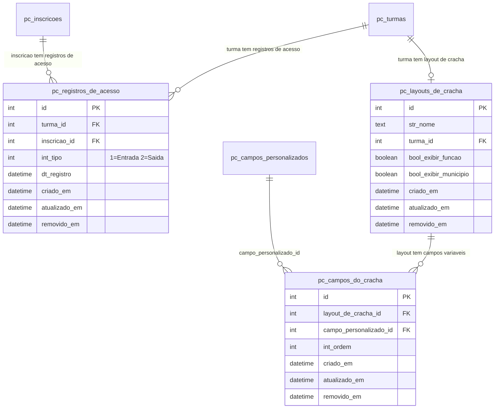
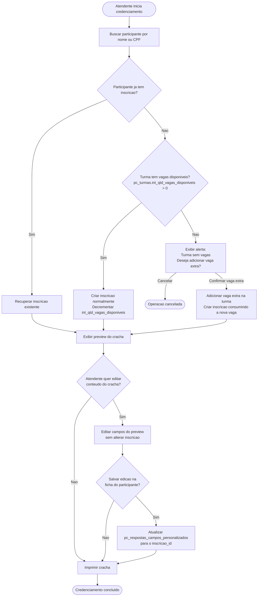
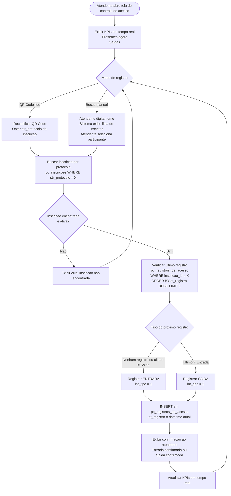

# Portal de Cursos - Modelagem de Melhorias

> **Origem:** Reuniao de planejamento - 19/03/2026
> **Modulo:** Portal de Cursos (prefixo `pc_*`)
> **Status:** Planejado / Pre-desenvolvimento

---

## 1. Resumo das Funcionalidades

### 1.1 Credenciamento com Validacao de Capacidade

- No ato do credenciamento, caso haja a necessidade de cadastrar um usuário na hora, o sistema valida a capacidade da turma
- Se houver vaga disponivel: inscreve normalmente
- Se a turma estiver cheia: exibe alerta com opcao de adicionar vaga extra
- Comportamento aplicado tanto no credenciamento quanto na inclusao manual de participante

### 1.2 Impressao de Cracha

- Layout de cracha configuravel por evento/turma
- Elementos fixos (sempre impressos): QR Code, nome do participante, nome do evento
- Elementos variaveis: campos da ficha de inscricao personalizada, configurados por turma
- Interface para selecionar e ordenar os campos variaveis
- Preview do cracha durante o credenciamento, com edicao pontual do conteudo antes da impressao
- A edição pode ser apenas para impressão do crachá ou pode alterar o valor do campo dependendo da escolha do atendente

### 1.3 Registro de Entrada e Saida

- Nova tabela: codigo do evento/turma, codigo da inscricao, horario, tipo (entrada/saida)
- Leitura automatica de QR Code: sistema discerne entrada (primeiro registro) ou saida (subsequente) (será lido com uma máquina de laser com gatilho)
- Pesquisa manual: busca por nome quando cracha nao esta disponivel ou leitura falha
- Edicao de registros manuais
- Remocao de registros incorretos (leituras duplas/triplas)
- Adicionar validação que, caso a diferença de um registro para o outro seja menor do que 10s na mesma inscrição, desconsiderar 

### 1.4 Tela Unica de Atendimento (Credenciamento + Entrada/Saida)

- Interface unificada para o atendente
- QR Code automatico + pesquisa manual na mesma tela
- KPIs em tempo real:
  - **Presentes no momento:** inscricoes com entrada sem saida correspondente
  - **Saídas:** registros com entrada e saida

---

## 2. Novas Tabelas - Diagrama ER

3 novas tabelas: `pc_registros_de_acesso`, `pc_layouts_de_cracha`, `pc_campos_do_cracha`.



### Notas de Implementacao

- **`pc_registros_de_acesso`**: nao tem UNIQUE — registros duplicados (leituras erroneas) sao permitidos e removidos manualmente pelo atendente.
- **`pc_layouts_de_cracha`**: relacao 1-1 com `pc_turmas` (uma turma tem no maximo um layout). Campos fixos (QR Code, nome, evento) nao sao armazenados — sao sempre impressos.
- **`pc_campos_do_cracha`**: vincula campos da ficha personalizada (`pc_campos_personalizados`) ao layout, com ordenacao (`int_ordem`).
- **Impressao do cracha nao cria registros**: o preview e a impressao sao operacoes em tempo de execucao, sem persistencia adicional no banco.
- **Edicao pontual do cracha**: o Service monta os dados do cracha a partir de `pc_respostas_campos_personalizados`. Se o atendente editar o conteudo pontualmente e optar por salvar na ficha, o Service atualiza `pc_respostas_campos_personalizados.str_resposta` para o `inscricao_id` correspondente.

---

## 3. Fluxo de Credenciamento



### Composicao do Cracha (Service)

```
Dados fixos (sempre):
  - QR Code com protocolo da inscricao (pc_inscricoes.str_protocolo)
  - Nome do participante (sg_usuarios / sg_pessoas)
  - Nome do evento/turma (pc_cursos.str_nome + pc_turmas.str_nome)

Dados variaveis (conforme pc_campos_do_cracha, ordenados por int_ordem):
  - Valores de pc_respostas_campos_personalizados
    filtrado por inscricao_id + campo_personalizado_id
```

---

## 4. Fluxo de Entrada e Saida (Tela Unica)



### Logica dos KPIs (Service/Query)

```
Presentes no momento:
  SELECT COUNT(*) FROM pc_registros_de_acesso r1
  WHERE turma_id = X
    AND removido_em IS NULL
    AND int_tipo = 1  -- entrada
    AND NOT EXISTS (
      SELECT 1 FROM pc_registros_de_acesso r2
      WHERE r2.inscricao_id = r1.inscricao_id
        AND r2.int_tipo = 2   -- saida
        AND r2.dt_registro > r1.dt_registro
        AND r2.removido_em IS NULL
    )

saídas:
  Inscricoes cujo COUNT(registros sem removido_em) é par e último registro é do tipo saída
  (logica: numero par = teve entrada e saída registrada) (verificar se é mais consisitentes contar o número de entradas e saídas do usuário e comparar se é igual)
```

### Edicao e Remocao de Registros

- **Edição** Qualquer registro pode ter seus dados editados, apagados ou criar manualmente
- **Remocao**: soft-delete via `removido_em` (padrao do sistema)
- Registros removidos nao entram nos calculos de KPI

---

## 5. Dependencias Externas das Novas Tabelas

| FK nas novas tabelas | Tabela Externa | Modulo |
|---|---|---|
| `pc_registros_de_acesso.turma_id` | `pc_turmas` | Portal de Cursos |
| `pc_registros_de_acesso.inscricao_id` | `pc_inscricoes` | Portal de Cursos |
| `pc_layouts_de_cracha.turma_id` | `pc_turmas` | Portal de Cursos |
| `pc_campos_do_cracha.layout_de_cracha_id` | `pc_layouts_de_cracha` | Portal de Cursos |
| `pc_campos_do_cracha.campo_personalizado_id` | `pc_campos_personalizados` | Portal de Cursos |

---

## 6. Impacto em Tabelas Existentes

| Tabela | Alteracao | Motivo |
|---|---|---|
| `pc_turmas` | Nenhuma alteracao estrutural | Layout de cracha e gerenciado via `pc_layouts_de_cracha` |
| `pc_inscricoes` | Nenhuma alteracao | Credenciamento reutiliza a estrutura existente |
| `pc_respostas_campos_personalizados` | Nenhuma coluna nova | Edicao pontual do cracha usa UPDATE no registro existente |

> **Estrutura de inscricao reutilizada:** O credenciamento nao cria um tipo novo de inscricao. Cria uma `pc_inscricoes` normal com `status_id` adequado. A logica de validacao de capacidade (vagas disponiveis vs. vaga extra) fica no Service, nao no banco.

---

## 7. Enum: Tipo de Registro de Acesso

```php
enum TipoDeRegistroDeAcessoEnum : int
{
    case ENTRADA = 1;
    case SAIDA   = 2;

    public function nome(): string
    {
        return match ($this) {
            self::ENTRADA => 'Entrada',
            self::SAIDA   => 'Saida',
        };
    }

    public static function retornarNome(int $valor): ?string
    {
        return self::tryFrom($valor)?->nome();
    }

    public static function opcoes(): array
    {
        return array_map(
            fn($case) => ['value' => $case->value, 'label' => $case->nome()],
            self::cases()
        );
    }
}
```
