# Desempenho da Sprint 163

> **Status:** sprint encerrada
> **Período de entregas:** 30/03/2026 → 12/04/2026 (14 dias)
> **Fonte:** export CSV do Jira (57 issues associadas à Sprint 163)

## Resumo executivo

| Indicador | Valor |
|---|---|
| Issues no escopo | **57** |
| Issues concluídas | **56** (+ 1 aplicada no cliente) = **100% de entrega** |
| Story Points comprometidos | **60** |
| Story Points entregues | **60** (100%) |
| Bugs resolvidos | **14** |
| Cycle time médio dos bugs | **37,5 dias** (min 2d · max 252d) |
| Horas apontadas (worklog) | **215,3 h** em 42/57 cards |

---

## 1. Distribuição por Status (final da sprint)

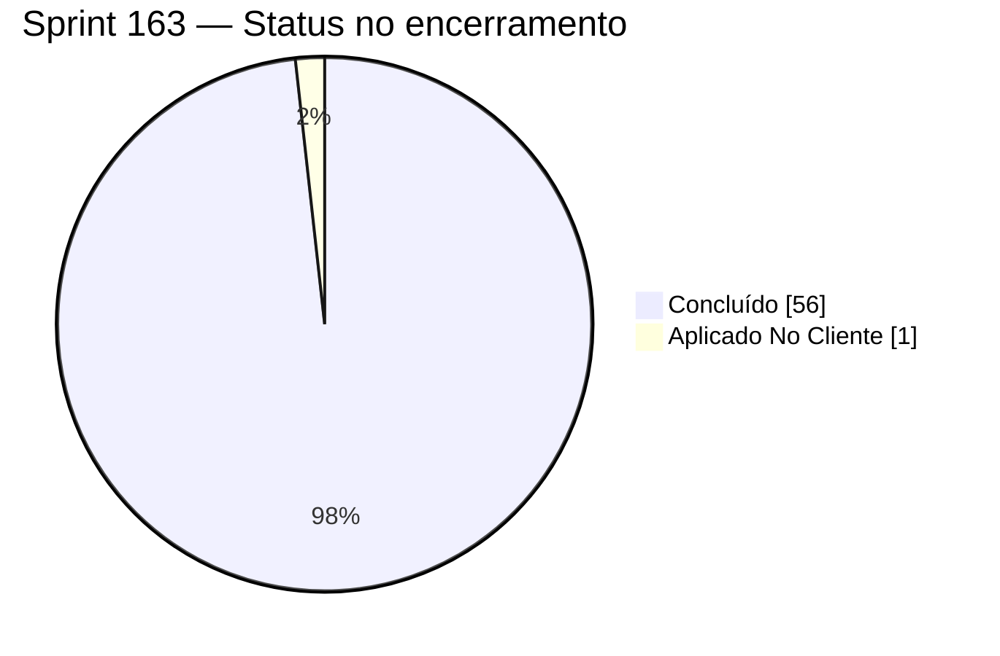
```mermaid
pie showData title Sprint 163 — Status no encerramento
    "Concluído" : 56
    "Aplicado No Cliente" : 1
```

**Leitura:** sprint entregue por completo — nenhuma issue voltou para backlog.

---

## 2. Distribuição por Tipo de Issue

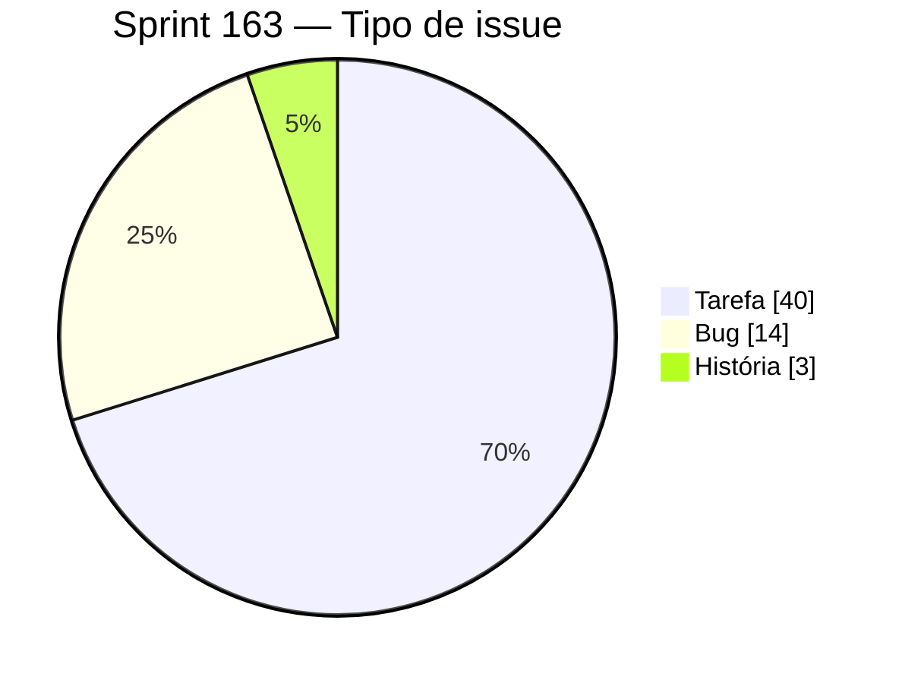
```mermaid
pie showData title Sprint 163 — Tipo de issue
    "Tarefa" : 40
    "Bug" : 14
    "História" : 3
```

**Leitura:** 70% Tarefas, 25% correção de Bugs, apenas 5% novas Histórias — perfil predominante de manutenção.

---

## 3. Distribuição por Prioridade

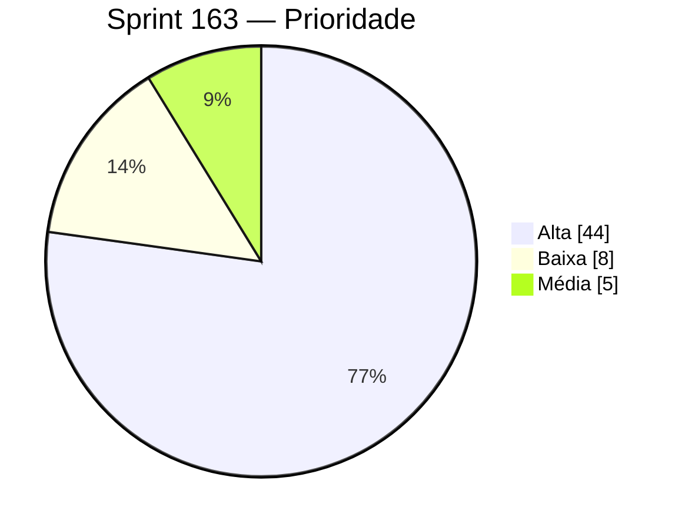
```mermaid
pie showData title Sprint 163 — Prioridade
    "Alta" : 44
    "Baixa" : 8
    "Média" : 5
```

**Leitura:** 77% Alta prioridade — sprint de urgência, mas entregue integralmente.

---

## 4. Carga por Responsável (contagem de issues)

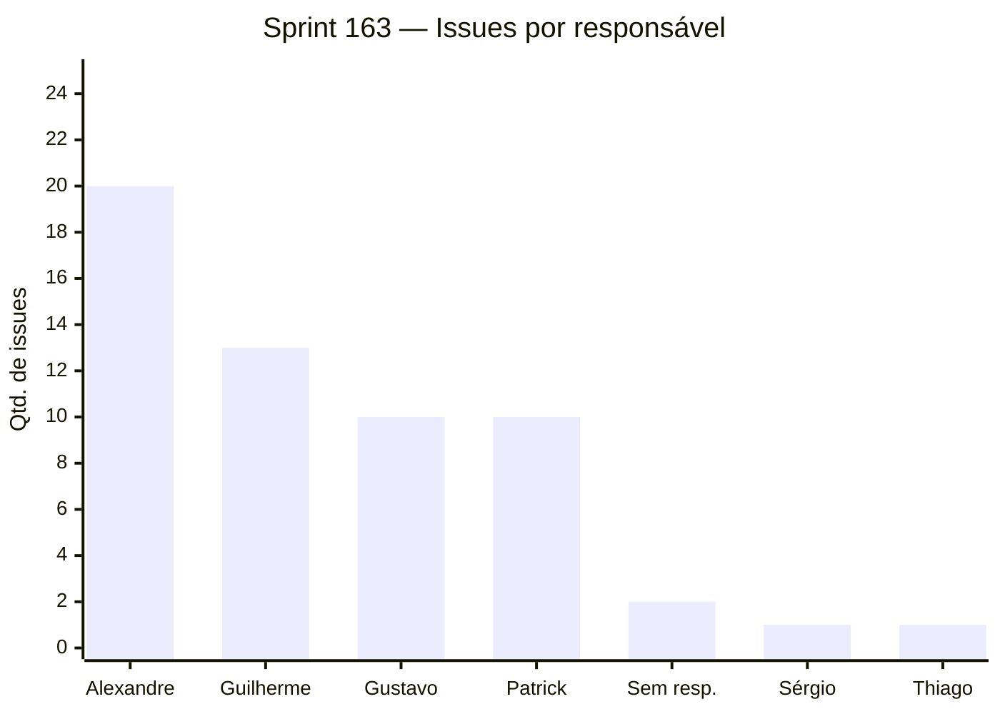
```mermaid
xychart-beta
    title "Sprint 163 — Issues por responsável"
    x-axis ["Alexandre", "Guilherme", "Gustavo", "Patrick", "Sem resp.", "Sérgio", "Thiago"]
    y-axis "Qtd. de issues" 0 --> 25
    bar [20, 13, 10, 10, 2, 1, 1]
```

**Leitura:** Alexandre assumiu a maior fatia (35%). Concentração saudável entre os 4 principais (Alexandre, Guilherme, Gustavo, Patrick = 93% do escopo).

---

## 5. Carga por Responsável (Story Points entregues)

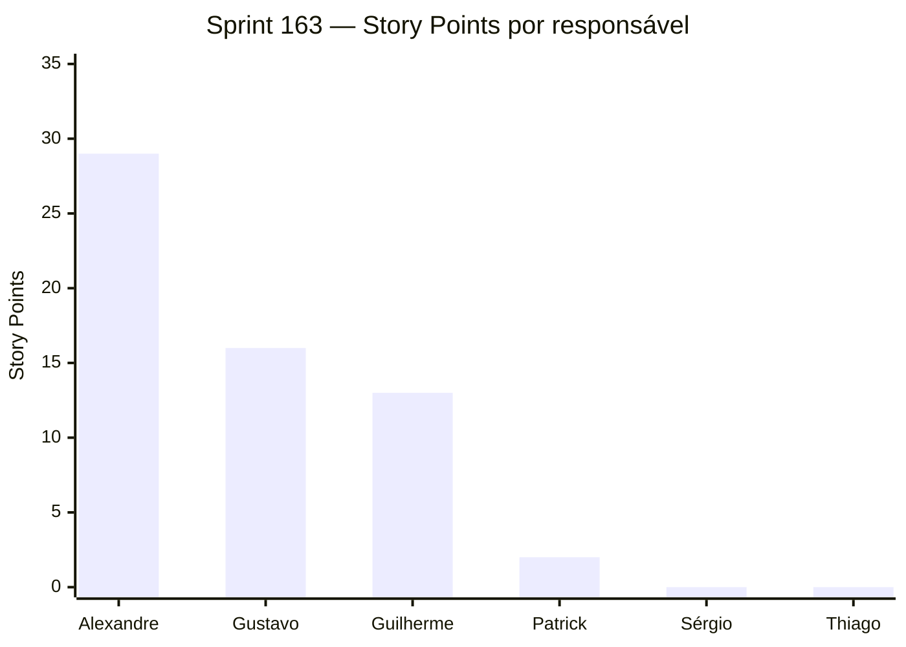
```mermaid
xychart-beta
    title "Sprint 163 — Story Points por responsável"
    x-axis ["Alexandre", "Gustavo", "Guilherme", "Patrick", "Sérgio", "Thiago"]
    y-axis "Story Points" 0 --> 35
    bar [29, 16, 13, 2, 0, 0]
```

**Leitura:** Alexandre também lidera em SP (48%). Observar o descompasso entre issues × SP: Patrick entregou 10 issues mas só 2 SP (issues pequenas/sem estimativa); Alexandre entregou 20 issues e 29 SP (issues mais pesadas).

---

## 6. Horas apontadas por responsável

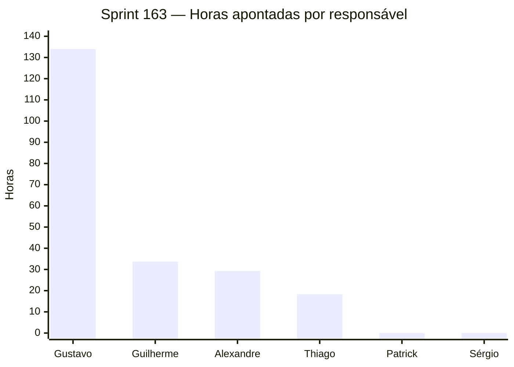
```mermaid
xychart-beta
    title "Sprint 163 — Horas apontadas por responsável"
    x-axis ["Gustavo", "Guilherme", "Alexandre", "Thiago", "Patrick", "Sérgio"]
    y-axis "Horas" 0 --> 140
    bar [134.0, 33.7, 29.3, 18.3, 0, 0]
```

**Leitura:** Gustavo concentra **62% das horas** da sprint (134h) — puxado por 2 cards pesados (SISP-9900 e SISP-9536 = 127h juntos). Patrick e Sérgio não registraram horas em nenhum card, apesar de terem issues atribuídas.

---

## 7. Horas apontadas por Tipo de Issue

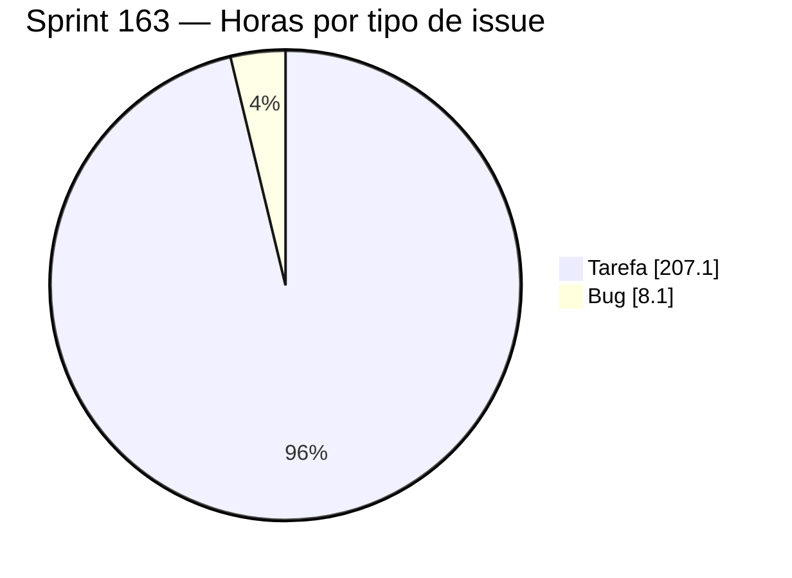
```mermaid
pie showData title Sprint 163 — Horas por tipo de issue
    "Tarefa" : 207.1
    "Bug" : 8.1
```

**Leitura:** 96% do esforço foi em Tarefas. Os 14 bugs resolvidos consumiram apenas 8,1h — eram correções pequenas/diretas.

---

## 8. Top 5 cards mais pesados (horas)

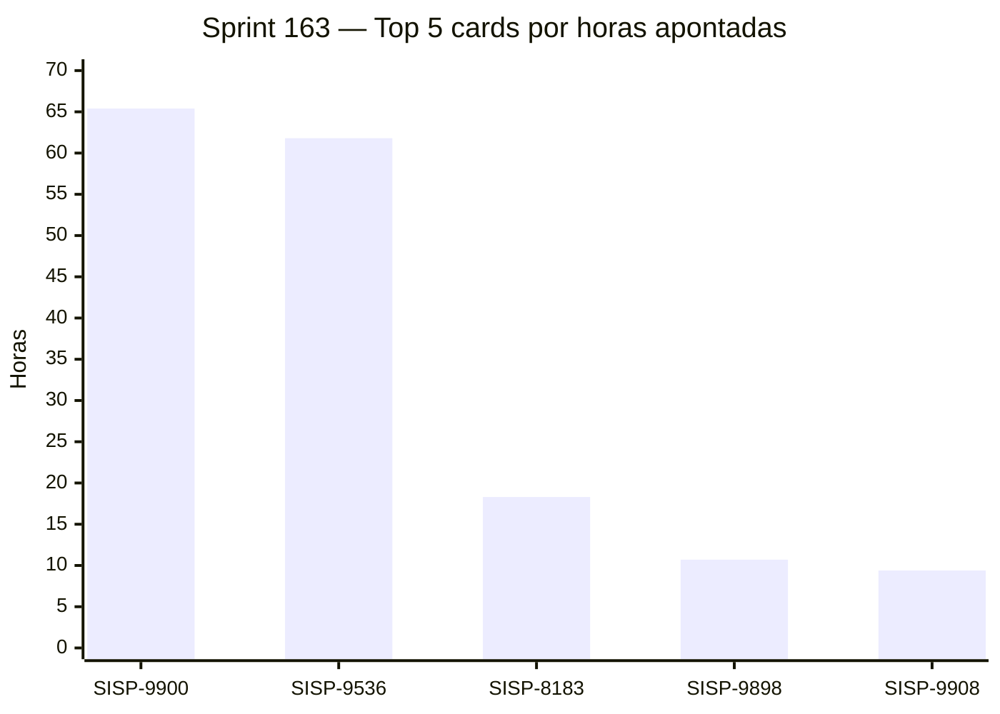
```mermaid
xychart-beta
    title "Sprint 163 — Top 5 cards por horas apontadas"
    x-axis ["SISP-9900", "SISP-9536", "SISP-8183", "SISP-9898", "SISP-9908"]
    y-axis "Horas" 0 --> 70
    bar [65.4, 61.8, 18.3, 10.7, 9.4]
```

**Leitura:** dois outliers concentram **59% das horas** da sprint (SISP-9900 + SISP-9536 = 127h de 215h). Sinaliza cards que deveriam ter sido quebrados.

---

## 9. Horas apontadas por dia (durante a sprint)

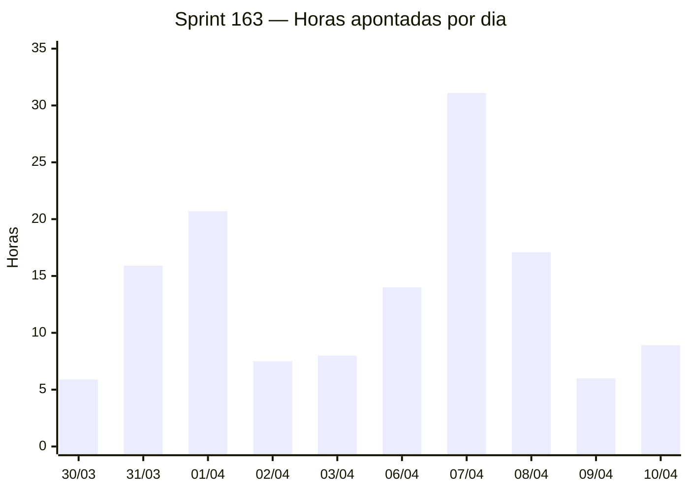
```mermaid
xychart-beta
    title "Sprint 163 — Horas apontadas por dia"
    x-axis ["30/03", "31/03", "01/04", "02/04", "03/04", "06/04", "07/04", "08/04", "09/04", "10/04"]
    y-axis "Horas" 0 --> 35
    bar [5.9, 15.9, 20.7, 7.5, 8.0, 14.0, 31.1, 17.1, 6.0, 8.9]
```

**Leitura:** pico em 07/04 (31h apontadas — provavelmente lançamentos em lote). Total de horas apontadas **no período da sprint**: 135,1h.

> ⚠️ **Observação:** existem ~80h adicionais de worklog em datas **anteriores** à sprint (ex.: nov/2025, jan/2026), lançadas em cards que só foram fechados na Sprint 163. Por isso o total geral (215,3h) é maior que o apontado no período (135,1h).

---

## 10. Throughput — Issues concluídas por dia

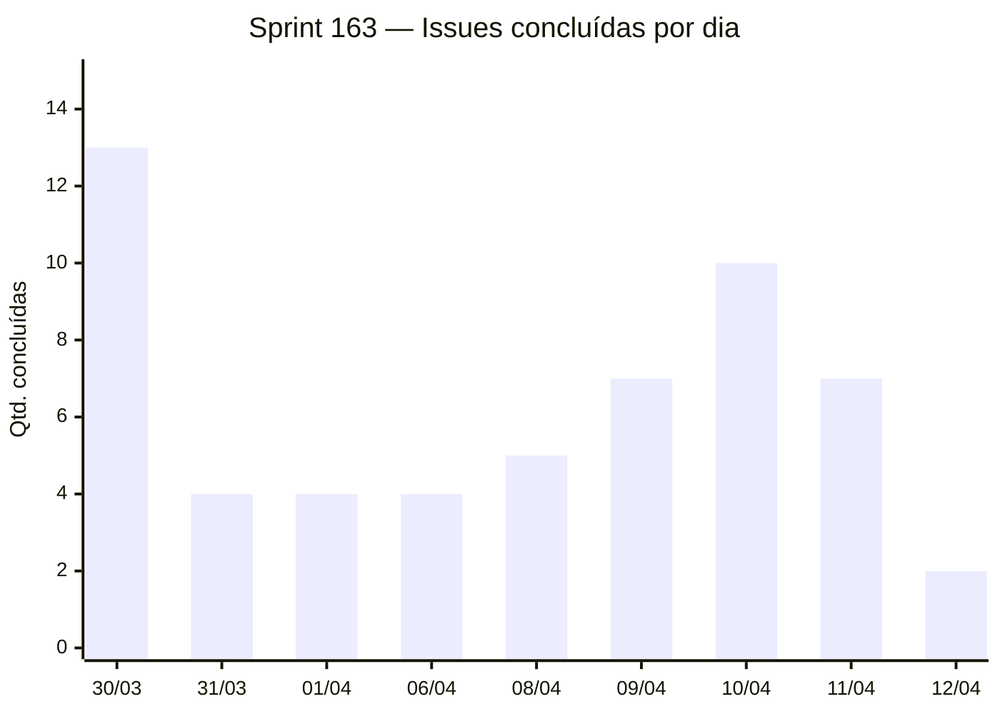
```mermaid
xychart-beta
    title "Sprint 163 — Issues concluídas por dia"
    x-axis ["30/03", "31/03", "01/04", "06/04", "08/04", "09/04", "10/04", "11/04", "12/04"]
    y-axis "Qtd. concluídas" 0 --> 15
    bar [13, 4, 4, 4, 5, 7, 10, 7, 2]
```

**Leitura:** pico inicial de 13 entregas em 30/03 (provavelmente limpeza de itens já prontos) e segundo pico em 10/04 (fechamento). Semana 1 entregou 21 issues, semana 2 entregou 35.

---

## 11. Bugs — Criados (ao longo do tempo) vs Resolvidos (durante a sprint)

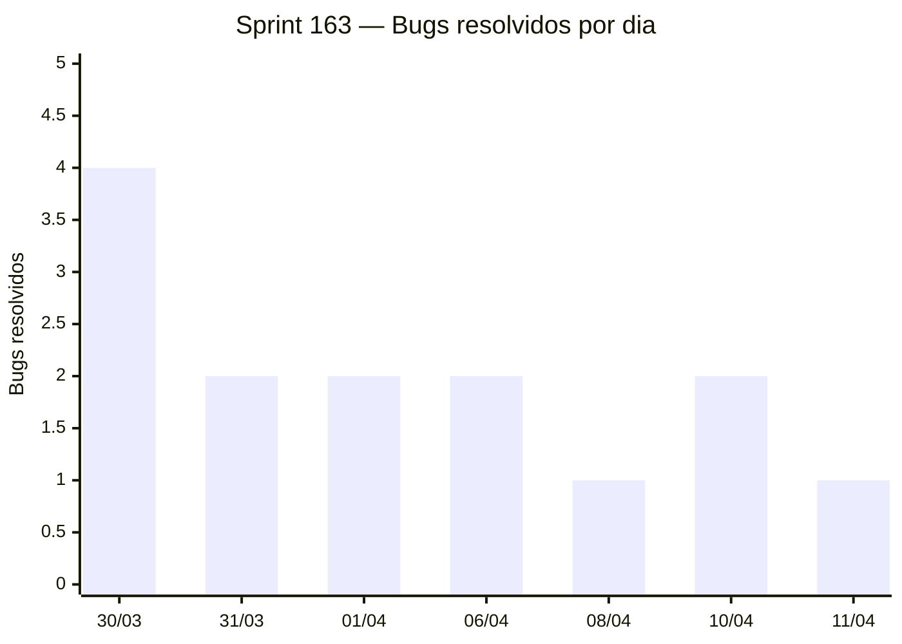
```mermaid
xychart-beta
    title "Sprint 163 — Bugs resolvidos por dia"
    x-axis ["30/03", "31/03", "01/04", "06/04", "08/04", "10/04", "11/04"]
    y-axis "Bugs resolvidos" 0 --> 5
    bar [4, 2, 2, 2, 1, 2, 1]
```

**Leitura:** dos 14 bugs resolvidos, **vários vinham do backlog** (o mais antigo criado em 21/jul/2025). A sprint 163 foi também um "mutirão" de limpeza de bugs antigos.

---

## 12. Cycle time dos bugs (dias entre criação e resolução)

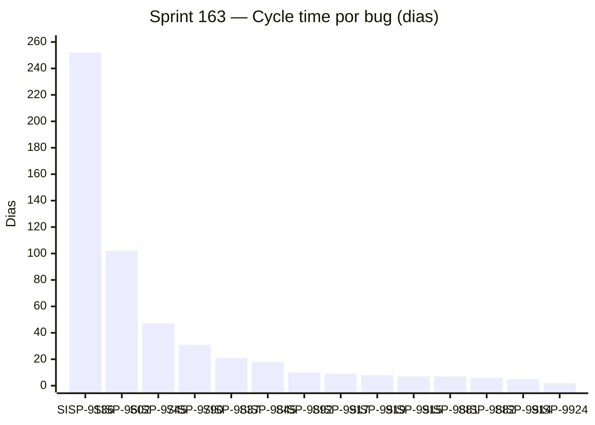
```mermaid
xychart-beta
    title "Sprint 163 — Cycle time por bug (dias)"
    x-axis ["SISP-9136", "SISP-9602", "SISP-9745", "SISP-9790", "SISP-9837", "SISP-9845", "SISP-9892", "SISP-9917", "SISP-9919", "SISP-9915", "SISP-9881", "SISP-9882", "SISP-9914", "SISP-9924"]
    y-axis "Dias" 0 --> 260
    bar [252, 102, 47, 31, 21, 18, 10, 9, 8, 7, 7, 6, 5, 2]
```

**Leitura:**
- **Outliers críticos:** SISP-9136 (252 dias) e SISP-9602 (102 dias) — bugs que ficaram parados no backlog por ~8 meses e ~3 meses.
- **Regime saudável:** bugs criados próximos ao início da sprint foram resolvidos em 2–10 dias (mediana ≈ 8d se remover os 2 outliers).
- Média geral: 37,5 dias (puxada pelos outliers); mediana: ~9 dias.

---

## Observações gerais

- **Taxa de entrega 100%** (57/57 issues + 60/60 SP) — performance de entrega excelente.
- **Sprint 163 teve função de "mutirão":** além do escopo normal, limpou 14 bugs (25% do total) incluindo itens antigos do backlog.
- **Alexandre** foi o principal contribuidor tanto em issues (20) quanto em SP (29).
- **Duração da sprint:** 14 dias, com dois picos de entrega (início e último terço).
- **Gap de estimativa reduziu:** 60 SP distribuídos em ~4 devs — bem melhor que a Sprint 164 (que só tinha 3 issues estimadas).
- **Atenção para backlog antigo:** o bug SISP-9136 ficando 252 dias parado sinaliza que a priorização poderia ser mais agressiva.
- **Descompasso SP × horas:** Gustavo tinha 16 SP estimados mas apontou 134h; Alexandre tinha 29 SP e apontou 29h. Os Story Points **não estão calibrados** com o esforço real — revisar o processo de estimativa.
- **2 cards concentram 59% das horas** (SISP-9900 e SISP-9536) — candidatos a serem quebrados em próximas sprints.
- **Lacuna de apontamento:** 15 de 57 cards (26%) sem worklog, incluindo todas as issues de Patrick e Sérgio.

## Próximos passos para enriquecer o relatório

Métricas que **não** foram geradas por limitação do CSV atual:

| Métrica | O que falta |
|---|---|
| **Burndown diário** | Exportar do Jira (Board → Reports → Burndown Chart → Raw Data) |
| **Velocity histórico** | CSV de sprints anteriores (160–162) para gráfico comparativo |
| **Tempo em cada status** | Requer `expand=changelog` via API REST do Jira |
| **Scope change** | Issues adicionadas/removidas durante a sprint (Sprint Report) |

---

## Resumo por Programador

### Gustavo Briel de Deus

| Métrica | Valor |
|---|---|
| Cards entregues | **10** (8 Tarefas · 2 Bugs) |
| Story Points | 16 |
| Horas totais apontadas | **134,0 h** |
| Horas no período da sprint | 72,2 h |
| Média de horas por card | 13,40 h |
| Prioridade dos cards | 9 Alta · 1 Baixa |
| Cycle time dos cards | média 50d · min 0d · max 131d |
| Cards sem apontamento | 1 |

**Horas apontadas por dia (durante a sprint):**

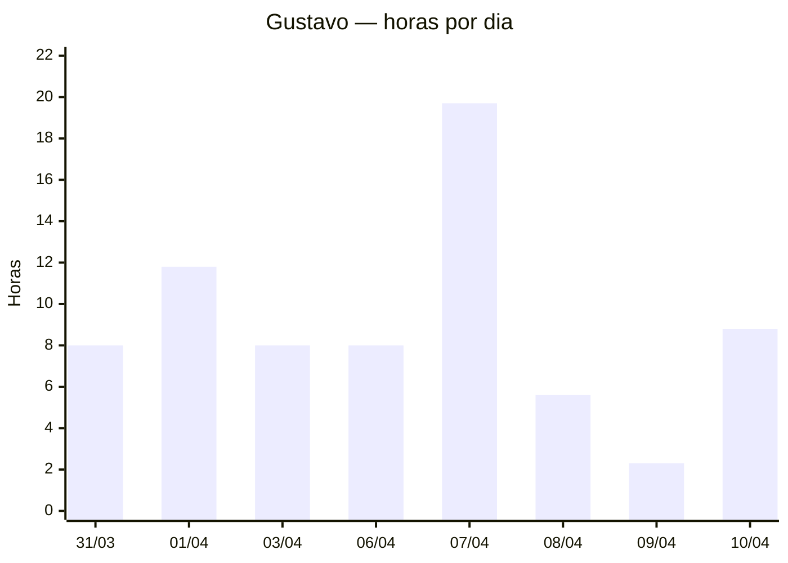
```mermaid
xychart-beta
    title "Gustavo — horas por dia"
    x-axis ["31/03", "01/04", "03/04", "06/04", "07/04", "08/04", "09/04", "10/04"]
    y-axis "Horas" 0 --> 22
    bar [8.0, 11.8, 8.0, 8.0, 19.7, 5.6, 2.3, 8.8]
```

**Top 3 cards:**
- SISP-9900 · 65,4 h · *PC - Criar funcionalidade de Curso com VideoAulas*
- SISP-9536 · 61,8 h · *BA - CRUDS Busca Ativa*
- SISP-9941 · 3,4 h · *Realização de testes SPRINT 163*

**Observações:** sozinho representa **62%** do esforço da sprint. Os dois principais cards (9900 + 9536 = 127h) são tarefas de grande porte — fortes candidatos a quebrar em sub-tasks. Pico em 07/04 (19,7h apontadas no dia).

---

### Guilherme Gomes

| Métrica | Valor |
|---|---|
| Cards entregues | **13** (7 Tarefas · 6 Bugs) |
| Story Points | 13 |
| Horas totais apontadas | **33,7 h** |
| Horas no período da sprint | 33,7 h |
| Média de horas por card | 2,59 h |
| Prioridade dos cards | 9 Alta · 1 Média · 3 Baixa |
| Cycle time dos cards | média 39,7d · min 5d · max 371d |
| Cards sem apontamento | 1 |

**Horas apontadas por dia:**

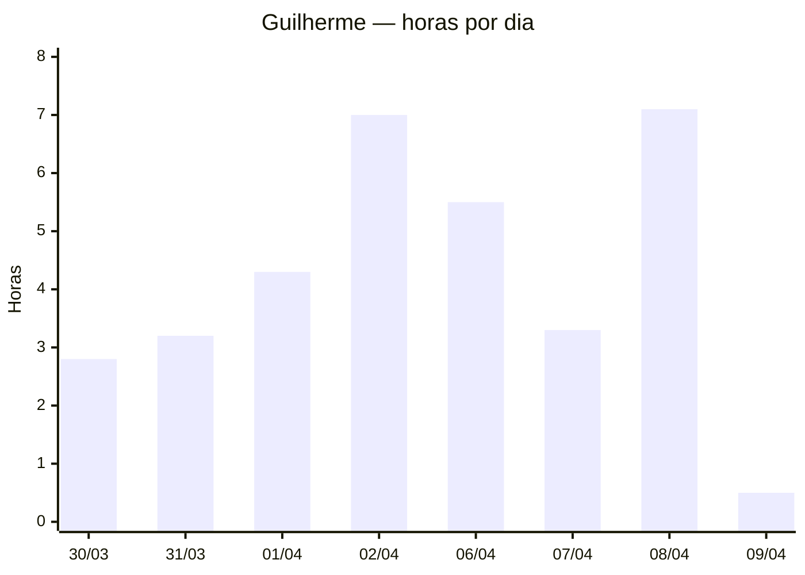
```mermaid
xychart-beta
    title "Guilherme — horas por dia"
    x-axis ["30/03", "31/03", "01/04", "02/04", "06/04", "07/04", "08/04", "09/04"]
    y-axis "Horas" 0 --> 8
    bar [2.8, 3.2, 4.3, 7.0, 5.5, 3.3, 7.1, 0.5]
```

**Top 3 cards:**
- SISP-9908 · 9,4 h · *CLONE - SA - ATA DE RESULTADO FINAL*
- SISP-9903 · 8,2 h · *SA - Criar função para validar planejamento de aulas*
- SISP-9902 · 5,6 h · *SA - Criar cópia de modelo de histórico escolar para Muqui*

**Observações:** o **maior caçador de bugs** da sprint (6 dos 14 bugs). Perfil consistente — 100% das horas apontadas dentro do período da sprint, distribuição uniforme entre os dias. Card mais antigo fechado: 371 dias no backlog.

---

### Alexandre Santos Gomes

| Métrica | Valor |
|---|---|
| Cards entregues | **20** (15 Tarefas · 5 Bugs) |
| Story Points | **29** (o maior da sprint) |
| Horas totais apontadas | 29,3 h |
| Horas no período da sprint | 29,3 h |
| Média de horas por card | 1,47 h |
| Prioridade dos cards | 15 Alta · 2 Média · 3 Baixa |
| Cycle time dos cards | média 41,9d · min 0d · max 331d |
| Cards sem apontamento | 1 |

**Horas apontadas por dia:**

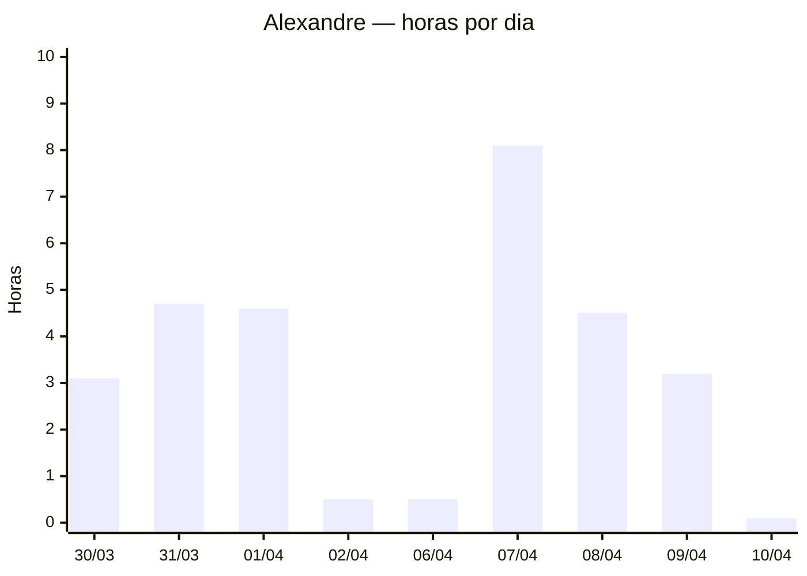
```mermaid
xychart-beta
    title "Alexandre — horas por dia"
    x-axis ["30/03", "31/03", "01/04", "02/04", "06/04", "07/04", "08/04", "09/04", "10/04"]
    y-axis "Horas" 0 --> 10
    bar [3.1, 4.7, 4.6, 0.5, 0.5, 8.1, 4.5, 3.2, 0.1]
```

**Top 3 cards:**
- SISP-9898 · 10,7 h · *Censo 2026 - Função de importação dos dados de retorno*
- SISP-9897 · 8,4 h · *Censo 2026 - Migrar dados para o cadastro da Diretoria*
- SISP-9852 · 2,1 h · *SA - Demora ao tentar Migrar Campos Personalizados em Massa*

**Observações:** **maior volume de cards** (35% da sprint) e **maior volume de SP** (48%), mas com média baixa de horas/card (1,47h) — perfil de cards menores e mais rápidos. Foco em Censo 2026 e correções (SA). Pico em 07/04 alinhado com o pico geral da sprint.

---

### Thiago Fabiano

| Métrica | Valor |
|---|---|
| Cards entregues | 1 (Tarefa) |
| Story Points | 0 |
| Horas totais apontadas | 18,3 h |
| Horas no período da sprint | **0 h** |
| Cycle time do card | 493 dias |

**Observações:** entregou **1 card muito antigo** (SISP-8183 — "PM - Refatorar Página de Home Simplificada"), com todo o apontamento de 18,3h feito **antes** da Sprint 163. Participação pontual — possível contribuição externa ao time regular.

---

### Patrick de Aquino Vieira

| Métrica | Valor |
|---|---|
| Cards entregues | 10 (8 Tarefas · 1 Bug · 1 História) |
| Story Points | 2 |
| Horas totais apontadas | **0 h** |
| Cards sem apontamento | **9 de 10** |
| Prioridade | 8 Alta · 2 Média |

**Observações:** segundo maior volume de cards (10), mas **sem registro de horas** em nenhum deles (apenas 1 card com apontamento zero). Perfil sugere atividades não-desenvolvimento (gestão, revisão, análise) ou lacuna no processo de apontamento. Recomenda-se alinhar o procedimento de worklog.

---

### Sérgio Monechi Sobrinho

| Métrica | Valor |
|---|---|
| Cards entregues | 1 (Tarefa) |
| Horas apontadas | 0 h |

**Observação:** participação pontual, 1 card entregue sem apontamento de horas.

---

### Cards sem responsável

2 Histórias (SISP-8378 e SISP-8377 — CENSO 2024/2025) entraram na sprint sem responsável atribuído. Requer revisão do processo de planejamento.

---

## Comparativo final

```mermaid
xychart-beta
    title "Sprint 163 — Cards × SP × Horas por responsável"
    x-axis ["Gustavo", "Alexandre", "Guilherme", "Patrick", "Thiago", "Sérgio"]
    y-axis "Valor" 0 --> 140
    bar [10, 20, 13, 10, 1, 1]
    bar [16, 29, 13, 2, 0, 0]
    bar [134, 29.3, 33.7, 0, 18.3, 0]
```

> Barras por dev (esq. → dir. em cada grupo): **Cards**, **SP**, **Horas**.
> Mostra os três perfis distintos da sprint: volume (Alexandre), profundidade (Gustavo) e equilíbrio (Guilherme).
