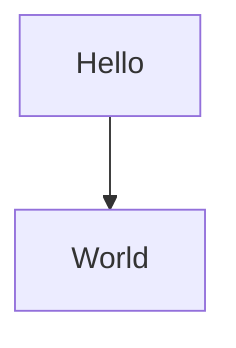
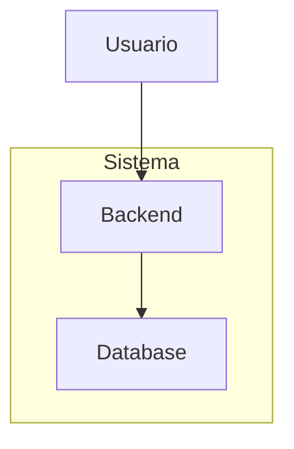

# Teste Mermaid

## Teste 1 - Minimo

```mermaid
graph TB
    A[Hello] --> B[World]
```

## Teste 2 - Subgraph

```mermaid
graph TB
    subgraph Sistema["Sistema"]
        C[Backend] --> D[Database]
    end
    E[Usuario] --> C
```
