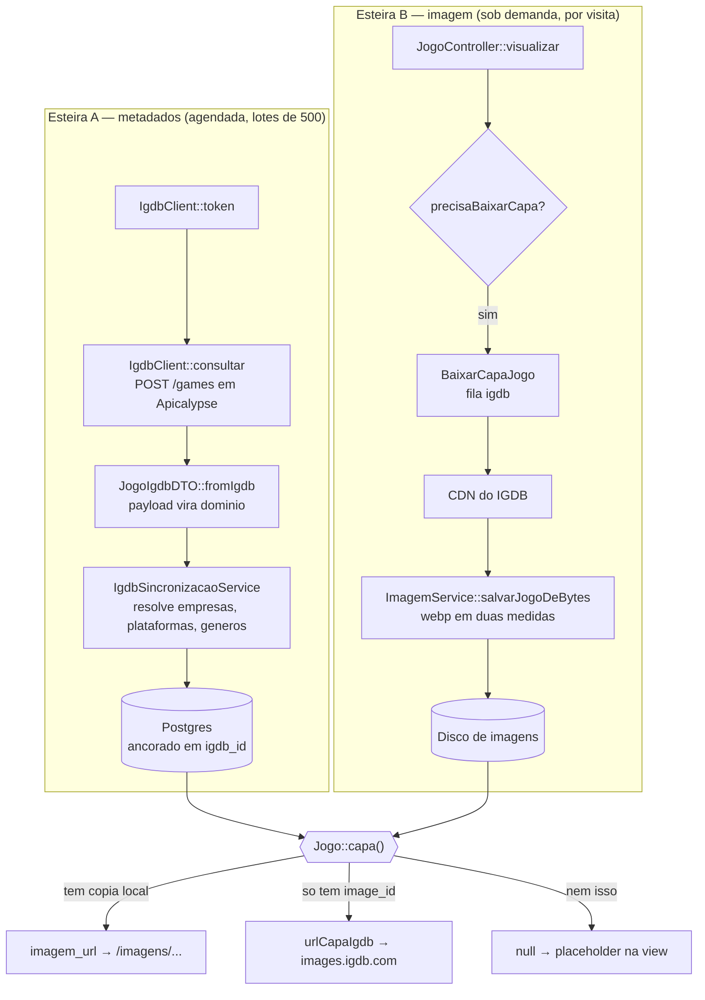

# Integração com o IGDB — Game Database

> **Escopo:** este documento descreve **como o catálogo é alimentado** e **como as imagens são armazenadas e exibidas**.
> A arquitetura de código (Controller, Service, Repositório, DTO, Resource, rotas, nomenclatura) segue o [`guidelines.md`](guidelines.md) — o "jeito SISP". Em caso de conflito, **o `guidelines.md` prevalece**.
> Identidade visual em [`estilo-visual.md`](estilo-visual.md).

---

## 1. O que mudou

O catálogo era preenchido de duas formas: cadastro manual pela tela de jogos e um comando de scraping (`jogos:enriquecer`) que lia o HTML do Backloggd com regex sobre meta tags OpenGraph. A ironia é que a capa que ele extraía já vinha de `images.igdb.com` — o Backloggd era um intermediário frágil da API que passamos a usar direto.

Hoje:

| | Antes | Agora |
|---|---|---|
| Origem dos dados | scraping de HTML do Backloggd | API oficial do IGDB v4 |
| Casamento de registros | por nome (`Str::slug`) | por `igdb_id`, com índice único |
| Atualização | manual, sob demanda | agendada de hora em hora |
| Imagens | `storage/app/public` | partição dedicada, selecionável por `.env` |
| Capas | baixadas no ato do scraping | sob demanda, com CDN do IGDB como origem |

---

## 2. Panorama: duas esteiras independentes

A decisão estruturante é que **metadado e imagem seguem caminhos separados**. Metadados chegam em massa, agendados, e só tocam o Postgres. Imagens chegam uma a uma, por visita de usuário, e só tocam o disco. As duas se encontram num único método — `Jogo::capa()`.

É isso que permite o catálogo ficar navegável em horas enquanto as capas se acumulam ao longo de semanas.



**Consequência prática:** o site funciona sem worker nenhum. Sem a esteira B, toda capa vem do CDN do IGDB e ninguém percebe diferença — só não se forma cópia local. **A esteira B é otimização, não requisito.**

---

## 3. Configuração

### 3.1 Variáveis de ambiente

| Variável | Papel |
|---|---|
| `IGDB_CLIENT_ID` | App registrado no [Twitch Developer Console](https://dev.twitch.tv/console/apps) |
| `IGDB_CLIENT_SECRET` | Idem. Sem as duas, o sync falha na primeira requisição |
| `IMAGENS_DISK` | `public` ou `imagens`. **Único lugar** que decide o storage de imagem |
| `IMAGENS_ROOT` | Só com `IMAGENS_DISK=imagens`. Pasta **pai** de `imagens/` |
| `DB_CONNECTION` | Tem que ser `pgsql` — os repositórios buscam com `ILIKE`, que não existe em SQLite nem MySQL |

> **`IMAGENS_ROOT` com barra normal:** `D:/game-database/storage`, nunca com barra invertida. O parser de `.env` trata `\` como escape. O PHP no Windows aceita `/` sem reclamar.

### 3.2 `config/igdb.php`

```php
return [
    'client_id'     => env('IGDB_CLIENT_ID'),
    'client_secret' => env('IGDB_CLIENT_SECRET'),
    'base_url'      => env('IGDB_BASE_URL', 'https://api.igdb.com/v4'),
    'token_url'     => env('IGDB_TOKEN_URL', 'https://id.twitch.tv/oauth2/token'),
    'cache_key'     => 'igdb_token_acesso',
];
```

### 3.3 `config/filesystems.php`

```php
'imagens' => [
    'driver'     => 'local',
    'root'       => env('IMAGENS_ROOT', storage_path('app/public')),
    'url'        => rtrim(env('APP_URL', 'http://localhost'), '/'),
    'visibility' => 'public',
    'throw'      => true,
],

// fora do array 'disks': o seletor que o ImagemService lê
'imagens_disco' => env('IMAGENS_DISK', 'public'),

'links' => [
    public_path('imagens') => env('IMAGENS_ROOT', storage_path('app/public')) . '/imagens',
],
```

O driver `local` aceita qualquer caminho absoluto, inclusive em outro volume — nenhuma dependência nova foi necessária. E como `IMAGENS_ROOT` aponta para a **pasta pai** de `imagens/`, os caminhos gravados no banco continuam idênticos (`imagens/jogos/grande/<uuid>.webp`). **Zero migração de dados.**

---

## 4. Esteira A — metadados

### 4.1 Token (`IgdbClient::token`)

A API é servida pela Twitch, então a autenticação é OAuth2 no fluxo `client_credentials`. O token vale cerca de 60 dias, e toda requisição leva os cabeçalhos `Client-ID` e `Authorization: Bearer`.

**Não dá para usar `Cache::remember`.** O TTL só é conhecido *depois* da resposta — a Twitch devolve `expires_in` junto com o token, e `remember()` exige o prazo antes de rodar o callback. Daí a forma manual com `Cache::get` + `Cache::put`.

Três detalhes que não são decoração:

- `Http::asForm()` — este endpoint específico da Twitch exige `x-www-form-urlencoded`. JSON devolve 400.
- `MARGEM_EXPIRACAO = 60` — descontar um minuto evita usar um token que expira no voo entre o cache e a requisição.
- `max($expiraEm - MARGEM, 60)` — se `expires_in` viesse pequeno ou zero, a subtração daria negativo e o `Cache::put` gravaria algo já vencido, causando uma ida à Twitch **por requisição**.

O cache é o `database`, que o projeto já usava. Não há Redis envolvido.

### 4.2 Consulta (`IgdbClient::consultar`)

O IGDB não recebe filtros por querystring nem por corpo JSON. Tem linguagem própria — **Apicalypse** — enviada como texto puro no corpo de um `POST`:

```
fields id, name, slug, summary, first_release_date, updated_at, game_type,
       cover.image_id, genres.id, genres.name,
       involved_companies.company.id, involved_companies.developer;
where updated_at >= 1690000000 & game_type = 0;
sort updated_at asc;
limit 500;
```

A notação com ponto (`cover.image_id`) **expande a relação dentro do mesmo payload**. É isso que evita uma segunda requisição para cada capa, gênero ou empresa — e também por que a constante `CAMPOS` do serviço é tão longa.

```php
Http::withHeaders([...])
    ->withBody($query, 'text/plain')   // ->post($array) viraria JSON e o IGDB recusa
    ->retry(
        times: 3,
        sleepMilliseconds: 500,
        when: fn(Throwable $e) => $e instanceof RequestException
            && in_array($e->response->status(), [429, 500, 502, 503, 504]),
        throw: false
    )
    ->post(config('igdb.base_url') . '/' . ltrim($endpoint, '/'));
```

O `when:` restringe a retentativa ao que adianta repetir: 429 (limite de 4 req/s estourado) e a família 5xx. Um 400 por consulta malformada ou 401 por credencial errada não melhoram na segunda tentativa — só falham três vezes mais devagar. E `throw: false` deixa a checagem explícita no `throw_unless` logo abaixo, **com o corpo da resposta na mensagem**: erro de Apicalypse vem descrito ali.

> ⚠️ O `when:` precisa de `Illuminate\Http\Client\RequestException`. Importar a homônima do Guzzle não gera erro — o `instanceof` simplesmente nunca casa e a retentativa fica desligada em silêncio.

### 4.3 Cursor (`IgdbSincronizacaoService::buscarLote`)

São 372.770 registros no IGDB, dos quais 310.887 são jogos base. A paginação não é por `offset`, e sim por **cursor sobre `updated_at`**.

A vantagem sobre `offset` é que o mesmo mecanismo serve a duas coisas: com o cursor em zero varre o catálogo inteiro; com o cursor no fim traz só o que mudou. **Backfill e manutenção são o mesmo código.**

O estado vive em `igdb_sincronizacoes`, uma linha por entidade:

| Coluna | Para quê |
|---|---|
| `entidade` | hoje só `games`; a tabela já comporta outras |
| `ultimo_updated_at` | o cursor, em epoch Unix |
| `total_processado` | acumulado, para acompanhar o avanço |
| `executado_em` | quando o último lote fechou |

#### Por que `>=` e não `>`

Decisão menos óbvia do serviço, e veio de medição. `updated_at` **não é único**: numa amostra de 500 registros havia 481 timestamps distintos, com até 3 jogos compartilhando o mesmo valor.

O problema aparece na fronteira do lote. Se o último registro tem `updated_at = T` e existem dois jogos com esse T no IGDB — mas só um coube — então com `> T` o próximo lote começa depois de T e **o segundo jogo nunca é visto**. Não é atraso: é perda permanente e silenciosa.

Com `>= T` o grupo empatado é reprocessado, no máximo 3 registros por lote. Reprocessar é inofensivo porque a escrita é idempotente. É por isso que, a partir do segundo lote, os logs sempre mostram alguns "atualizados" — são os empates voltando, e é o comportamento correto.

#### A trava que o `>=` introduz

```php
// Só ocorreria se um único timestamp tivesse mais registros
// que o limite do lote. Medido, o maior grupo tem 3.
if ($novoCursor === $cursor && count($dtos) >= $limite) {
    $novoCursor = $cursor + 1;
}
```

Se um único timestamp tivesse mais de 500 registros, o lote viria cheio, o cursor não avançaria, e o comando repetiria o mesmo lote para sempre. O empurrão de um segundo quebra o laço.

> ⚠️ **É `game_type`, não `category`.** O campo `category` **foi removido da API**, e o IGDB **não reclama de campo inexistente no `where`**: `where category = 0` devolve zero resultados, sem erro, sem aviso. `game_type = 0` significa "jogo base" — 310.887 dos 372.770 registros. Os demais são DLC, expansão, bundle, mod, port.

### 4.4 Tradução (`JogoIgdbDTO::fromIgdb`)

O projeto já tinha um `JogoDTO` para o formulário. O `JogoIgdbDTO` é irmão dele com postura oposta:

| | `JogoDTO` | `JogoIgdbDTO` |
|---|---|---|
| Origem | formulário do próprio app | payload de terceiro |
| Campo faltando | erro de validação | normal — vira `null` |
| Obrigatórios | nome, desenvolvedora, gêneros, plataformas | só `id` e `name` |
| Falha | 422 na tela | exceção que aborta o lote |

A tolerância não é desleixo: a cobertura real do IGDB é irregular — 87% dos jogos têm `summary`, 75% têm plataforma. Exigir campo cheio derrubaria a maior parte do catálogo. Já `id` e `name` ausentes indicam payload corrompido, e aí abortar é o certo.

Duas conversões com pegadinha:

```php
Carbon::createFromTimestampUTC($dados['first_release_date'])->format('Y-m-d')
```

`createFromTimestampUTC`, **não** `createFromTimestamp` — o segundo aplica o fuso da aplicação sobre um valor que já é UTC, e um jogo lançado à meia-noite troca de dia.

```php
$porEmpresa[$id]['desenvolvedora'] =
    $porEmpresa[$id]['desenvolvedora'] || (bool) ($vinculo['developer'] ?? false);
```

O IGDB entrega `involved_companies` como lista de vínculos, cada um com quatro booleanos (`developer`, `publisher`, `porting`, `supporting`), e **a mesma empresa pode aparecer em mais de um vínculo**. Os papéis são combinados com `||`.

> ⚠️ **`||` e não `|=`.** O atalho `|=` é um OU *bit a bit*: devolve `int`, não `bool`. O Postgres recusa `1` numa coluna `boolean` e o lote inteiro morre no `sync()` do pivot, com mensagem que não aponta para o DTO.

### 4.5 Resolução em lote (trait `ResolvePorIgdbId`)

Cada jogo traz empresas, plataformas e gêneros que podem ou não existir no banco. A forma ingênua seria um `firstOrCreate` por entidade. A conta desmonta a ideia: um lote de 500 jogos carrega **cerca de 151 entidades distintas** (99 empresas, 37 plataformas, 15 gêneros). Uma consulta cada, ao longo dos 622 lotes do backfill, dá **94 mil idas ao banco**.

O serviço faz uma passada por *tipo*, não por registro:

1. `coletar()` percorre os DTOs do lote e desduplica por `igdb_id` — de milhares de menções para ~151 itens únicos.
2. `resolver()` pergunta quais já existem (`mapaPorIgdbId`), calcula a diferença, e insere só o que falta (`criarEmLote`).
3. Devolve um mapa `igdb_id => id local`, que `traduzir()` usa para montar as chaves estrangeiras.

**3 a 6 consultas por lote em vez de 151.** No backfill inteiro, ~3.700 em vez de 94 mil.

Dois detalhes do trait carregam peso:

```php
return $this->modelo->newQuery()
    ->withTrashed()          // ← linha removida ainda ocupa o índice único
    ->whereIn('igdb_id', $igdbIds)
    ->pluck('id', 'igdb_id')
    ->all();
```

`withTrashed()` não é opcional: soft delete só marca `removido_em`, e a linha continua ocupando o índice único de `igdb_id`. Sem ele, a busca não acha, o código tenta inserir, e o banco recusa por chave duplicada.

`criarEmLote` usa `insertOrIgnore`: se duas execuções tentarem criar "Nintendo" ao mesmo tempo, uma perde a corrida — com `insert` seria exceção; com `insertOrIgnore` a linha perdedora é descartada e o mapa é relido logo depois, já com o id certo.

### 4.6 Persistência

Antes, o casamento de jogos era **por nome** — o repositório lançava exceção se o nome já existisse. Razoável num cadastro manual, insustentável num sync: nomes mudam entre revisões, colidem entre remakes, reaparecem em coletâneas.

A reforma deu a `jogos`, `empresas`, `plataformas` e `generos` uma coluna `igdb_id` com índice único. É uma **chave natural**: vem de fora, é estável, não muda quando o registro é editado. O `id` local segue como chave primária para tudo que já apontava para ele — reviews, coleções, pivots.

É essa âncora que dá a propriedade central: **rodar duas vezes é igual a rodar uma vez.** Verificado reprocessando 100 registros com o cursor zerado — `0 novos, 100 atualizados`, com todas as contagens idênticas.

```php
$criou = $existente === null;
$jogo  = $existente ?? new Jogo();

// Jogo removido continua ocupando o índice único de igdb_id.
// Restaurar é a única saída — inserir de novo bate no índice.
if ($jogo->trashed()) {
    $jogo->restore();
}
```

O jogo existente vem de `porIgdbIds()`, que carrega o lote inteiro de uma vez indexado por `igdb_id` — sem ele seriam 500 consultas por lote, 311 mil no backfill. A gravação passa por `salvarSincronizado()`, que faz `save()` mais três `sync()`; ele existe separado de `criar()` justamente para **não** ter a checagem de nome duplicado.

#### O pivot com quatro papéis

`jogo_empresas` guarda `desenvolvedora`, `publicadora`, `portabilidade` e `apoio` como quatro booleanos, e não um campo `papel` com um valor. A razão apareceu no primeiro lote: **Pangea Software é desenvolvedora e publicadora do mesmo jogo**. Com um enum, seriam duas linhas para a mesma dupla, ou uma escolha arbitrária.

O `DB::transaction` envolve o lote todo: se o registro 400 falhar, os 399 anteriores voltam atrás e o cursor não avança.

### 4.7 Comando e agendamento

```bash
php artisan igdb:sincronizar
    --lotes=1      # quantos lotes nesta execução
    --limite=500   # registros por lote (teto do IGDB)
    --tudo         # vai até o fim do catálogo
    --reiniciar    # zera o cursor e reprocessa tudo
```

O comando é casca fina: lê as opções, chama `sincronizarLote()` em laço, imprime uma linha por lote. Nenhuma regra vive nele — é o serviço que decide tudo, e por isso o mesmo código servirá a um webhook no futuro.

Quando um lote estoura, o comando informa e sai com `FAILURE`, sem tentar o próximo. Isso é seguro porque **o cursor só avança em lote concluído** — rodar de novo retoma exatamente de onde parou.

```php
// routes/console.php
Schedule::command('igdb:sincronizar --tudo')
    ->hourly()
    ->withoutOverlapping()
    ->runInBackground();
```

`withoutOverlapping()` é obrigatório, não higiene: sem ele uma execução longa seria atropelada pela seguinte, as duas partiriam **do mesmo cursor** e reprocessariam o mesmo trecho em paralelo.

---

## 5. Esteira B — capas sob demanda

### 5.1 Por que sob demanda

A intenção original era baixar tudo. Os números — medidos, não estimados — mudaram a decisão.

O custo por jogo saiu das 114 capas que o scraper antigo já tinha baixado, pelo mesmo pipeline (`t_cover_big_2x` convertido para webp em duas medidas): **74,2 KB** na grande e **31,0 KB** na pequena, ou seja **~105 KB por jogo**. O tamanho do catálogo veio de `POST /v4/games/count`:

| Escopo | Jogos | Storage a 105 KB |
|---|---|---|
| Registros no IGDB | 372.770 | — |
| Jogos base (`game_type = 0`) | 310.887 | — |
| Base **com capa** | 267.021 | **26,7 GB** |
| Base com capa e ao menos 1 avaliação | 25.383 | 2,5 GB |

Duas leituras decidiram o desenho:

- **26,7 GB numa partição de 27,9 GB é 96% de ocupação.** Não cabe.
- **Só 9,5% dos jogos base têm uma única avaliação.** Os outros 90% são entradas que ninguém tocou. Baixar 24 GB para elas é encher o disco com imagem que nenhum usuário vai abrir.

Daí a inversão: metadados de todos os jogos no Postgres, **nenhuma capa baixada de antemão**, e a imagem servida do CDN do IGDB até alguém de fato abrir o jogo. O que torna isso possível é uma coluna: `igdb_imagem_id`.

### 5.2 A cascata (`Jogo::capa`)

```php
public function urlCapaIgdb(string $tamanho = 't_cover_big_2x'): ?string
{
    return $this->igdb_imagem_id
        ? "https://images.igdb.com/igdb/image/upload/{$tamanho}/{$this->igdb_imagem_id}.jpg"
        : null;
}

public function capa(bool $grande = true): ?string
{
    $local = $grande ? $this->url_imagem_grande : $this->url_imagem_pequena;

    if ($local) {
        return imagem_url($local);              // 1. cópia local
    }

    return $this->urlCapaIgdb($grande ? 't_cover_big_2x' : 't_cover_small_2x');
}                                               // 2. CDN · 3. null
```

A URL do CDN é **montada, não armazenada** — só o `image_id` fica no banco, e o tamanho entra no caminho. É por isso que a mesma capa sai em medidas diferentes sem nada mudar no banco.

As views chamam `$jogo->capa()` e não sabem de onde a imagem vem. Essa indiferença é o ponto: no dia do bucket, ou quando um backfill de capas rodar, nenhuma view muda.

`precisaBaixarCapa()` é o complemento — verdadeiro quando existe `igdb_imagem_id` mas não existe `url_imagem_grande`. É a condição que o controller consulta antes de despachar o job.

### 5.3 O job (`BaixarCapaJogo`)

```php
// JogoController::visualizar()
if ($jogo->precisaBaixarCapa()) {
    BaixarCapaJogo::dispatch($jogo->id);
}
```

O usuário que dispara o job **não é quem se beneficia dele** — a página dele já foi renderizada com a imagem do CDN. Quem ganha é a próxima visita. Por isso o job nunca é urgente e pode falhar sem estragar nada.

| Mecanismo | Contra o quê |
|---|---|
| `ShouldBeUnique` + `uniqueId()` | Dez visitas simultâneas ao mesmo jogo enfileirariam dez downloads idênticos |
| `onQueue('igdb')` | Fila própria. O reencode é caro e não pode competir com o resto do app |
| `$tries = 3`, `$backoff = [10, 60, 300]` | Falha de rede é transitória; o intervalo crescente evita martelar o CDN |
| `temEspaco()` | Encher a partição quebraria o próximo upload de usuário com erro obscuro. Para sozinho com 2 GB de reserva |

E uma decisão explícita sobre o que **não** retentar:

```php
// 404 no CDN acontece — image_id desatualizado. Não é motivo pra retentar.
if (! $resposta->successful()) {
    return;
}
```

Sair com `return`, e não com exceção, separa "não deu" de "deu erro". Um `image_id` que o IGDB trocou daria 404 nas três tentativas e depois poluiria `failed_jobs` sem que houvesse nada a corrigir.

> ⚠️ **O worker precisa escutar a fila certa.** `onQueue('igdb')` significa que um `queue:work` sem `--queue` **não pega esses jobs** — ele escuta só a `default`, e os downloads se acumulam na tabela `jobs` sem nunca rodar. O `composer dev` já roda `--queue=igdb,default`. Em produção, use um worker dedicado: `php artisan queue:work --queue=igdb`.

### 5.4 `ImagemService::salvarJogoDeBytes`

O `ImagemService` só sabia receber `UploadedFile`, porque nasceu servindo formulário. O scraper antigo contornava isso escrevendo os bytes num `tempnam()` e forjando um `UploadedFile` por cima. O novo método aceita bytes direto:

```php
$grande  = (string) Image::read($bytes)->scaleDown(width: 600)->toWebp(90);
$pequena = (string) Image::read($bytes)->scaleDown(width: 300)->toWebp(90);
```

`scaleDown` nunca amplia — capa pequena no CDN continua pequena em vez de virar um borrão de 600px. Webp a 90 é o que produz os ~105 KB por jogo.

---

## 6. Do disco ao navegador

### 6.1 A ligação

A partição fica fora de `public/`, então o servidor web não a alcança sozinho. A ligação vem de `filesystems.links` + `php artisan storage:link`, que no Windows cria uma *junction* com `mklink /J` — **sem exigir administrador nem Modo de Desenvolvedor**, ao contrário do que se supõe de symlinks no Windows. O único requisito é a pasta de destino já existir.

A alternativa seria `'serve' => true` no disco, que faz o PHP entregar cada arquivo. Descartada por dois motivos: o `ServeFile` do Laravel crava `Cache-Control: no-store` em toda resposta — uma página de catálogo com 20 capas rebaixaria as 20 a cada visita — e põe o PHP no caminho crítico de cada imagem. Esse recurso foi feito para arquivo protegido, não para asset público.

### 6.2 O ponto único de URL

Antes havia dois padrões conflitantes espalhados por views e Resources:

- `Storage::url($campo)` — usava o disco **default**, não o disco onde os arquivos estavam. Só funcionava por acidente do symlink.
- `asset('storage/' . $campo)` — cravava o caminho e ignorava o disco por completo. Teria quebrado em silêncio na migração.

Os dois foram substituídos por um helper:

```php
// app/Helpers/imagens.php, registrado em composer.json → autoload.files
function imagem_url(?string $caminho): ?string
{
    return app(IImagemService::class)->url($caminho);
}
```

Blade e Resource não sabem mais em que disco a imagem está. **Trocar de storage é trocar `IMAGENS_DISK` no `.env`, e nada mais.**

---

## 7. Operação — o que rodar, e como saber o que está rodando

Esta seção é o runbook. As duas esteiras da seção 2 precisam de **processos diferentes**, e nenhum dos dois sobe sozinho.

### 7.1 Resumo: o que precisa estar de pé

| Quero que… | Processo | Obrigatório? |
|---|---|---|
| o catálogo se atualize sozinho | `php artisan schedule:work` | **sim**, senão o catálogo congela |
| as capas virem cópia local | `php artisan queue:work --queue=igdb` | não — sem ele tudo vem do CDN |
| desenvolver normalmente | `composer dev` | já inclui o worker de fila |

> ⚠️ **`composer dev` NÃO inclui o scheduler.** Ele sobe `serve`, `queue:listen --queue=igdb,default`, `pail` e `vite`. Se quiser que o catálogo se atualize enquanto você desenvolve, o `schedule:work` vai num terminal à parte.

### 7.2 Atualizar o catálogo

```bash
# um lote de 500, para conferir se está tudo de pé
php artisan igdb:sincronizar

# do cursor até o fim — é o que roda no backfill e na recuperação
php artisan igdb:sincronizar --tudo

# retomar depois de queda, hibernação ou reboot: MESMO comando
php artisan igdb:sincronizar --tudo
```

**Nunca use `--reiniciar` para retomar.** Essa flag zera o cursor e reprocessa os 311 mil registros do começo — cerca de duas horas. Não corrompe nada (a escrita é ancorada em `igdb_id`), mas é tempo jogado fora. Ela só serve quando você quer mesmo uma varredura completa, por exemplo depois de mudar o filtro de `game_type`.

Para deixar automático, em vez de rodar à mão:

```bash
php artisan schedule:work    # deixa o terminal ocupado; dispara o sync de hora em hora
```

Em produção Windows, o equivalente é uma tarefa no Agendador chamando `php artisan schedule:run` **a cada minuto**; em Linux, a linha de cron correspondente. O Laravel decide sozinho o que está devido — o gatilho de minuto é só o pulso.

> ⚠️ **`schedule:list` engana.** Ele mostra a entrada e diz "Next Due: 43 minutes from now" mesmo quando **nada** está invocando o scheduler. Isso é só o Laravel calculando quando *seria* devido. Ver se está realmente rodando é a seção 7.5.

### 7.3 Baixar as capas

Não existe comando de backfill de capa, e é de propósito (seção 5.1). As capas são baixadas por job, disparado quando alguém abre a tela de um jogo. O que você roda é o **worker que consome esses jobs**:

```bash
php artisan queue:work --queue=igdb
```

Sem ele, as capas continuam vindo do CDN do IGDB e o site funciona normalmente — só não se forma cópia local. Os jobs ficam acumulados na tabela `jobs` esperando.

```bash
# processa o que está na fila e sai (útil para esvaziar um acúmulo)
php artisan queue:work --queue=igdb --stop-when-empty

# acelerar: vários workers em paralelo, cada um no seu terminal
php artisan queue:work --queue=igdb
```

> ⚠️ **`queue:work` sem `--queue` não serve.** Ele escuta só a fila `default`, e os jobs de capa vão para a `igdb`. Ficam parados para sempre, sem erro nenhum.

### 7.4 Limpar imagens sem dono

```bash
php artisan imagens:orfas              # relatório, não apaga nada
php artisan imagens:orfas --apagar     # remove de fato
```

Detalhes em 8.1.

### 7.5 Saber o que está rodando

**Quais processos PHP estão de pé** (PowerShell) — mostra a linha de comando de cada um, então dá para distinguir `serve`, `queue:work`, `schedule:work` e `igdb:sincronizar`:

```powershell
Get-CimInstance Win32_Process -Filter "Name='php.exe'" |
    Select-Object ProcessId, CommandLine | Format-List
```

Se não sair nada, **nada do pipeline está rodando**. É a checagem mais confiável — mais que o `schedule:list`.

**Como está o pipeline** (funciona com qualquer coisa rodando ou não):

```bash
php artisan tinker --execute="
\$s = \App\Models\Igdb\IgdbSincronizacao::first();
printf(\"catalogo...: %s jogos  ·  cursor em %s  ·  ultimo lote %s\n\",
    number_format(\App\Models\Catalogo\Jogo::count(), 0, ',', '.'),
    date('d/m/Y H:i', \$s->ultimo_updated_at),
    \$s->executado_em?->diffForHumans() ?? 'nunca');
printf(\"capas......: %s locais de %s disponiveis\n\",
    number_format(\App\Models\Catalogo\Jogo::whereNotNull('url_imagem_grande')->count(), 0, ',', '.'),
    number_format(\App\Models\Catalogo\Jogo::whereNotNull('igdb_imagem_id')->count(), 0, ',', '.'));
printf(\"fila igdb..: %d na fila  ·  %d falhas\n\",
    \DB::table('jobs')->where('queue', 'igdb')->count(),
    \DB::table('failed_jobs')->count());
"
```

Saída típica com tudo em ordem:

```
catalogo...: 311.071 jogos  ·  cursor em 21/08/2026 14:50  ·  ultimo lote 53 minutes ago
capas......: 20 locais de 267.188 disponiveis
fila igdb..: 0 na fila  ·  0 falhas
```

Como ler cada linha:

| Sintoma | O que significa |
|---|---|
| `ultimo lote` de horas atrás | O scheduler não está rodando. Ver 7.2 |
| `cursor` muito atrás de hoje | Backfill incompleto. Rode `igdb:sincronizar --tudo` |
| `na fila` crescendo e `locais` parado | Nenhum worker na fila `igdb`. Ver 7.3 |
| `falhas` > 0 | Investigue com `php artisan queue:failed` |

**O sync está avançando agora?** Rode a checagem acima duas vezes seguidas: se `cursor` e a contagem de jogos mudarem, está andando.

**Verificações pontuais:**

```bash
php artisan schedule:list     # o que está agendado (não prova que roda — ver 7.2)
php artisan queue:failed      # jobs que falharam
php artisan queue:retry all   # reenfileira os que falharam
```

### 7.6 Ordem numa máquina limpa

```bash
composer install && npm install
# preencher .env: IGDB_CLIENT_ID, IGDB_CLIENT_SECRET, DB_*, IMAGENS_*
php artisan migrate
php artisan db:seed                       # situações e patch notes; catálogo NÃO
php artisan storage:link                  # só se IMAGENS_DISK=imagens
php artisan igdb:sincronizar --tudo       # backfill: ~2h para 311 mil jogos
```

O backfill sobrevive a hibernação e suspensão — o processo é apenas suspenso e retoma sozinho. Se a máquina desligar de verdade, o cursor está no último lote **completo** (a transação envolve o lote inteiro), então perde-se no máximo 500 registros de trabalho e nunca dados. Retomar é rodar `--tudo` de novo.

> **A ordem do backfill surpreende.** O cursor anda por `updated_at` — quando o IGDB editou o registro —, não por data de lançamento. Jogo popular é editado o tempo todo, então cai no **fim** da fila; jogo obscuro que ninguém toca vem primeiro. Splatoon, Elden Ring e Breath of the Wild só apareceram na última fatia do backfill. É esperado, não é erro.

---

## 8. Manutenção

### 8.1 `imagens:orfas`

A remoção de jogo é *soft delete*: a linha fica marcada em `removido_em` e pode voltar. Por isso o service **não apaga arquivo no `remover()`** — apagar ali deixaria um jogo restaurado apontando para arquivo inexistente.

A limpeza fica num comando à parte:

```bash
php artisan imagens:orfas                 # relatório, não apaga nada
php artisan imagens:orfas --apagar        # remove de fato
php artisan imagens:orfas --disco=public  # varre outro disco
```

Ele varre `imagens/` no disco configurado, monta o conjunto de caminhos vivos a partir de `jogos` e `sg_usuarios` — **incluindo os registros com soft delete**, via `withTrashed()` — e trata como órfão tudo que sobrar.

Três cuidados no comando:

- **Relatório por padrão.** Sem `--apagar` ele lista e mede, e não toca em nada.
- **Rede de segurança.** Se o banco não referenciar imagem alguma (banco vazio, conexão errada), todo arquivo pareceria órfão e o `--apagar` limparia o disco inteiro. O comando recusa esse caso.
- **Ordenação no `chunk`.** Paginar sem `orderBy` repete e pula linhas, o que aqui significaria classificar como órfão um arquivo em uso.

### 8.2 Seeders

O catálogo **não é semeado**. `DatabaseSeeder` chama apenas `SituacaoSeeder` e `PatchNoteSeeder`; jogos, empresas, plataformas e gêneros vêm do IGDB. Semear essas tabelas à mão recria registros **sem `igdb_id`**, e o sync passa a criar duplicatas em vez de atualizar.

### 8.3 Webhooks (fase futura)

O fluxo que o IGDB recomenda é paginar tudo uma vez e depois manter por **webhooks**. Isso exige `APP_URL` público, então hoje usamos poll horário. Quando houver URL pública, o caminho é uma rota com verificação de assinatura e um controller que converte o payload no mesmo `JogoIgdbDTO` — **nenhuma lógica nova, só outra porta de entrada**. O comando agendado fica como rede de segurança, em cadência diária.

---

## 9. Armadilhas

Todas apareceram durante a implementação. O que elas têm em comum é a falta de alarde: quase nenhuma dá erro.

| Onde | O que acontece |
|---|---|
| `where category = 0` | Campo removido da API. Devolve zero resultados **sem erro**. O nome atual é `game_type` |
| `updated_at > cursor` | Perde os registros empatados na fronteira do lote, em definitivo. Use `>=` |
| `firstOrCreate` | Insere só os atributos informados e devolve o model **sem reler a linha** — os `DEFAULT` do banco não chegam em memória. Defina-os no segundo argumento |
| `\|=` em boolean | OU bit a bit devolve `int`; o Postgres recusa numa coluna `boolean`. Use `\|\|` |
| `'Bearer' . $token` | Sem o espaço, 401 em toda requisição |
| `RequestException` do Guzzle | Classe errada no `when:` desliga a retentativa em silêncio. É a do `Illuminate\Http\Client` |
| `createFromTimestamp` | Aplica fuso local sobre valor UTC e troca o dia do lançamento. Use `createFromTimestampUTC` |
| Índice único + soft delete | Linha removida continua ocupando o índice. Toda busca por `igdb_id` precisa de `withTrashed()` |
| `Schema::rename()` | Renomeia a tabela mas **não a sequence**. Exige `ALTER SEQUENCE` explícito |
| `env()` com valor vazio | Devolve `''`, não o default do segundo argumento |
| Paginar sem desempate | Ordenação com muitos empates deixa o Postgres livre para reordenar; a paginação repete e esconde linhas |
| `queue:work` sem `--queue` | Escuta só a `default`. Jobs em `igdb` acumulam sem rodar |

---

## 10. Mapa de arquivos

| Arquivo | Papel |
|---|---|
| `config/igdb.php` | Credenciais e endpoints |
| `app/Services/Igdb/IgdbClient.php` | Fronteira HTTP: token e Apicalypse |
| `app/Services/Igdb/IgdbSincronizacaoService.php` | Orquestra o lote: cursor, resolução, persistência |
| `app/Http/DTO/Catalogo/JogoIgdbDTO.php` | Payload do IGDB → vocabulário do domínio |
| `app/Repositorios/Concerns/ResolvePorIgdbId.php` | Trait de resolução em lote (empresa, plataforma, gênero) |
| `app/Console/Commands/SincronizarIgdb.php` | `igdb:sincronizar` |
| `app/Console/Commands/LimparImagensOrfas.php` | `imagens:orfas` |
| `app/Jobs/Igdb/BaixarCapaJogo.php` | Download e conversão da capa, fila `igdb` |
| `app/Services/Imagem/ImagemService.php` | Disco configurável, conversão webp, `url()` |
| `app/Helpers/imagens.php` | `imagem_url()` — ponto único de URL |
| `app/Models/Catalogo/Jogo.php` | `capa()`, `urlCapaIgdb()`, `precisaBaixarCapa()`, pivot de empresas |
| `app/Models/Igdb/IgdbSincronizacao.php` | Cursor |
| `routes/console.php` | Agendamento horário |
| `database/migrations/2026_08_18_*` | Reforma: `empresas`, pivot de papéis, campos IGDB, cursor |

---

## 11. Atribuição e licença

O IGDB pede crédito explícito em troca do uso gratuito da API. Está no rodapé (`resources/views/components/footer.blade.php`), presente em todas as telas via componente único, com link para o site deles:

> **Game data freely provided by IGDB.com**

Dois pontos que valem registro:

- **Guardar os dados no próprio banco não é interpretação criativa da licença.** É o fluxo que o IGDB documenta e recomenda — paginar 500 em 500, salvar, e manter por webhooks.
- **O uso gratuito é não comercial**, sob o Twitch Developer Services Agreement. Se o projeto um dia gerar receita, o caminho é `partner@igdb.com`.

Sobre re-hospedar as imagens: a arte de capa é copyright das publishers, e esse copyright existe igual apontando para o CDN ou servindo do nosso disco — a diferença é que re-hospedar coloca o projeto como host do arquivo. Para projeto de estudo sem monetização, o risco é baixo, e o `igdb_imagem_id` guardado no banco permite voltar a apontar para o CDN trocando uma função, sem migração de dados.
